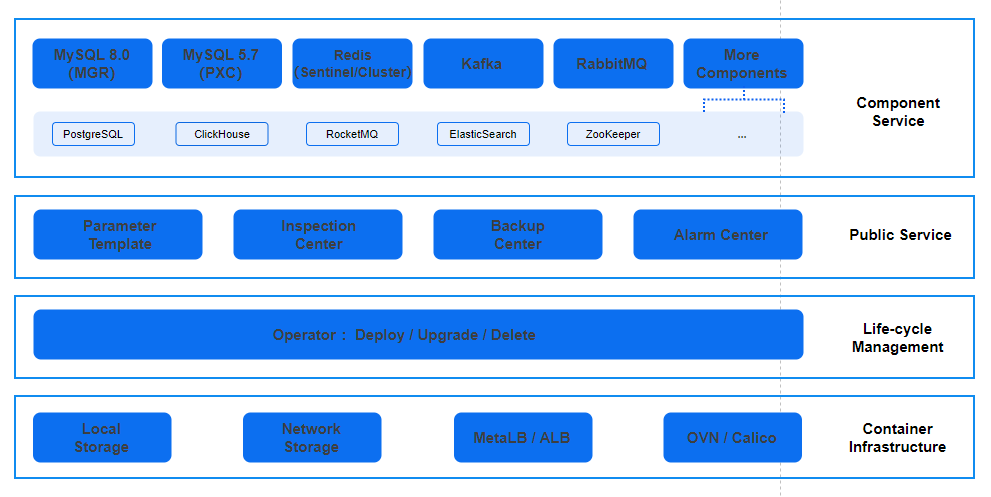

# Architecture

The Alauda Application Services platform is a robust, open-source service management solution built on Kubernetes (K8S), tailored for seamless Alauda Application Services operations. It serves as a centralized hub, efficiently orchestrating a diverse range of popular service components, including MySQL, Redis, Kafka, and RabbitMQ. Here's how it works:

- Service Components: The platform supports key services like MySQL, Redis, Kafka, and RabbitMQ, ensuring stable, reliable operation across all components.

- Common Services: It provides parameter templates, inspection, alert management, backup services etc, offering users a one-stop service management solution.

- Operator Controller: The Operator Controller is an extension of Kubernetes, designed to simplify the deployment and management of applications. It extends the Kubernetes API through Custom Resource Definitions (CRD) to manage the lifecycle of applications.

- Container Infrastructure: The Alauda Application Services platform is built on Kubernetes and leverages the underlying infrastructure it provides to offer foundational capabilities such as data persistence and external access.

## Rich Services Support \{#compatible_sc}

The Alauda Application Services platform supports various types of services, including databases, caches, message queues, etc. To choose storage for these services, see [Storage Selection](./storage_selection.mdx). Each service is released independently of the platform, so its supported versions are listed in its own documentation: <ExternalSiteLink name="mysql-mgr" children="MySQL-MGR" />, <ExternalSiteLink name="redis" children="Redis" />, <ExternalSiteLink name="valkey" children="Valkey" />, <ExternalSiteLink name="kafka" children="Kafka" />, <ExternalSiteLink name="rabbitmq" children="RabbitMQ" />, and <ExternalSiteLink name="postgresql" children="PostgreSQL" />.

The following are the default scheduling rules of the main Alauda Application Services:

  | Alauda Application Services | Default Scheduling Rule (Single Instance) |
  | --------------------------- | ------------------------------------------------------------------------ |
  | MySQL-MGR                   | At most (required) only one MySQL node can be scheduled on each node. |
  | Redis                       | Cluster mode: At most (required) only one Redis node can be scheduled on each node. Sentinel mode: At most (required) only one Redis data node and only one Redis Sentinel node can be scheduled on each node, so a data node and a Sentinel node can share a node. |
  | Valkey                      | Cluster mode: At most (required) only one Valkey node of the same shard can be scheduled on each node; nodes of different shards can share a node. Failover mode: At most (required) only one Valkey data node and only one Sentinel node can be scheduled on each node, so a data node and a Sentinel node can share a node. Replica mode: At most (required) only one Valkey data node can be scheduled on each node. |
  | Kafka                       | At most (required) only one Broker node can be scheduled on each node. |
  | RabbitMQ                    | Instances created in the console: at most (required) only one RabbitMQ node can be scheduled on each node. |
  | PostgreSQL                  | Strive to schedule one PostgreSQL node on each node. |
