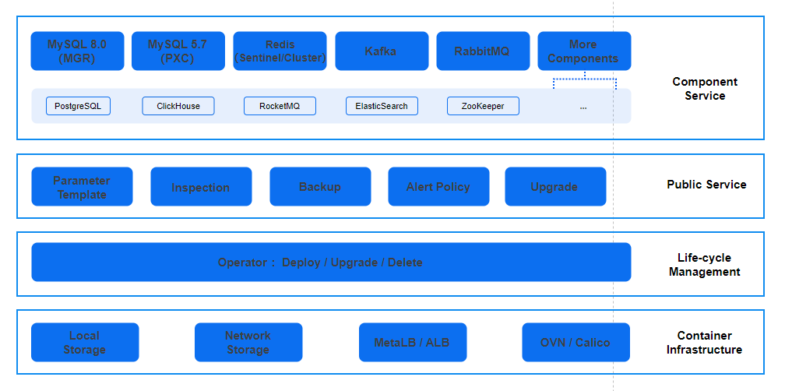

# Architecture

The Alauda Application Services platform is a robust, open-source service management solution built on Kubernetes (K8S), tailored for seamless Alauda Application Services operations. It serves as a centralized hub, efficiently orchestrating a diverse range of popular service components, including MySQL, Redis, Kafka, and RabbitMQ. Here’s how it works:

- Service Components: The platform supports key services like MySQL, Redis, Kafka, and RabbitMQ, ensuring stable, reliable operation across all components.

- Common Services: It provides parameter templates, inspection, alert management, backup services etc, offering users a one-stop service management solution.

- Operator Controller: The Operator Controller is an extension of Kubernetes, designed to simplify the deployment and management of applications. It extends the Kubernetes API through Custom Resource Definitions (CRD) to manage the lifecycle of applications.

- Container Infrastructure: The Alauda Application Services platform is built on Kubernetes and leverages the underlying infrastructure it provides to offer foundational capabilities such as data persistence and external access.
