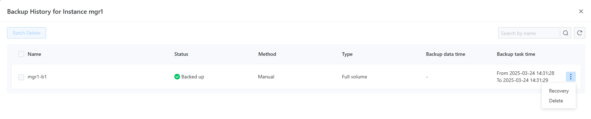
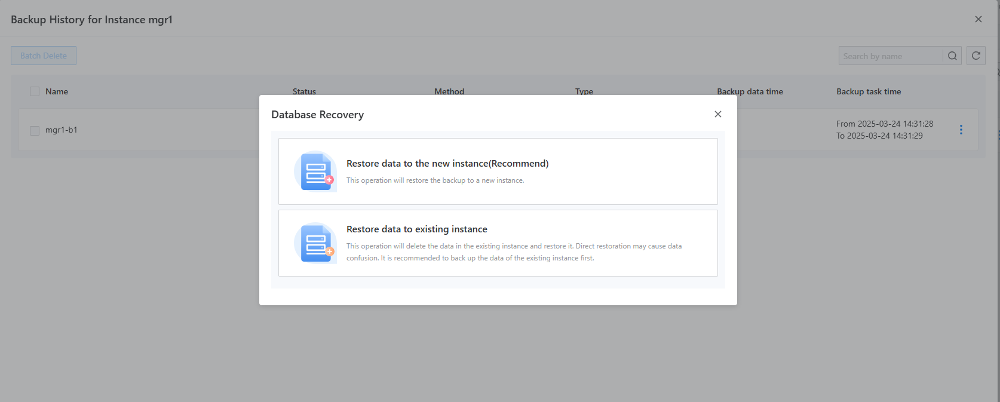

# Backup Management

## Overview

The backup management feature provides you with an intuitive and practical interface. By simply selecting a project and namespace, you can comprehensively view the backup status of instances, including the automatic backup toggle, counts of successful and failed backups, the last backup result, and storage location. This allows you to quickly assess the backup situation and promptly identify issues. Through the menu on the right side of the instance, you can navigate to the backup history page, which clearly displays key information such as backup time, results, and storage methods. Furthermore, you can bulk delete redundant backups to free up space or accurately restore specified backups to handle data loss or system failures, ensuring business continuity and stability.

- **Enhanced Data Visibility and Control**

The backup management page provides a comprehensive display of the instance backup status, allowing you to easily grasp progress, effectiveness, and storage locations, saving you from tedious searches and improving management efficiency. Meanwhile, you can adjust strategies at any time to ensure data security and reliability.

- **Convenient Historical Traceability and Issue Diagnosis**

With the backup history feature, you can clearly trace the instance backup history, quickly check information such as time and results, accurately locate issues, verify data integrity, minimize business interruptions, and ensure normal operation.

## Main Functions

### View Backup List

Users can select the backup management feature under the backup center to enter the backup list page, as shown in the following image.

On this page, users can view the backup status of instances for the specified project and namespace, including whether automatic backups are enabled, counts of successful and failed backups, and the result of the most recent backup.

### View Backup History

By selecting the `Backup History` function from the right-side menu of the specified instance, users will see a pop-up menu displaying all backup records for that instance, as shown in the following image.

This page allows direct querying of the backup resources of the corresponding component, and detailed information can be found in the backup recovery documentation for the respective component.

### Restore Operations

On the backup history page, after selecting a backup record, users can choose the menu on the side and click the `Restore` button. The system will pop up a tab for recovery options. Different components may support different recovery methods; however, by default, all will support recovery to a new instance, while MGR additionally supports recovery to an existing instance.

- If the user chooses to restore to a new instance, the system will redirect to the new instance creation page. After the user inputs the relevant information for the new instance (name, specifications, parameters, etc.), the system will automatically apply the backup data for recovery once the instance has been created. Once the new instance's status changes to ready, the specified backup data will be successfully restored.

- If the user selects to restore to an existing instance, the system will prompt the user to select an instance and perform the recovery operation.

### Delete Backup Operations

On the backup history page, users can delete specific backup records from the right-side menu or select multiple different backup records for bulk deletion. Note: **This operation is irreversible; please proceed with caution!**
