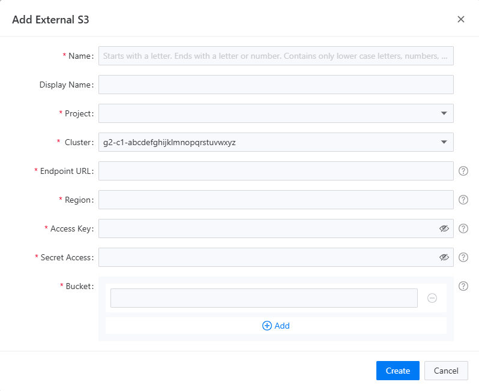
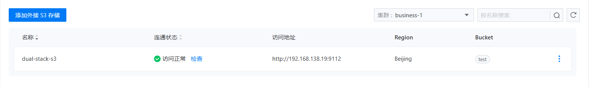

# External S3 Storage

## Feature Overview

This feature provides registration services for external S3 storage for the currently selected project. With a simple and intuitive interface, you can easily complete a few steps to successfully register an external S3 storage for the project. The external storage list page also integrates an intelligent detection mechanism. You can manually initiate a scan to check the availability of the external S3 storage. If any issues arise, such as a connection failure, immediate notifications will be sent to inform you, allowing you to grasp the storage status in real-time. When you or other project members need to back up data, whether creating an automatic backup task or manually triggering an instant backup, you just need to easily select a registered external S3 storage in the backup settings, and the system will promptly and securely save the backup data to that storage.

- **Enhanced Data Security**

Storing backup data in external S3 storage provides an additional layer of security for your data. External S3 storage typically comes with robust data redundancy and disaster recovery mechanisms, effectively preventing data loss due to local hardware failures, natural disasters, and other reasons. Even if the local environment encounters unexpected issues, your data will remain safely stored in the external storage, ensuring business continuity.

- **Increased Flexibility and Scalability**

The feature supports flexible selection of backup storage, allowing you to allocate backup resources freely based on different requirements and scenarios. You can choose the most suitable external S3 storage to store backup data considering factors such as performance, cost, and geographical location. Additionally, as your business grows and data volume increases, you can easily add new external S3 storage to expand storage resources, adapting to the ever-changing business needs.

## Main Features

### Add External S3 Storage

Before adding external S3 storage, users need to gather the following information about the storage:

- Endpoint URL
- Access Key
- Secret Access Key
- Bucket Name

External storage does not need to be deployed in the current cluster or namespace, as long as network connectivity is available. Users can verify the availability of external storage through web requests in advance. To add external S3 storage, simply fill in the external S3 storage registration form in the backup center as shown in the image below.

### View External S3 Storage List

After the external S3 storage is registered successfully, it will be visible in the storage list. The storage list integrates an automatic check of the storage status: when a newly registered external S3 storage is added, a connectivity status check will be automatically triggered. Users can also manually click the `Check` button next to the connectivity status to initiate a manual check. The results of the connectivity status check will be directly displayed in the list, as shown in the images below:

