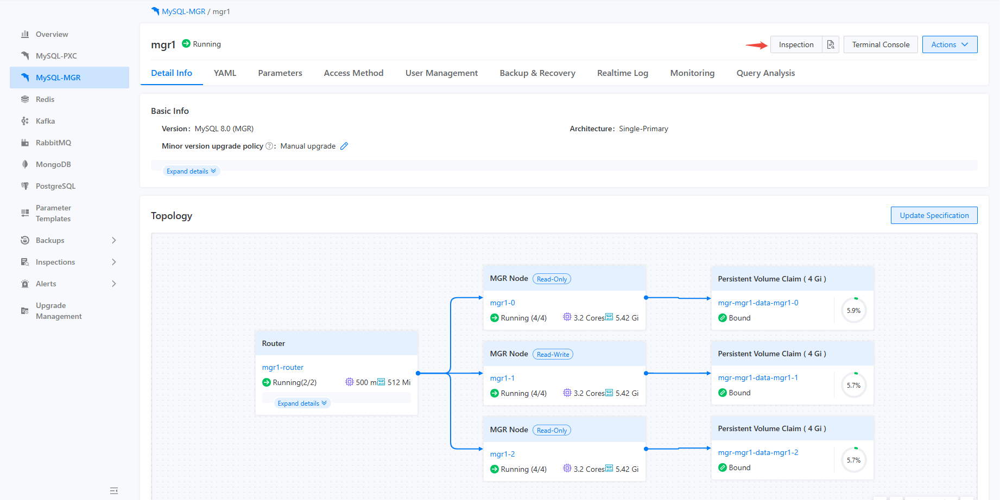
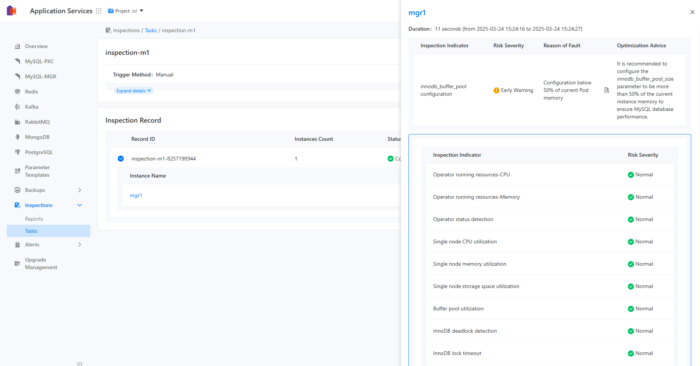
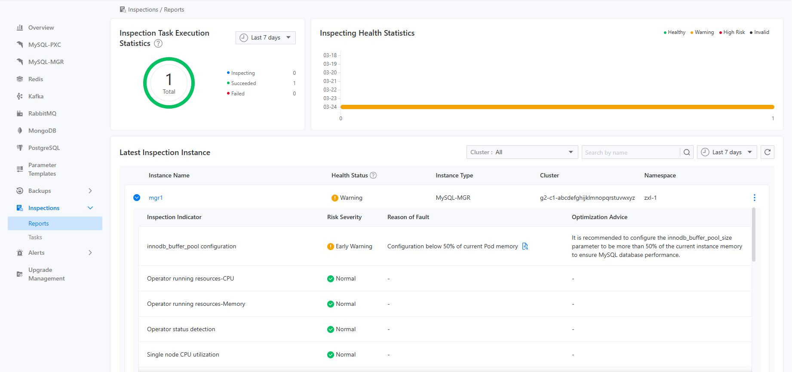
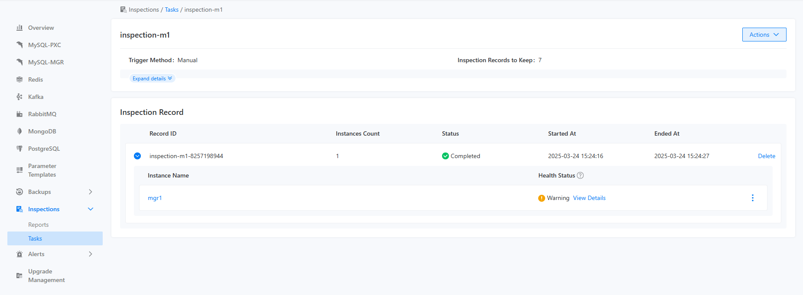

# Inspection Task Execution

## Function Overview

There are two trigger methods for inspection tasks: manual trigger and scheduled trigger. If a user chooses to manually trigger an inspection, the corresponding inspection action will be executed immediately, and the inspection results will be presented in different locations depending on the trigger method.

- If the user triggers the inspection from the details page of a specific component instance, the inspection results will be displayed on that component instance's details page, and will also appear on the inspection report page, as shown in the images below:







- If the user triggers it on a specific inspection task, whether manually or automatically, the inspection results will be presented in the form of inspection records on that task's inspection records, as illustrated below:



## Main Functions

The result of a specific execution of an inspection task can be queried through the CLI, as shown below:

```bash
kubectl get -n namespace inspectionjobs/name -o yaml

apiVersion: middleware.alauda.io/v1
kind: InspectionJob
metadata:
  annotations:
    cpaas.io/creator: admin
    cpaas.io/updated-at: "2025-02-24T06:36:11Z"
  creationTimestamp: "2025-02-24T06:36:11Z"
  generation: 1
  labels:
    inspection.middleware.io/cluster: business-1
    inspection.middleware.io/component: mysqlcluster
    inspection.middleware.io/inspection: insp-task
    inspection.middleware.io/namespace: tongrds-1
    inspection.middleware.io/project: tongrds
    inspection.middleware.io/trigger: Manual
  name: insp-task-8259621030
  namespace: tongrds-1
  ownerReferences:
  - apiVersion: middleware.alauda.io/v1
    blockOwnerDeletion: true
    controller: true
    kind: Inspection
    name: insp-task
    uid: b9252d5a-4f94-4901-8036-e963f0cc0acb
  resourceVersion: "58806102"
  uid: 524ad817-ef5e-4eea-9b06-83782616ca03
spec:
  component: mysqlcluster
  instances:
  - name: mgr1
status:
  instanceCount: 1
  message: ""
  results:
  - healthyStatus: HealthyWithWarning
    id: mgr1-2x4eojeu
    instance: mgr1
    message: ""
    startTime: "2025-02-24T06:36:14Z"
    status: done
    stopTime: "2025-02-24T06:36:22Z"
  startTime: "2025-02-24T06:36:11Z"
  status: succeed
  stopTime: "2025-02-24T06:36:22Z"

```

::: info

- `<spec.component>` is the target instance type for this inspection execution.
- `<spec.instances>` is the list of target instances for this inspection execution.
- `<status.results>` is the list of results for this inspection execution, with fields that include the start and end times of the inspection, an overview of the inspection, and status among others.

:::
