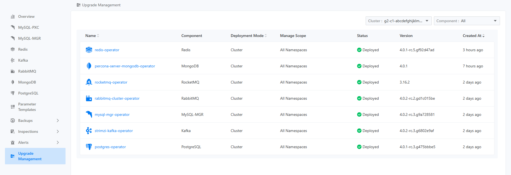
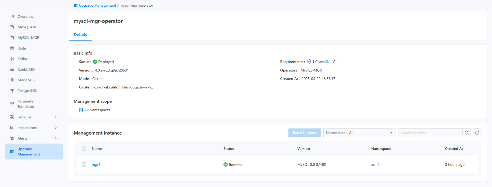

# Instance Upgrade

The instance upgrade control feature allows users to independently choose a time window for upgrading instances. Different instances can be upgraded in different time windows to ensure business continuity.

## View the Operator List

Users can view the currently deployed Operator list in the instance upgrade control center. The list displays key information such as deployment mode, Operator management scope, Operator status, and Operator version. It is important to note that after switching the current project, the cluster selector in the upper right corner will also reset, requiring the user to reselect the cluster for the Operator list to display correctly. This design is due to the multi-tenant model, where a project can contain multiple different clusters.

The Operator list is shown in the figure below.

## View the Instance List

After clicking on the name of a specific Operator, users can navigate to the instance list page. On the instance list page, users can view the names, statuses, and versions of all instances managed by that Operator in the current project and cluster. It should be noted that the instance list page will only display instances under the current project and cluster, and it will also verify related permissions for viewing the project.

The instance list is shown in the figure below.

## Upgrade Instance

When users want to upgrade an instance, they can select the desired instance from the instance list and then click on the batch upgrade button in the upper right corner to trigger the rolling update for the corresponding instance. Users will observe that the status of the selected instances will sequentially change to `in progress`. Once the instance update is completed, the status will change back to `ready`.

It is important to note that, according to K8S characteristics, the upgrade order of multiple instances is not fixed, but they will all ultimately transition to the upgraded ready state.
