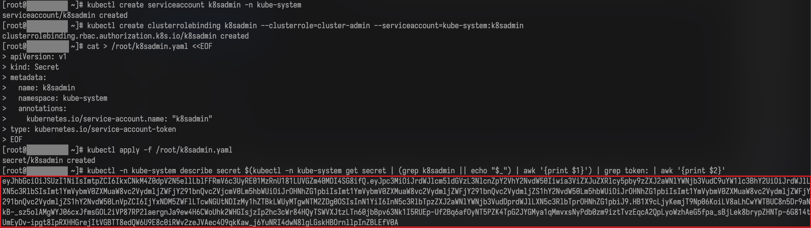

# How to fetch import cluster information?

## Problem description

Obtain the configuration required to connect to the import cluster so that the platform can be authorized to access and manage it. This section provides the steps to retrieve the import cluster information.

## Prerequisites

- A working `kubectl` environment. **For public cloud clusters, it is strongly recommended to use the provider's CloudShell.** If CloudShell is not available, Linux or macOS is recommended.

- You have obtained the import cluster's KubeConfig file and copied it to the environment where `kubectl` is installed. **To avoid operating on the wrong environment, forcibly overwrite the contents of `"${HOME}/.kube/config"` once.**

## Get cluster information

### Get cluster token <span id="fetchtoken"></span>

1. Run the following commands:

    ```shell
    # [Important] The following operations support bash only

    # Manually create a secret, bind a service account, and generate a non-expiring token
    kubectl get ns cpaas-system > /dev/null 2>&1 || kubectl create namespace cpaas-system
    kubectl create serviceaccount k8sadmin -n cpaas-system
    kubectl create clusterrolebinding k8sadmin --clusterrole=cluster-admin --serviceaccount=cpaas-system:k8sadmin

    cat | kubectl apply -f - <<EOF
    apiVersion: v1
    kind: Secret
    metadata:
      name: k8sadmin
      namespace: cpaas-system
      annotations:
        kubernetes.io/service-account.name: "k8sadmin"
    type: kubernetes.io/service-account-token
    EOF

    kubectl -n cpaas-system describe secret \
        $(kubectl -n cpaas-system get secret | (grep k8sadmin || echo "$_") | awk '{print $1}') \
        | grep -F 'token:' | awk '{print $2}'

    ```

2. An example of the token obtained in the previous step is shown below.

    

3. Validate the token expiration.

    Use any tool that supports parsing JWT tokens to analyze the token and confirm its expiration time.
    If you can find an expiration field in the parsed result (a key containing "exp", as shown below), the platform will be unable to manage the import cluster after that time.
    In this case, stop and contact technical support.

    

:::tip
The expiration is recorded as `"exp": 1684486916,` in the original JWT payload. The value is a UNIX timestamp and can be converted to UTC time.
:::

### Get the import cluster API server address and CA certificate

:::tip
If you have already obtained the API server address and CA certificate using the platform's `Parse KubeConfig File` feature on the import cluster page, skip this step.
:::

1. Run the following commands:

    ```shell
    # View the import cluster API server addresses. There may be multiple addresses; choose the one that fits your environment.
    kubectl --kubeconfig "${HOME}/.kube/config" config view --show-managed-fields=false --flatten --raw -ojsonpath='{$.clusters..cluster.server}'
    addr_apiserver='<Selected API server address>'

    # Get the CA certificate for the API server specified above
    kubectl --kubeconfig "${HOME}/.kube/config" config view --show-managed-fields=false --flatten --raw \
        -ojsonpath="{$.clusters[?(@.cluster.server == '${addr_apiserver}')].cluster.certificate-authority-data}" \
        | base64 -d
    ```


