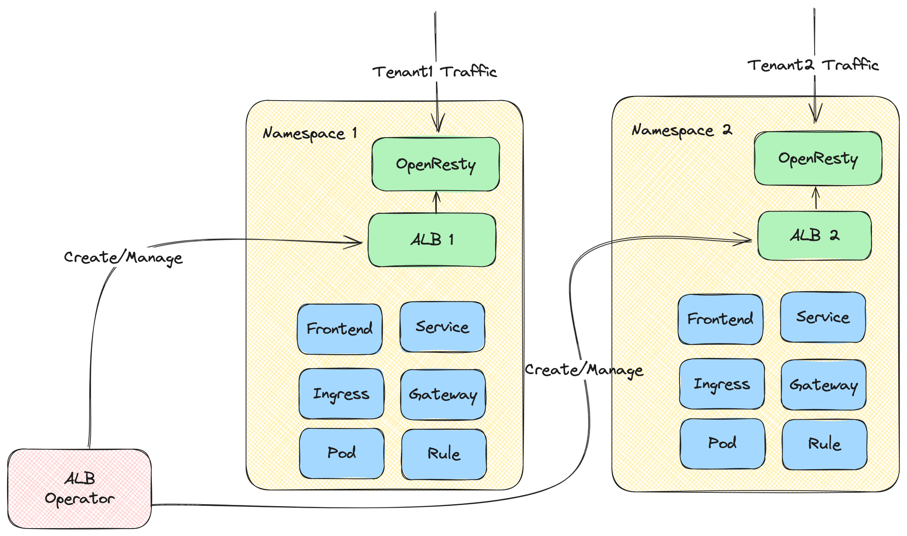

# Understanding ALB

ALB (Another Load Balancer) is a Kubernetes Gateway powered by OpenResty with years of production experience from Alauda.

## Core components



- **ALB Operator**: An operator that manage the lifecycle of ALB instances. It is responsible for watching ALB CRs and then creating and updating ALB instances for different tenants.
- **ALB Instance**: The ALB instance includes an Openresty that act as the data plan and a Go controller as the controller plan.
  The Go controller monitors various CRs (Ingress, Gateway, Rule, etc.) and converts them into ALB-specific DSL rules. OpenResty then uses these DSL rules to match and process incoming requests.

## Quick Start

### Deploy the ALB Operator

1. Create a cluster.
2. ```shell
    helm repo add alb https://alauda.github.io/alb/;helm repo update;helm search repo|grep alb
   ```
3. ```shell
    helm install alb-operator alb/alauda-alb2
   ```

### Deploy an ALB Instance

```yaml
cat <<EOF | kubectl apply -f -
apiVersion: crd.alauda.io/v2beta1
kind: ALB2
metadata:
    name: alb-demo
    namespace: kube-system
spec:
    address: "172.20.0.5"  # the ip address of node where alb been deployed
    type: "nginx"
    config:
        networkMode: host
        loadbalancerName: alb-demo
        projects:
        - ALL_ALL
        replicas: 1
EOF
```

### Run a demo application

```yaml
cat <<EOF | kubectl apply -f -
apiVersion: apps/v1
kind: Deployment
metadata:
  name: hello-world
  labels:
    k8s-app: hello-world
spec:
  replicas: 1
  selector:
    matchLabels:
      k8s-app: hello-world
  template:
    metadata:
      labels:
        k8s-app: hello-world
    spec:
      terminationGracePeriodSeconds: 60
      containers:
      - name: hello-world
        image: docker.io/crccheck/hello-world:latest
        imagePullPolicy: IfNotPresent
---
apiVersion: v1
kind: Service
metadata:
  name: hello-world
  labels:
    k8s-app: hello-world
spec:
  ports:
  - name: http
    port: 80
    targetPort: 8000
  selector:
    k8s-app: hello-world
---
apiVersion: networking.k8s.io/v1
kind: Ingress
metadata:
  name: hello-world
spec:
  rules:
  - http:
      paths:
      - path: /
        pathType: Prefix
        backend:
          service:
            name: hello-world
            port:
              number: 80
EOF
```

Now you can access the app via `curl http://${ip}`

## ALB Common Concepts

The following defines common concepts in the ALB.

### Auth

Auth is a mechanism that performs authentication before a request reaches the actual service. It allows you to handle authentication at the ALB level uniformly, without implementing authentication logic in each backend service.

Learn more about ALB [Auth](../concepts/auth.mdx).

### Network Mode

An ALB instance could be deployed in two modes: host network mode and container network mode.

#### Host Network Mode

Directly use the node's network stack, sharing the IP address and port with the node.

In this mode, the load balancer instance directly binds to the node's port, without port mapping or similar container network encapsulation conversion.

:::note

To avoid port conflicts, only one ALB instance is allowed to be deployed on a single node.

:::


In host-network mode ALB instance will listen to all the NIC of the node by default.

##### Advantages:

1. Best network performance.
2. Could be accessed by node's IP address.

##### Disadvantages:

1. Only one ALB instance is allowed to be deployed on a single node.
2. Port might conflict with other processes.

#### Container Network Mode

Unlike host network mode, container network mode deploys ALB using container networking.


##### Advantages:

1. Supports deploying multiple ALB instances on a single node.
2. ALB provides integration with MetalLB, which can provide VIP for ALB.
3. Port will not conflict with other processes.

##### Disadvantages:

1. Slightly lower performance.
2. Must access ALB through LoadBalancer service.

### Frontend

We define a resource called frontend (abbreviated as ft), which is used to declare all the ports that all the alb should listen to.

Each frontend corresponds to a listening port on the load balancer (LB). A Frontend is associated with the ALB via labels.

```yaml
apiVersion: crd.alauda.io/v1
kind: Frontend
metadata:
  labels:
    alb2.cpaas.io/name: alb-demo # [!code callout]
  name: alb-demo-00080 # [!code callout]
  namespace: cpaas-system
spec:
  backendProtocol: "http"
  certificate_name: "" # [!code callout]
  port: 80
  protocol: http # [!code callout]
  serviceGroup: # [!code callout]
    services:
      - name: hello-world
        namespace: default
        port: 80
        weight: 100 # [!code callout]
```

<Callouts>

1. Required, indicate the ALB instance to which this Frontend belongs to.
2. Format as `$alb_name-$port`.
3. Format as `$secret_ns/$secret_name`.
4. Protocol of this Frontend itself.
   - `http|https|grpc|grpcs` for l7 proxy.
   - `tcp|udp` for l4 proxy.
5. For l4 proxy, `serviceGroup` is required. For l7 proxy, `serviceGroup`
   is. optional. When a request arrives, ALB will first try to match it against
   rules associated with this Frontend. Only if the request doesn't match any
   rule, ALB will then forward it to the default `serviceGroup` specified in the Frontend configuration.
6. `weight` configuration applicable to Round Robin and Weighted Round Robin scheduling algorithms.

</Callouts>

:::note
ALB listens to ingress and automatically creates a `Frontend` or [Rule](#rules). `source` field is defined as follows:

1. `spec.source.type` currently only supports `ingress`.
2. `spec.source.name` is ingress name.
3. `spec.source.namespace` is ingress namespace.

:::

#### Additional resources

- [L4/L7 timeout](../concepts/timeout.mdx)
- [Keepalive](../concepts/keepalive.mdx)

### Rules

We define a resource called rule, which is used to describe how an alb instance should handle a 7-layer request.

Complex traffic matching and distribution patterns can be configured by Rule. When the traffic arrives, it hits the traffic according to the internal rules and does the corresponding forwarding, and provides some additional functions such as cors, url rewrite and so on.

```yaml
apiVersion: crd.alauda.io/v1
kind: Rule
metadata:
  labels:
    alb2.cpaas.io/frontend: alb-demo-00080 # [!code callout]
    alb2.cpaas.io/name: alb-demo #[!code callout]
  name: alb-demo-00080-test
  namespace: kube-system
spec:
  backendProtocol: "" #[!code callout]
  certificate_name: "" #[!code callout]
  dslx:
    - type: METHOD
      values:
        - - EQ
          - POST
    - type: URL
      values:
        - - STARTS_WITH
          - /app-a
        - - STARTS_WITH
          - /app-b
    - type: PARAM
      key: group
      values:
        - - EQ
          - vip
    - type: HOST
      values:
        - - ENDS_WITH
          - .app.com
    - type: HEADER
      key: LOCATION
      values:
        - - IN
          - east-1
          - east-2
    - type: COOKIE
      key: uid
      values:
        - - EXIST
    - type: SRC_IP
      values:
        - - RANGE
          - "1.1.1.1"
          - "1.1.1.100"
  enableCORS: false
  priority: 4 #[!code callout]
  serviceGroup: #[!code callout]
    services:
      - name: hello-world
        namespace: default
        port: 80
        weight: 100
```

<Callouts>

1. Required, indicate the Frontend to which this rule belongs.
2. Required, indicate the ALB to which this rule belongs.
3. As same as Frontend.
4. As same as Frontend.
5. The lower the number, the higher the priority.
6. As same as Frontend.

</Callouts>

#### dslx

dslx is a domain specific language, it is used to describe the matching criteria.

For example, below rule matches a request that satisfies all the following criteria:

- url starts with /app-a or /app-b
- method is post
- url param's group is vip
- host is \*.app.com
- header's location is east-1 or east-2
- has a cookie name is uid
- source IPs come from 1.1.1.1-1.1.1.100

```yaml
dslx:
  - type: METHOD
    values:
      - - EQ
        - POST
  - type: URL
    values:
      - - STARTS_WITH
        - /app-a
      - - STARTS_WITH
        - /app-b
  - type: PARAM
    key: group
    values:
      - - EQ
        - vip
  - type: HOST
    values:
      - - ENDS_WITH
        - .app.com
  - type: HEADER
    key: LOCATION
    values:
      - - IN
        - east-1
        - east-2
  - type: COOKIE
    key: uid
    values:
      - - EXIST
  - type: SRC_IP
    values:
      - - RANGE
        - "1.1.1.1"
        - "1.1.1.100"
```

### Project Isolation

For rule, default is project isolation, each user can only see the rule of their own project.

#### Project Mode

An ALB can be shared by multiple projects, and these projects can control this ALB. All ports of the ALB are visible to these projects.

#### Port Project Mode

A port of a ALB can belong to different projects. This deployment mode is called Port Project Mode. The administrator needs to specify the port segment that each project can use. The users of this project can only create ports within this port segment, and can only see the ports within this port segment.

## Relationship between ALB, ALB Instance, Frontend/FT, Rule, Ingress, and Project

LoadBalancer is a key component in modern cloud-native architectures, serving as an intelligent traffic router and load balancer.

To understand how ALB works in a Kubernetes cluster, we need to understand several core concepts and their relationships:

- ALB itself
- Frontend (FT)
- Rules
- Ingress resources
- Projects

These components work together to enable flexible and powerful traffic management capabilities.

Next introduces how these concepts work together and what roles they play in the request-calling chain. Detailed introductions for each concept will be covered in other articles.


In a request-calling chain:

1. A client sends an HTTP/HTTPS/other protocol request, and finally the request will **arrive on a pod of ALB**, and the pod (an ALB instance) will start to handle this request.
2. This ALB instance finds a rule which could match this request.
3. If needed, modify/redirect/rewrite the request based on the rule.
4. Find and select one pod IP from the services which the rule configured. And forward the request to the pod.

### Ingress

Ingress is a resource in Kubernetes, used to describe what request should be sent to which service.

### Ingress Controller

A program that understands Ingress resource and will proxy request to service.

### ALB

ALB is an Ingress controller.

In Kubernetes cluster, we use the `alb2` resource to operate an ALB. You could use `kubectl get alb2 -A` to view all the ALBs in the cluster.

ALBs are created by users manually. Each ALB has its own IngressClass. When you create an Ingress, you can use `.spec.ingressClassName` field to indicate which Ingress controller should handle this Ingress.

### ALB Instance

ALB also is a Deployment (bunch of pods) running in the cluster. Each pod is called an ALB instance.

Each ALB instance handles requests independently, but all instances share Frontend (FT), Rule, and other configurations belonging to the same ALB.

### ALB-Operator

ALB-Operator, a default component deployed in the cluster, is an operator for ALB. It will create/update/delete Deployment and other related resources for each ALB according to the ALB resource.

### Frontend (abbreviation: FT)

FT is a resource defined by ALB itself. It is used to represent the ALB instance listening ports.

FT could be created by ALB-Leader or user manually.

Cases of FT created by ALB-Leader:

1.  If Ingress has certificate, we will create FT 443 (HTTPS).
2.  If Ingress has no certificate, we will create FT 80 (HTTP).

### RULE

RULE is a resource defined by ALB itself.
It takes the same role as the Ingress, but it is more specific.
A RULE is uniquely associated with a FT.

RULE could be created by ALB-Leader or user manually.

Cases of RULE created by ALB-Leader:

1. Sync Ingress to RULE.

## ALB Leader

In multiple ALB instances, one will be elected as leader.
The leader is responsible for:

1. Translating the Ingress into Rules.
   We will create Rule for each path in the Ingress.
2. Creating FT needed by Ingress.
   For example, if Ingress has certificate we will create FT 443 (HTTPS), if Ingress has no certificate we will create FT 80 (HTTP).

### Project

From the perspective of ALB, Project is a set of namespaces.

You could configure one or more Projects in an ALB.
When ALB Leader translates the Ingress into Rules, it will ignore Ingress in namespaces which do not belong to the Project.

## Additional resources:

- [Configure a Load Balancer](../how_to/create_loadbalancer.mdx)
