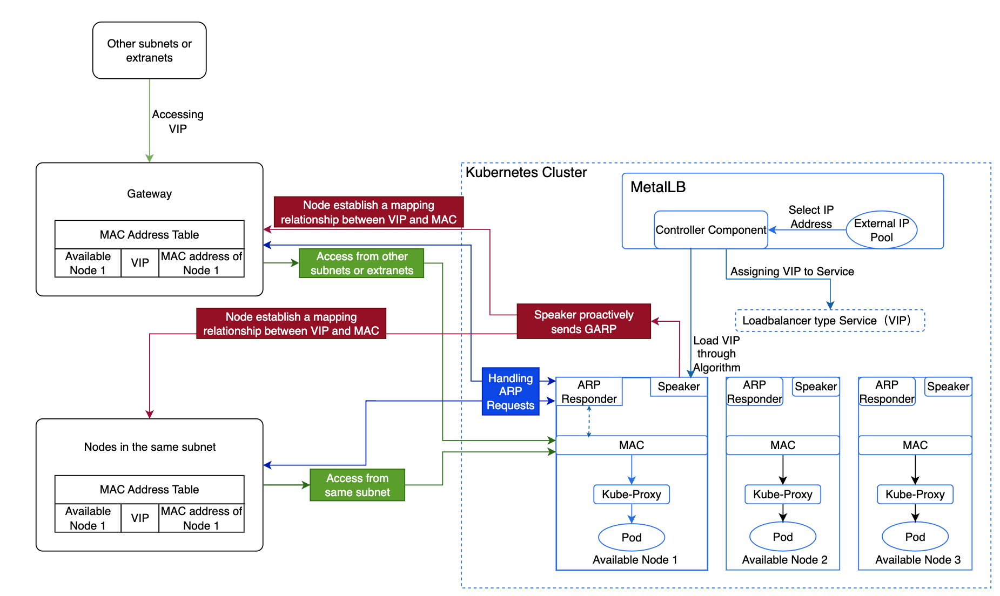

# Understanding MetalLB

## Terminology

| Term              | Description                                                                                                                                                                                                                                                                                                                                                     |
| ----------------- | --------------------------------------------------------------------------------------------------------------------------------------------------------------------------------------------------------------------------------------------------------------------------------------------------------------------------------------------------------------- |
| **VIP**           | A Virtual IP Address (VIP) is the IP address assigned by MetalLB for the LoadBalancer type internal routing, providing a unified access point for external traffic to access services within the cluster.                                                                                                                                                       |
| **ARP**           | The Address Resolution Protocol (ARP) is utilized to map network layer IP addresses to data link layer MAC addresses.                                                                                                                                                                                                                                           |
| **GARP**          | Gratuitous ARP (GARP) is a special ARP request used to inform other nodes in the network about the binding of an IP address to a MAC address. Unlike normal ARP requests, GARP does not wait for responses but actively sends information across the network.                                                                                                   |
| **ARP Responder** | A component of MetalLB responsible for responding to ARP requests by mapping the VIP to the node's MAC address. When a node needs to communicate with the VIP, it sends ARP requests to retrieve the MAC address corresponding to the VIP. Each available node has an ARP Responder that responds to these requests, mapping the VIP to the node's MAC address. |
| **Controller**    | A component of MetalLB that dynamically allocates VIPs from the external address pool for LoadBalancer type internal routing. The Controller listens for creation and deletion events of internal routes in the cluster to allocate or free VIPs as required.                                                                                                   |
| **Speaker**       | A component of MetalLB that determines, based on policies or algorithms, whether nodes should host a VIP and send GARP. It ensures a certain level of balance among nodes, and when a node becomes unavailable, other nodes can take over the VIP and send GARP, thereby achieving high availability.                                                           |

## Principles of High Availability in MetalLB

By default, the platform uses MetalLB's ARP mode, and the specific implementation process and principles are as follows:

- The Controller component of MetalLB selects an IP address from the external address pool and allocates it to the LoadBalancer type internal routing as a VIP.

- MetalLB selects an available node as the leader to host the VIP based on the [algorithm](#vip), which then forwards the traffic.

- The Speaker component on this node actively sends GARP, establishing a mapping relationship between the VIP and MAC address across all nodes.

  - Nodes within the same subnet, upon learning the mapping between the VIP and the available node's MAC address, will communicate directly with this node when accessing the VIP.

  - Nodes in different subnets will route traffic to the gateway of their subnet first, which will then forward the traffic to the node hosting the VIP.

- When this node encounters a failure, MetalLB selects another leader to host the VIP. Then send GARP to refresh Service IP mac address, thereby ensuring high availability.

- Upon reaching the node, Kube-Proxy forwards the traffic to the corresponding Pod.

## Algorithm for Selecting VIP Host Nodes\{#vip}

The election of the "leader" (the node which is going to advertise the IP) of a
given loadbalancer IP is stateless and works in the following way:

- each speaker collects the list of the potential announcers of a given IP, taking
  into account active speakers, external traffic policy, active endpoints, node selectors and other things.
- each speaker does the same computation: it gets a sorted list of a hash of "node+VIP" elements and
  announces the service if it is the first item of the list.

This removes the need of having to keep memory of which speaker is in charge of
announcing a given IP.

### Calculation Formula

The formula is: **Number of external address pools = ceil(n-vip / n-node)**, where ceil rounds up.

**Note**: If using virtual machines, the number of virtual machines = Number of external address pools \* n. Here, n must be greater than 2, with a maximum of one node failure allowed.

- n-vip: Represents the number of VIPs.

- n-node: Represents the number of VIPs a single node can handle.

### Application Example

If a company has 10 VIPs, and each available node can handle 5 VIPs, allowing for one node failure, how should the company plan the number of external address pools and available nodes?

**Analysis**:

A total of two external address pools and four available nodes are needed.

- Each available node can handle a maximum of 5 VIPs, meaning one external address pool can accommodate 5 VIPs, so two external address pools are required for 10 VIPs.

- Allowing one node failure means that each address pool must include one node hosting the VIP and one backup node, resulting in two available nodes for each of the two external address pools.

## Additional resources

- [Creating External IP Address Pool](../functions/create_metallb.mdx)
- [Creating BGP Peers](../functions/create_bgppeer.mdx)
