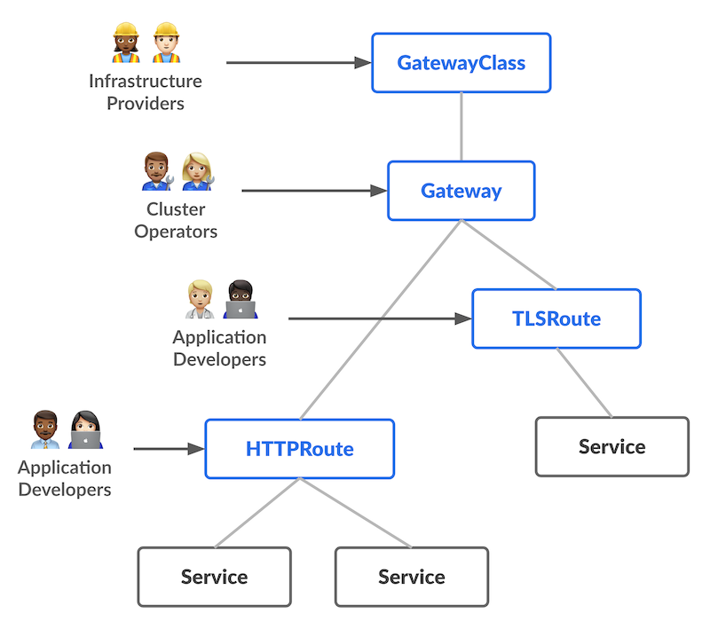

# GatewayAPI
[GatewayAPI](https://gateway-api.sigs.k8s.io/) is an official Kubernetes project focused on L4 and L7 routing in Kubernetes. This project represents the next generation of Kubernetes Ingress, Load Balancing, and Service Mesh APIs. From the outset, it has been designed to be generic, expressive, and role-oriented.

The overall resource model focuses on 3 separate personas and corresponding resources that they are expected to manage:

## Via ALB
ALB supports GatewayAPI. Each Gateway resource maps to an ALB resource.
Listeners and routers are handled directly by ALB; they are not translated into `Frontend` or `Rule`.
[Create a GatewayAPI Gateway via ALB](../how_to/alb/configure_gatewayapi_gateway_via_alb.mdx)