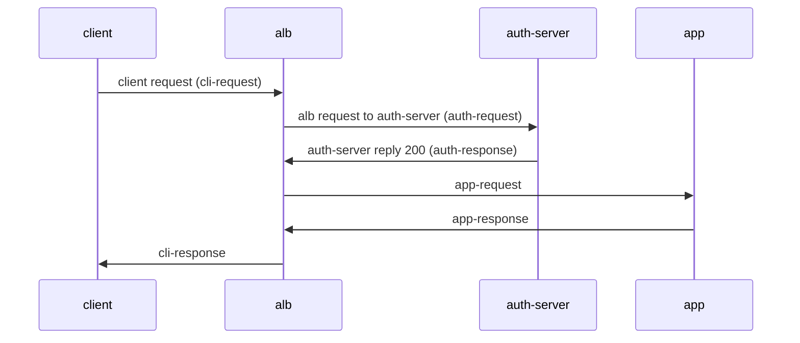
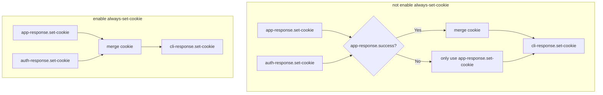
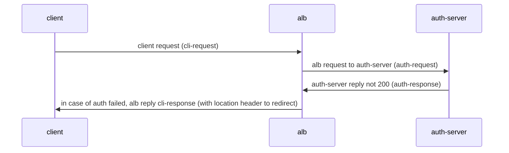
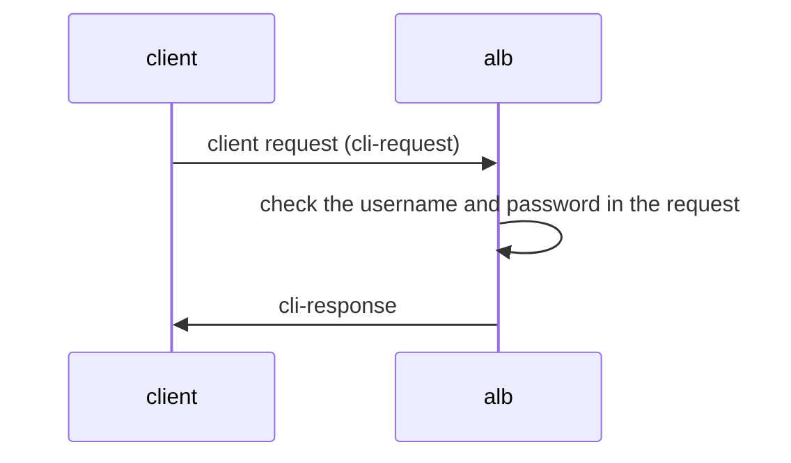

# Auth

## Basic Concept

### What is Auth

Auth is a mechanism that performs authentication before a request reaches the actual service. It allows you to handle authentication at the ALB level uniformly, without implementing authentication logic in each backend service.

### Supported Auth Methods

ALB supports two main authentication methods:

1. **Forward Auth (External Authentication)**
   - Send a request to an external authentication service to verify the user's identity
   - Applicable scenarios: Need complex authentication logic, such as OAuth, SSO, etc.
   - Workflow:
     1. User request arrives at ALB
     2. ALB forwards the authentication information to the authentication service
     3. The authentication service returns the verification result
     4. Based on the authentication result, decide whether to allow access to the backend service

2. **Basic Auth (Basic Authentication)**
   - A simple authentication mechanism based on username and password
   - Applicable scenarios: Simple access control, development environment protection
   - Workflow:
     1. User request arrives at ALB
     2. ALB checks the username and password in the request
     3. Compare with the configured authentication information
     4. If the verification passes, forward to the backend service

### Auth Configuration Methods

1. **Global Auth**
   - Configure at the ALB level, applicable to all services
   - Configure at the ALB or FT CR

2. **Path-level Auth**
   - Configure at the specific Ingress path
   - Configure at the specific Rule
   - Can override the global auth configuration

3. **Disable Auth**
   - Disable auth for a specific path
   - Configure at the Ingress with annotation: `alb.ingress.cpaas.io/auth-enable: "false"`
   - Configure at the Rule with CR

### Auth Result Handling

- Auth success: Request will be forwarded to the backend service
- Auth failed: Return 401 unauthorized error
- Can configure the redirect behavior after auth failed (applicable to Forward Auth)

## Quick Start

Configure Basic Auth with ALB

### Deploy ALB

```bash
cat <<EOF | kubectl apply -f -
apiVersion: crd.alauda.io/v2
kind: ALB2
metadata:
  name: auth
  namespace: cpaas-system
spec:
  config:
    networkMode: container
    projects:
    - ALL_ALL
    replicas: 1
    vip: 
      enableLbSvc: false
  type: nginx
EOF
export ALB_IP=$(kubectl get pods -n cpaas-system -l service_name=alb2-auth -o jsonpath='{.items[*].status.podIP}');echo $ALB_IP
```

### Configure Secret and Ingress

```bash
# echo "Zm9vOiRhcHIxJHFJQ05aNjFRJDJpb29pSlZVQU1tcHJxMjU4L0NoUDE=" | base64 -d #  foo:$apr1$qICNZ61Q$2iooiJVUAMmprq258/ChP1
# openssl passwd -apr1 -salt qICNZ61Q bar # $apr1$qICNZ61Q$2iooiJVUAMmprq258/ChP1

kubectl apply -f - <<'END'
apiVersion: v1
kind: Secret
metadata:
  name: auth-file
type: Opaque
data:
  auth: Zm9vOiRhcHIxJHFJQ05aNjFRJDJpb29pSlZVQU1tcHJxMjU4L0NoUDE=
---
apiVersion: networking.k8s.io/v1
kind: Ingress
metadata:
  name: auth-file
  annotations:
    "nginx.ingress.kubernetes.io/auth-type": "basic"
    "nginx.ingress.kubernetes.io/auth-secret": "default/auth-file"
    "nginx.ingress.kubernetes.io/auth-secret-type": "auth-file"
spec:
  rules:
  - http:
      paths:
      - path: /app-file
        pathType: Prefix
        backend:
          service:
            name: app-server
            port:
              number: 80
END
```

### Verify

```bash
# echo "Zm9vOiJhYXIi" | base64 -d # foo:bar
curl -v -X GET -H "Authorization: Basic Zm9vOmJhcg==" http://$ALB_IP:80/app-file # should return 200
# wrong password
curl -v -X GET -H "Authorization: Basic XXXXOmJhcg==" http://$ALB_IP:80/app-file # should return 401
```

## Related Ingress Annotations

Ingress-nginx defines a series of annotations to configure the specific details of the authentication process. Below is a list of annotations that ALB supports, where "v" indicates support and "x" indicates no support.

|                                                                                                                                                        | support | type                | note                                                                 |
|--------------------------------------------------------------------------------------------------------------------------------------------------------|---------|---------------------|----------------------------------------------------------------------|
| forward-auth                                                                                                                                           |         |                     | forward auth by sending http request                                  |
| nginx.ingress.kubernetes.io/auth-url                                                                                                                   | v       | string              |                                                                      |
| nginx.ingress.kubernetes.io/auth-method                                                                                                                | v       | string              |                                                                      |
| nginx.ingress.kubernetes.io/auth-signin                                                                                                                | v       | string              |                                                                      |
| nginx.ingress.kubernetes.io/auth-signin-redirect-param                                                                                                 | v       | string              |                                                                      |
| nginx.ingress.kubernetes.io/auth-response-headers                                                                                                      | v       | string              |                                                                      |
| nginx.ingress.kubernetes.io/auth-proxy-set-headers                                                                                                     | v       | string              |                                                                      |
| nginx.ingress.kubernetes.io/auth-request-redirect                                                                                                      | v       | string              |                                                                      |
| nginx.ingress.kubernetes.io/auth-always-set-cookie                                                                                                     | v       | boolean             |                                                                      |
| nginx.ingress.kubernetes.io/auth-snippet                                                                                                               | x       | string              |                                                                      |
| basic-auth                                                                                                                                             |         |                     | auth by username and password secret                                  |
| nginx.ingress.kubernetes.io/auth-realm                                                                                                                 | v       | string              |                                                                      |
| nginx.ingress.kubernetes.io/auth-secret                                                                                                                | v       | string              |                                                                      |
| nginx.ingress.kubernetes.io/auth-secret-type                                                                                                           | v       | string              |                                                                      |
| nginx.ingress.kubernetes.io/auth-type                                                                                                                  | -       | "basic" or "digest" | basic: supports apr1 **digest: not supported**                     |
| auth-cache                                                                                                                                             |         |                     |                                                                      |
| nginx.ingress.kubernetes.io/auth-cache-key                                                                                                             | x       | string              |                                                                      |
| nginx.ingress.kubernetes.io/auth-cache-duration                                                                                                        | x       | string              |                                                                      |
| auth-keepalive                                                                                                                                         |         |                     | keepalive when sending request. specify keepalive behavior through a series of annotations |
| nginx.ingress.kubernetes.io/auth-keepalive                                                                                                             | x       | number              |                                                                      |
| nginx.ingress.kubernetes.io/auth-keepalive-share-vars                                                                                                  | x       | "true" or "false"   |                                                                      |
| nginx.ingress.kubernetes.io/auth-keepalive-requests                                                                                                    | x       | number              |                                                                      |
| nginx.ingress.kubernetes.io/auth-keepalive-timeout                                                                                                     | x       | number              |                                                                      |
| [auth-tls](https://github.com/kubernetes/ingress-nginx/blob/main/docs/user-guide/nginx-configuration/annotations.md#client-certificate-authentication) |         |                     | when request is https, extra verify the certificate.                            |
| nginx.ingress.kubernetes.io/auth-tls-secret                                                                                                            | x       | string              |                                                                      |
| nginx.ingress.kubernetes.io/auth-tls-verify-depth                                                                                                      | x       | number              |                                                                      |
| nginx.ingress.kubernetes.io/auth-tls-verify-client                                                                                                     | x       | string              |                                                                      |
| nginx.ingress.kubernetes.io/auth-tls-error-page                                                                                                        | x       | string              |                                                                      |
| nginx.ingress.kubernetes.io/auth-tls-pass-certificate-to-upstream                                                                                      | x       | "true" or "false"   |                                                                      |
| nginx.ingress.kubernetes.io/auth-tls-match-cn                                                                                                          | x       | string              |                                                                      |

## forward-auth



Related annotations:
- nginx.ingress.kubernetes.io/auth-url
- nginx.ingress.kubernetes.io/auth-method
- nginx.ingress.kubernetes.io/auth-signin
- nginx.ingress.kubernetes.io/auth-signin-redirect-param
- nginx.ingress.kubernetes.io/auth-response-headers
- nginx.ingress.kubernetes.io/auth-proxy-set-headers
- nginx.ingress.kubernetes.io/auth-request-redirect
- nginx.ingress.kubernetes.io/auth-always-set-cookie

These annotations describe the modifications made to auth-request, app-request, and cli-response in the above diagram.

### Construct Related Annotations

#### auth-url

Auth-request's URL, value can be a variable.

#### auth-method

Auth-request's method.

#### auth-proxy-set-headers

The value is a ConfigMap reference in the format `ns/name`.
By default, all headers from the cli-request will be sent to the auth-server. Additional headers can be configured through proxy_set_header. The following headers are sent by default:

```
X-Original-URI          $request_uri;
X-Scheme                $pass_access_scheme;
X-Original-URL          $scheme://$http_host$request_uri;
X-Original-Method       $request_method;
X-Sent-From             "alb";
X-Real-IP               $remote_addr;
X-Forwarded-For         $proxy_add_x_forwarded_for;
X-Auth-Request-Redirect $request_uri;	
```
### Construct app-request related annotations

#### auth-response-headers

Value is a comma-separated string, allowing us to bring specific headers from auth-response to app-request.
example:

```
nginx.ingress.kubernetes.io/auth-response-headers: Remote-User,Remote-Name
```

When ALB initiates an app-request, it will include the Remote-User and Remote-Name from the auth-response headers.

### cookie handling

auth-response and app-response can both set cookies. By default, only when app-response.success, the auth-response.set-cookie will be merged into cli-response.set-cookie.



### Redirect sign related configuration

When the auth-server returns 401, we can set the redirect header in the cli-response to instruct the browser to redirect to the url specified by auth-signin for verification.



#### auth-signin

Value is a url, specify the location header in cli-response.

#### auth-signin-redirect-param

The name of the query parameter in the signin-url, default is rd.
if the signin-url does not contain the `auth-signin-redirect-param` specified parameter name, alb will automatically add the parameter. The parameter value will be set to `$pass_access_scheme://$http_host$escaped_request_uri`, used to record the original request URL.

#### auth-request-redirect

Set the `x-auth-request-redirect` header in auth-request.

## basic-auth

basic-auth is the authentication process described in [RFC 7617](https://datatracker.ietf.org/doc/html/rfc7617).
The interaction process is as follows:



### auth-realm

[description of the protected area](https://developer.mozilla.org/zh-CN/docs/Web/HTTP/Headers/WWW-Authenticate#realm)
Which is the realm value in the `WWW-Authenticate` header of cli-response.
WWW-Authenticate: Basic realm="$realm"

### auth-type

The type of the authentication scheme, currently only supports basic

### auth-secret

The secret refs of the username and password, format is ns/name

### auth-secret-type

Secret supports two types:

1. auth-file: secret's data only contains one key "auth", and its value is the string of Apache htpasswd format. for example:
   ```
   data:
     auth: "user1:$apr1$xyz..."
   ```

2. auth-map: secret's data each key represents a username, and the corresponding value is the password hash (without the username in htpasswd format). for example:
   ```
   data:
     user1: "$apr1$xyz...."
     user2: "$apr1$abc...."
   ```

Note: Currently, only htpasswd format password hashes generated using the apr1 algorithm are supported.

## CR

ALB CR has added auth-related configuration items that can be configured on ALB/Frontend/Rule CRs.
During runtime, ALB will convert the annotations on Ingress into rules.

```yaml
auth:
  # Basic authentication configuration
  basic:
    #  string; corresponding to nginx.ingress.kubernetes.io/auth-type: basic
    auth_type: "basic"
    #  string; corresponding to nginx.ingress.kubernetes.io/auth-realm
    realm: "Restricted Access"  
    #  string; corresponding to nginx.ingress.kubernetes.io/auth-secret
    secret: "ns/name"
    #  string; corresponding to nginx.ingress.kubernetes.io/auth-secret-type
    secret_type: "auth-map|auth-file"
  # Forward authentication configuration
  forward:
    #  boolean; corresponding to nginx.ingress.kubernetes.io/auth-always-set-cookie
    always_set_cookie: true
    #  string; corresponding to nginx.ingress.kubernetes.io/auth-proxy-set-headers
    auth_headers_cm_ref: "ns/name"
    #  string; corresponding to nginx.ingress.kubernetes.io/auth-request-redirect
    auth_request_redirect: "/login"
    #  string; corresponding to nginx.ingress.kubernetes.io/auth-method
    method: "GET"
    #  string; corresponding to nginx.ingress.kubernetes.io/auth-signin
    signin: "/signin"
    #  string; corresponding to nginx.ingress.kubernetes.io/auth-signin-redirect-param
    signin_redirect_param: "redirect_to"
    #  []string; corresponding to nginx.ingress.kubernetes.io/auth-response-headers
    upstream_headers:
      - "X-User-ID" 
      - "X-User-Name"
      - "X-User-Email"
    #  string; corresponding to nginx.ingress.kubernetes.io/auth-url
    url: "http://auth-service/validate"
```

Auth supports configuration on:
- Alb CR's `.spec.config.auth`
- Frontend CR's `.spec.config.auth`
- Rule CR's `.spec.config.auth`

The inheritance order is Alb > Frontend > Rule. If a child cr is not configured, the configuration of the parent cr will be used.

## ALB Special Ingress Annotation

In the process of handling Ingress, ALB determines the priority based on the prefix of the annotation. The priority from high to low is:
- `index.$rule_index-$path_index.alb.ingress.cpaas.io`
- `alb.ingress.cpaas.io`
- `nginx.ingress.kubernetes.io`

This can handle the compatibility problem with ingress-nginx and specify the auth configuration on a specific Ingress path.

### Auth-Enable
```yaml
alb.ingress.cpaas.io/auth-enable: "false"
```
A new annotation added by ALB, used to specify whether to enable authentication functionality for the Ingress.

## Ingress-Nginx Auth Related Other Features
### Global-Auth
In ingress-nginx, you can set a global auth through the ConfigMap. This is equivalent to configuring auth for all Ingresses. In ALB, you can configure auth on the ALB2 and FT CRs. The rules under them will inherit these configurations.

### No-Auth-Locations

In ALB, you can disable the auth function of this Ingress by configuring the annotation: `alb.ingress.cpaas.io/auth-enable: "false"` on the Ingress.

## Note: Incompatible Parts with Ingress-Nginx

1. Does not support auth-keepalive
2. Does not support auth-snippet
3. Does not support auth-cache
4. Does not support auth-tls
5. Basic-auth only supports basic, does not support digest
6. Basic-auth basic only supports apr1 algorithm, does not support bcrypt sha256, etc.

## Troubleshooting

1. Check ALB pod Nginx container log
2. Check the `X-ALB-ERR-REASON` header in the return