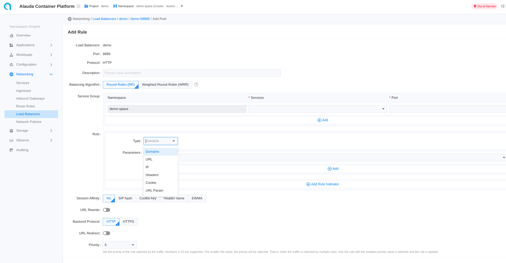

# Configure ALB Rules
## Introduction

### What is a Rule?
Rule is a Custom Resource(CR) that defines how incoming requests are matched and processed by the ALB.

Ingresses handled by ALB can be [auto translated to rules](./configure_alb_rule.mdx#alb_ingress).

### Prerequisites
[install alb and ft](../how_to/alb/deploy_alb.mdx)
### Quick demo of rule \{#alb_add_rule}
Here is a demo rule to give you a quick first impression of how to use rules.

:::note
rule must be attached to a frontend and alb via label.
:::

```yaml
apiVersion: crd.alauda.io/v1
kind: Rule
metadata:
  labels:
    alb2.cpaas.io/frontend: alb-demo-00080 # [!code callout]
    alb2.cpaas.io/name: alb-demo #[!code callout]
  name: alb-demo-00080-test
  namespace: cpaas-system
spec:
  backendProtocol: "https" #[!code callout]
  certificate_name: "a/b" #[!code callout]
  dslx:                #[!code callout]
    - type: URL
      values:
        - - STARTS_WITH
          - /
  priority: 4 #[!code callout]
  serviceGroup: #[!code callout]
    services:
      - name: hello-world
        namespace: default
        port: 80
        weight: 100
```

<Callouts>

1. Required, indicate the `Frontend` to which this rule belongs.
2. Required, indicate the ALB to which this rule belongs.
3. [backendProtocol](./configure_alb_rule.mdx#backend_protocol)
4. [certificate_name](./configure_alb_rule.mdx#certificate_name)
5. [dslx](./configure_alb_rule.mdx#dslx)
6. The lower the number, the higher the priority.
7. [serviceGroup](./configure_alb_rule.mdx#service_group)

</Callouts>

### match request with dslx and priority
#### dslx
DSLX is a domain-specific language used to describe the matching criteria.
For example, the rule below matches a request that satisfies **all** the following criteria:

- url starts with /app-a **or** /app-b
- method is post
- url param's group is vip
- host is \*.app.com
- header's location is east-1 or east-2
- has a cookie name is uid
- source IPs come from 1.1.1.1-1.1.1.100

{/* lint ignore code-block-split-list */}

```yaml
dslx:
  - type: METHOD
    values:
      - - EQ
        - POST
  - type: URL
    values:
      - - STARTS_WITH
        - /app-a
      - - STARTS_WITH
        - /app-b
  - type: PARAM
    key: group
    values:
      - - EQ
        - vip
  - type: HOST
    values:
      - - ENDS_WITH
        - .app.com
  - type: HEADER
    key: LOCATION
    values:
      - - IN
        - east-1
        - east-2
  - type: COOKIE
    key: uid
    values:
      - - EXIST
  - type: SRC_IP
    values:
      - - RANGE
        - "1.1.1.1"
        - "1.1.1.100"
```
#### priority
Priority is an integer ranging from 0 to 10, where lower values indicate higher priority. To configure the priority of a rule in ingress, you can use the following annotation format:
```yaml
# alb.cpaas.io/ingress-rule-priority-$rule_index-$path_index
alb.cpaas.io/ingress-rule-priority-0-0: "10"
```
For rules, simply set the priority directly in `.spec.priority` using an integer value.

## Action
After a request matches a rule, you can apply the following actions to the request

| Feature          | Description                                                               |Link|
|------------------|---------------------------------------------------------------------------|-----|
| Timeout          | Configures the timeout settings for requests.                             |[timeout](../how_to/alb/l4_l7_timeout.mdx)|
| Redirect         | Redirects incoming requests to a specified URL.                           |[redirect](../how_to/alb/http_redirect.mdx)|
| CORS             | Enables Cross-Origin Resource Sharing (CORS) for the application.         |[cors](../how_to/alb/cors.mdx)|
| Header Modification    | Allows modification of request or response headers.                 |[header modification](../how_to/alb/header_modification.mdx)|
| URL Rewrite      | Rewrites the URL of incoming requests before forwarding them.             |[url-rewrite](../how_to/alb/url_rewrite.mdx)|
| WAF              | Integrates Web Application Firewall (WAF) for enhanced security.          |[waf](../how_to/alb/modsecurity.mdx)|
| OTEL             | Enables OpenTelemetry (OTEL) for distributed tracing and monitoring.      |[otel](../how_to/alb/otel.mdx)|
| Keepalive         | Enables or disables the keepalive feature for the application.           |[keepalive](../how_to/alb/tcp_http_keepalive.mdx)|

## Backend
### backend protocol \{#backend_protocol}
By default, the backend protocol is set to HTTP. If you want to use TLS re-encryption, you can configure it as HTTPS.

### Service Group and Session Affinity Policy \{#service_group}
You can configure one or more services within a rule.

By default, the ALB uses a round-robin (RR) algorithm to distribute requests among backend services. However, you can assign weights to individual services or choose a different load balancing algorithm. 

For more details, refer to [Balance Algorithm](../how_to/alb/load_balancing_session_affinity_policy_in_alb.mdx).

## Creating Rule
### Using web console

1. Go to **Container Platform**.
2. Click on **Network** > **Load Balancing** in the left navigation bar.
3. Click on the name of the load balancer.
4. Click on the name of the listener port.
5. Click **Add Rule**.
6. Refer to the following descriptions to configure the relevant parameters.
7. Click **Add**.

Each input item on the webui corresponds to a field of the CR

### using the CLI

```shell
kubectl apply -f alb-rule-demo.yaml -n cpaas-system
```

## Https
If the frontend protocol (ft) is HTTPS or GRPCS, the rule can also be configured to use HTTPS.
You can specify the certificate either in the rule or in the ingress to match the certificate for that specific port.

Termination is supported, and re-encryption is possible if the backend protocol is HTTPS. However, you **cannot** specify a certificate for communication with the backend service.

### Certificate Annotation in Ingress
Certificates can be referenced across namespaces via annotation.
```yaml
alb.networking.cpaas.io/tls: qq.com=cpaas-system/dex.tls,qq1.com=cpaas-system/dex1.tls
```

### Certificate in Rule \{#certificate_name}
In `.spec.certificate_name`, the format is `$secret_namespace/$secret_name`

### TLS Mode
#### Edge Mode
In edge mode, the client communicates with the ALB using HTTPS, and ALB communicates with backend services using HTTP protocol.
To achieve this:
1. create ft use https protocol
2. create rule with backend protocol http, and specify cert via `.spec.certificate_name`
#### Re-encrypt Mode
In re-encrypt mode, the client communicates with the ALB using HTTPS, and ALB communicates with backend services using HTTPS protocol.
To achieve this:
1. create ft use https protocol
2. create rule with backend protocol https, and specify cert via `.spec.certificate_name`

## Ingress \{#alb_ingress}
### ingress sync \{#alb_ingress_sync}
Each ALB creates an IngressClass with the same name and handles ingresses within the same project. 

When an ingress namespace has a label like `cpaas.io/project: demo`, it indicates that the ingress belongs to the `demo` project. 

ALBs that have the project name `demo` in their `.spec.config.projects` configuration will automatically translate these ingresses into rules.

:::note
ALB listens to ingress and automatically creates a `Frontend` or Rule. `source` field is defined as follows:

1. `spec.source.type` currently only supports `ingress`.
2. `spec.source.name` is ingress name.
3. `spec.source.namespace` is ingress namespace.
:::

#### ssl strategy \{#alb_ingress_ssl_strategy}
For ingresses that do not have certificates configured, ALB provides a strategy to use a default certificate.

You can configure the ALB custom resource with the following settings:
- `.spec.config.defaultSSLStrategy`: Defines the SSL strategy for ingresses without certificates
- `.spec.config.defaultSSLCert`: Sets the default certificate in the format `$secret_ns/$secret_name`

Available SSL strategies:
- **Never**: Do not create rules on HTTPS ports (default behavior)
- **Always**: Create rules on HTTPS ports using the default certificate
