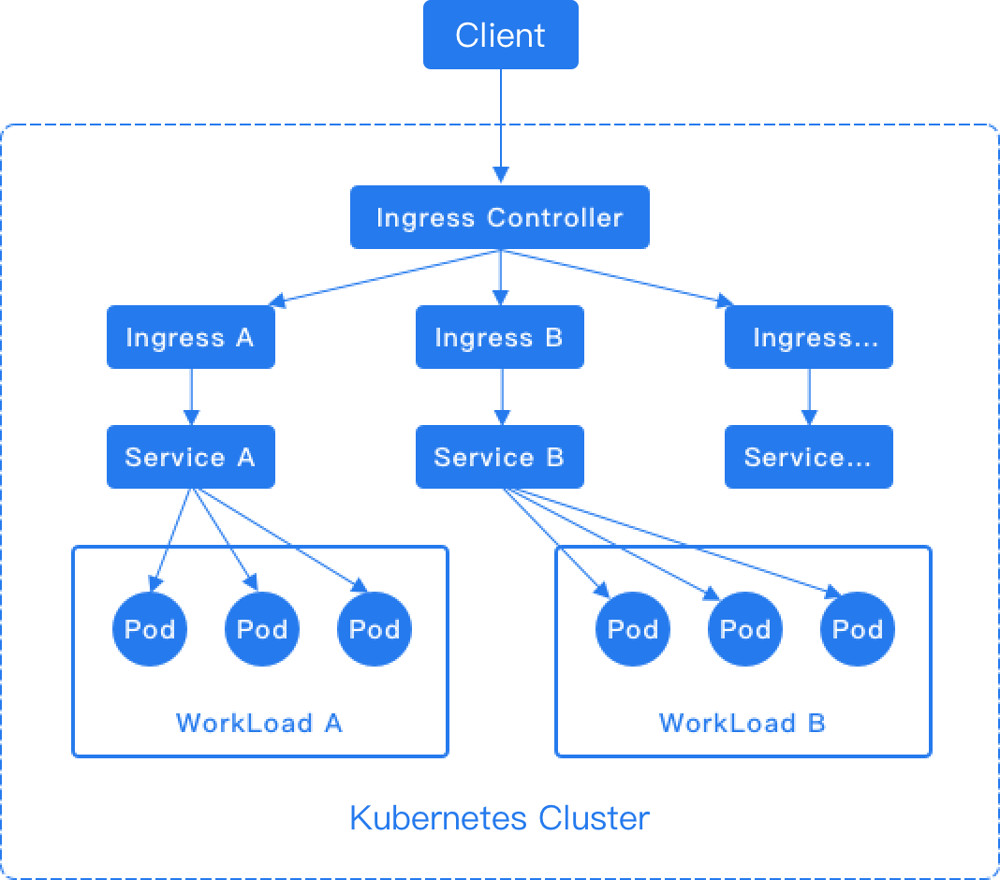

# Configure Ingresses

Ingress rules (Kubernetes Ingress) expose HTTP/HTTPS routes from outside the cluster to internal routing (Kubernetes Service), enabling control of external access to computing components.

Create an Ingress to manage the external HTTP/HTTPS access to a Service.

:::warning
When creating multiple ingresses within the same namespace, different ingresses **MUST NOT** have the same
**Domain**, **Protocol**, and **Path** (i.e., duplicate access points are not allowed).
:::

## Implementation Method

Ingress rules depend on the implementation of the Ingress Controller, which is responsible for listening to changes in Ingress and Service. After a new Ingress is created, when the Ingress Controller receives a request, it matches the forwarding rule from the Ingress and distributes the traffic to the specified internal routes, as shown in the diagram below.



:::note
For the HTTP protocol, Ingress only supports the 80 port as the external port. For the HTTPS protocol, Ingress only supports the 443 port as the external port. The platform's load balancer will automatically add the 80 and 443 listening ports.
:::

- [Install ingress-nginx as ingress-controller via ingress-nginx-operator](../../../networking/operators/ingress_nginx_operator.mdx)
- [Install alb as ingress-controller via alb-operator](../../../networking/operators/alb_operator.mdx)

## Example Ingress:

```yaml
# nginx-ingress.yaml
apiVersion: networking.k8s.io/v1
kind: Ingress
metadata:
  name: nginx-ingress
  namespace: k-1
  annotations:
    nginx.ingress.kubernetes.io/rewrite-target: / # [!code callout]
spec:
  ingressClassName: nginx # [!code callout]
  rules:
    - host: demo.local # [!code callout]
      http:
        paths:
          - path: /
            pathType: Prefix
            backend:
              service:
                name: nginx-service
                port:
                  number: 80
```

<Callouts>

1. To see more configurations please refer to
   [nginx-configuration](https://kubernetes.github.io/ingress-nginx/user-guide/nginx-configuration/annotations/).
2. `nginx` to using `ingress-nginx` controller, `$alb_name` to use alb as ingress controller.
3. If you only want to run ingress locally, configure the `hosts` beforehand.

</Callouts>
## Creating a Ingress by using the web console

1. Access the **Container Platform**.

2. In the left navigation bar, click **Network** > **Ingress**.

3. Click **Create Ingress**.

4. Reference the instructions below to configure certain parameters.

   | Parameter                   | Description                                                                                                                                                                                                                                                                                                               |
   | --------------------------- | ------------------------------------------------------------------------------------------------------------------------------------------------------------------------------------------------------------------------------------------------------------------------------------------------------------------------- |
   | **Ingress Class**           | Ingresses can be implemented by different controllers with different `IngressClass` name. If multiple ingress controllers are available on the platform, the user can select which one to use with this option.                                                                                                           |
   | **Domain Name**             | Hosts can be precise matches (for example `foo.bar.com`) or a wildcard (for example `*.foo.com`). The domain names available are allocated by platform administrator.                                                                                                                                                     |
   | **Certificates**            | TLS secret or Certificates allocated by platform administrator.                                                                                                                                                                                                                                                           |
   | **Match Type** and **Path** | <ul><li>**Prefix**: Matches path prefixes, e.g., `/abcd` can match `/abcd/efg` or `/abcde`.</li><li>**Exact**: Matches exact paths, e.g., `/abcd`.</li><li>**Implementation specific**: If you are using a custom Ingress controller to manage the Ingress rules, you may choose to have the controller decide.</li></ul> |
   | **Service**                 | External traffic will be forwarded to this Service.                                                                                                                                                                                                                                                                       |
   | **Service Port**            | Specify which Service port the traffic will be forwarded to.                                                                                                                                                                                                                                                              |

5. Click **Create**.

## Creating a Ingress by using the CLI

```shell
kubectl apply -f nginx-ingress.yaml
```
