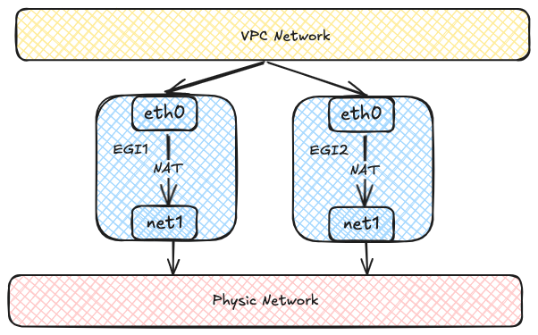
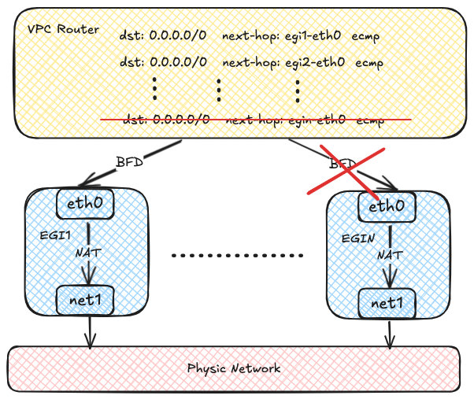

# Configure Egress Gateway

## About Egress Gateway

Egress Gateway is used to control external network access for Pods with a group of static addresses and has the following features:

- Achieves Active-Active high availability through ECMP, enabling horizontal throughput scaling
- Implements fast failover \(\<1s\) via BFD
- Supports IPv6 and dual-stack
- Enables granular routing control through NamespaceSelector and PodSelector
- Allows flexible scheduling of Egress Gateway through NodeSelector

At the same time, Egress Gateway has the following limitations:

- Uses macvlan for underlying network connectivity, requiring Underlay support from the underlying network
- In multi-instance Gateway mode, multiple Egress IPs are required
- Currently, only supports SNAT; EIP and DNAT are not supported
- Currently, recording source address translation relationships is not supported

### Implementation Details

Each Egress Gateway consists of multiple Pods with multiple network interfaces.
Each Pod has two network interfaces: one joins the virtual network for communication within the VPC,
and the other connects to the underlying physical network via Macvlan for external network communication.
Virtual network traffic ultimately accesses the external network through NAT within the Egress Gateway instances.



Each Egress Gateway instance registers its address in the OVN routing table.
When a Pod within the VPC needs to access the external network,
OVN uses source address hashing to forward traffic to multiple Egress Gateway instance addresses,
achieving load balancing. As the number of Egress Gateway instances increases,
throughput can also scale horizontally.


OVN uses the BFD protocol to probe multiple Egress Gateway instances.
When an Egress Gateway instance fails, OVN marks the corresponding route as unavailable,
enabling rapid failure detection and recovery.



## Notes

- Only Kube-OVN CNI supports Egress Gateway.
- Egress Gateway requires Multus-CNI.

## Usage

### Creating a Network Attachment Definition

Egress Gateway uses multiple NICs to access both the internal network and the external network,
so you need to create a Network Attachment Definition to connect to the external network.
An example of using the macvlan plugin with IPAM provided by Kube-OVN is shown below:

```yaml
apiVersion: k8s.cni.cncf.io/v1
kind: NetworkAttachmentDefinition
metadata:
  name: eth1
  namespace: default
spec:
  config: '{
      "cniVersion": "0.3.0",
      "type": "macvlan", [!code callout]
      "master": "eth1",
      "mode": "bridge",
      "ipam": {
        "type": "kube-ovn",
        "server_socket": "/run/openvswitch/kube-ovn-daemon.sock", [!code callout]
        "provider": "eth1.default"
      }
    }'
---
apiVersion: kubeovn.io/v1
kind: Subnet
metadata:
  name: macvlan1
spec:
  protocol: IPv4
  provider: eth1.default # [!code callout]
  cidrBlock: 172.17.0.0/16
  gateway: 172.17.0.1
  excludeIps:
    - 172.17.0.2..172.17.0.10
```

<Callouts>

1. Host interface that connects to the external network.
2. Provider name with a format of `<network attachment definition name>.<namespace>`.
3. Provider name used to identify the external network and MUST be consistent with the one in the NetworkAttachmentDefinition.

</Callouts>

:::info
You can create a Network Attachment Definition with any CNI plugin to access the corresponding network.
:::

### Creating a VPC Egress Gateway

Create a VPC Egress Gateway resource as shown in the example below:

```yaml
apiVersion: kubeovn.io/v1
kind: VpcEgressGateway
metadata:
  name: gateway1
  namespace: default # [!code callout]
spec:
  replicas: 1 # [!code callout]
  externalSubnet: macvlan1 # [!code callout]
  nodeSelector: # [!code callout]
    - matchExpressions:
        - key: kubernetes.io/hostname
          operator: In
          values:
            - kube-ovn-worker
            - kube-ovn-worker2
  selectors: # [!code callout]
    - namespaceSelector:
        matchLabels:
          kubernetes.io/metadata.name: default
  policies: # [!code callout]
    - snat: true # [!code callout]
      subnets: # [!code callout]
        - subnet1
    - snat: false
      ipBlocks: # [!code callout]
        - 10.18.0.0/16
```

<Callouts>

1. Namespace where the VPC Egress Gateway instances is created.
2. Replicas of the VPC Egress Gateway instances.
3. External subnet that connects to the external network.
4. Node selectors to which the VPC Egress Gateway applies.
5. Namespace and Pod selectors to which the VPC Egress Gateway applies.
6. Policies for the VPC Egress Gateway, including SNAT and subnets/ipBlocks to be applied.
7. Whether to enable SNAT for the policy.
8. Subnets to which the policy applies.
9. IP blocks to which the policy applies.

</Callouts>

The above resource creates a VPC Egress Gateway named *gateway1* under the default namespace,
and the following Pods will access the external network via the *macvlan1* subnet:

- Pods in the default namespace.
- Pods under the *subnet1* subnet.
- Pods with IPs in the CIDR *10.18.0.0/16*.

:::info
Pods matching *.spec.selectors* will access the external network with SNAT always enabled.
:::

After the creation is complete, check out the VPC Egress Gateway resource:

```shell
$ kubectl get veg gateway1
NAME       VPC           REPLICAS   BFD ENABLED   EXTERNAL SUBNET   PHASE       READY   AGE
gateway1   ovn-cluster   1          false         macvlan1          Completed   true    13s
```

To view more informations:

```shell
kubectl get veg gateway1 -o wide
NAME       VPC           REPLICAS   BFD ENABLED   EXTERNAL SUBNET   PHASE       READY   INTERNAL IPS     EXTERNAL IPS      WORKING NODES         AGE
gateway1   ovn-cluster   1          false         macvlan1          Completed   true    ["10.16.0.12"]   ["172.17.0.11"]   ["kube-ovn-worker"]   82s
```

To view the workload:

```shell
$ kubectl get deployment -l ovn.kubernetes.io/vpc-egress-gateway=gateway1
NAME       READY   UP-TO-DATE   AVAILABLE   AGE
gateway1   1/1     1            1           4m40s

$ kubectl get pod -l ovn.kubernetes.io/vpc-egress-gateway=gateway1 -o wide
NAME                       READY   STATUS    RESTARTS   AGE     IP           NODE              NOMINATED NODE   READINESS GATES
gateway1-b9f8b4448-76lhm   1/1     Running   0          4m48s   10.16.0.12   kube-ovn-worker   <none>           <none>
```

To view IP addresses, routes, and iptables rules in the Pod:

```shell
$ kubectl exec gateway1-b9f8b4448-76lhm -c gateway -- ip address show
1: lo: <LOOPBACK,UP,LOWER_UP> mtu 65536 qdisc noqueue state UNKNOWN group default qlen 1000
    link/loopback 00:00:00:00:00:00 brd 00:00:00:00:00:00
    inet 127.0.0.1/8 scope host lo
       valid_lft forever preferred_lft forever
    inet6 ::1/128 scope host
       valid_lft forever preferred_lft forever
2: net1@if13: <BROADCAST,MULTICAST,UP,LOWER_UP> mtu 1500 qdisc noqueue state UP group default qlen 1000
    link/ether 62:d8:71:90:7b:86 brd ff:ff:ff:ff:ff:ff link-netnsid 0
    inet 172.17.0.11/16 brd 172.17.255.255 scope global net1
       valid_lft forever preferred_lft forever
    inet6 fe80::60d8:71ff:fe90:7b86/64 scope link
       valid_lft forever preferred_lft forever
17: eth0@if18: <BROADCAST,MULTICAST,UP,LOWER_UP> mtu 1400 qdisc noqueue state UP group default
    link/ether 36:7c:6b:c7:82:6b brd ff:ff:ff:ff:ff:ff link-netnsid 0
    inet 10.16.0.12/16 brd 10.16.255.255 scope global eth0
       valid_lft forever preferred_lft forever
    inet6 fe80::347c:6bff:fec7:826b/64 scope link
       valid_lft forever preferred_lft forever

$ kubectl exec gateway1-b9f8b4448-76lhm -c gateway -- ip rule show
0:      from all lookup local
1001:   from all iif eth0 lookup default
1002:   from all iif net1 lookup 1000
1003:   from 10.16.0.12 iif lo lookup 1000
1004:   from 172.17.0.11 iif lo lookup default
32766:  from all lookup main
32767:  from all lookup default

$ kubectl exec gateway1-b9f8b4448-76lhm -c gateway -- ip route show
default via 172.17.0.1 dev net1
10.16.0.0/16 dev eth0 proto kernel scope link src 10.16.0.12
10.17.0.0/16 via 10.16.0.1 dev eth0
10.18.0.0/16 via 10.16.0.1 dev eth0
172.17.0.0/16 dev net1 proto kernel scope link src 172.17.0.11

$ kubectl exec gateway1-b9f8b4448-76lhm -c gateway -- ip route show table 1000
default via 10.16.0.1 dev eth0

$ kubectl exec gateway1-b9f8b4448-76lhm -c gateway -- iptables -t nat -S
-P PREROUTING ACCEPT
-P INPUT ACCEPT
-P OUTPUT ACCEPT
-P POSTROUTING ACCEPT
-N VEG-MASQUERADE
-A PREROUTING -i eth0 -j MARK --set-xmark 0x4000/0x4000
-A POSTROUTING -d 10.18.0.0/16 -j RETURN
-A POSTROUTING -s 10.18.0.0/16 -j RETURN
-A POSTROUTING -j VEG-MASQUERADE
-A VEG-MASQUERADE -j MARK --set-xmark 0x0/0xffffffff
-A VEG-MASQUERADE -j MASQUERADE --random-fully
```

Capture packets in the Gateway Pod to verify network traffic:

```shell
$ kubectl exec -ti gateway1-b9f8b4448-76lhm -c gateway -- bash
nobody@gateway1-b9f8b4448-76lhm:/kube-ovn$ tcpdump -i any -nnve icmp and host 172.17.0.1
tcpdump: data link type LINUX_SLL2
tcpdump: listening on any, link-type LINUX_SLL2 (Linux cooked v2), snapshot length 262144 bytes
06:50:58.936528 eth0  In  ifindex 17 92:26:b8:9e:f2:1c ethertype IPv4 (0x0800), length 104: (tos 0x0, ttl 63, id 30481, offset 0, flags [DF], proto ICMP (1), length 84)
    10.17.0.9 > 172.17.0.1: ICMP echo request, id 37989, seq 0, length 64
06:50:58.936574 net1  Out ifindex 2 62:d8:71:90:7b:86 ethertype IPv4 (0x0800), length 104: (tos 0x0, ttl 62, id 30481, offset 0, flags [DF], proto ICMP (1), length 84)
    172.17.0.11 > 172.17.0.1: ICMP echo request, id 39449, seq 0, length 64
06:50:58.936613 net1  In  ifindex 2 02:42:39:79:7f:08 ethertype IPv4 (0x0800), length 104: (tos 0x0, ttl 64, id 26701, offset 0, flags [none], proto ICMP (1), length 84)
    172.17.0.1 > 172.17.0.11: ICMP echo reply, id 39449, seq 0, length 64
06:50:58.936621 eth0  Out ifindex 17 36:7c:6b:c7:82:6b ethertype IPv4 (0x0800), length 104: (tos 0x0, ttl 63, id 26701, offset 0, flags [none], proto ICMP (1), length 84)
    172.17.0.1 > 10.17.0.9: ICMP echo reply, id 37989, seq 0, length 64
```

Routing policies are automatically created on the OVN Logical Router:

```shell
$ kubectl ko nbctl lr-policy-list ovn-cluster
Routing Policies
     31000                            ip4.dst == 10.16.0.0/16   allow
     31000                            ip4.dst == 10.17.0.0/16   allow
     31000                           ip4.dst == 100.64.0.0/16   allow
     30000                              ip4.dst == 172.18.0.2  reroute  100.64.0.4
     30000                              ip4.dst == 172.18.0.3  reroute  100.64.0.3
     30000                              ip4.dst == 172.18.0.4  reroute  100.64.0.2
     29100                  ip4.src == $VEG.8ca38ae7da18.ipv4  reroute  10.16.0.12 # [!code callout]
     29100                   ip4.src == $VEG.8ca38ae7da18_ip4  reroute  10.16.0.12 # [!code callout]
     29000 ip4.src == $ovn.default.kube.ovn.control.plane_ip4  reroute  100.64.0.3
     29000       ip4.src == $ovn.default.kube.ovn.worker2_ip4  reroute  100.64.0.2
     29000        ip4.src == $ovn.default.kube.ovn.worker_ip4  reroute  100.64.0.4
     29000     ip4.src == $subnet1.kube.ovn.control.plane_ip4  reroute  100.64.0.3
     29000           ip4.src == $subnet1.kube.ovn.worker2_ip4  reroute  100.64.0.2
     29000            ip4.src == $subnet1.kube.ovn.worker_ip4  reroute  100.64.0.4
```

<Callouts>

1. Logical Router Policy used by the VPC Egress Gateway to forward traffic from the Pods specified by *.spec.policies*.
2. Logical Router Policy used by the VPC Egress Gateway to forward traffic from the Pods specified by *.spec.selectors*.

</Callouts>

If you need to enable load balancing, modify *.spec.replicas* as shown in the following example:

```shell
$ kubectl scale veg gateway1 --replicas=2
vpcegressgateway.kubeovn.io/gateway1 scaled

$ kubectl get veg gateway1
NAME       VPC           REPLICAS   BFD ENABLED   EXTERNAL SUBNET   PHASE       READY   AGE
gateway1   ovn-cluster   2          false         macvlan           Completed   true    39m

$ kubectl get pod -l ovn.kubernetes.io/vpc-egress-gateway=gateway1 -o wide
NAME                       READY   STATUS    RESTARTS   AGE   IP           NODE               NOMINATED NODE   READINESS GATES
gateway1-b9f8b4448-76lhm   1/1     Running   0          40m   10.16.0.12   kube-ovn-worker    <none>           <none>
gateway1-b9f8b4448-zd4dl   1/1     Running   0          64s   10.16.0.13   kube-ovn-worker2   <none>           <none>

$ kubectl ko nbctl lr-policy-list ovn-cluster
Routing Policies
     31000                            ip4.dst == 10.16.0.0/16    allow
     31000                            ip4.dst == 10.17.0.0/16    allow
     31000                           ip4.dst == 100.64.0.0/16    allow
     30000                              ip4.dst == 172.18.0.2  reroute  100.64.0.4
     30000                              ip4.dst == 172.18.0.3  reroute  100.64.0.3
     30000                              ip4.dst == 172.18.0.4  reroute  100.64.0.2
     29100                  ip4.src == $VEG.8ca38ae7da18.ipv4  reroute  10.16.0.12, 10.16.0.13
     29100                   ip4.src == $VEG.8ca38ae7da18_ip4  reroute  10.16.0.12, 10.16.0.13
     29000 ip4.src == $ovn.default.kube.ovn.control.plane_ip4  reroute  100.64.0.3
     29000       ip4.src == $ovn.default.kube.ovn.worker2_ip4  reroute  100.64.0.2
     29000        ip4.src == $ovn.default.kube.ovn.worker_ip4  reroute  100.64.0.4
     29000     ip4.src == $subnet1.kube.ovn.control.plane_ip4  reroute  100.64.0.3
     29000           ip4.src == $subnet1.kube.ovn.worker2_ip4  reroute  100.64.0.2
     29000            ip4.src == $subnet1.kube.ovn.worker_ip4  reroute  100.64.0.4
```

### Enabling BFD-based High Availability

BFD-based high availability relies on the VPC BFD LRP function,
so you need to modify the VPC resource to enable BFD Port.
Here is an example to enable BFD Port for the default VPC:

```yaml
apiVersion: kubeovn.io/v1
kind: Vpc
metadata:
  name: ovn-cluster
spec:
  bfdPort:
    enabled: true # [!code callout]
    ip: 10.255.255.255 # [!code callout]
    nodeSelector: # [!code callout]
      matchLabels:
        kubernetes.io/os: linux
```

<Callouts>

1. Whether to enable the BFD Port.
2. IP address of the BFD Port, which MUST be a valid IP address that does not conflict with ANY other IPs/Subnets.
3. Node selector used to select the nodes where the BFD Port is running in Active-Backup mode.

</Callouts>

After the BFD Port is enabled, an LRP dedicated to BFD is automatically created on the corresponding OVN Logical Router:

```shell
$ kubectl ko nbctl show ovn-cluster
router 0c1d1e8f-4c86-4d96-88b2-c4171c7ff824 (ovn-cluster)
    port bfd@ovn-cluster # [!code callout]
        mac: "8e:51:4b:16:3c:90"
        networks: ["10.255.255.255"]
    port ovn-cluster-join
        mac: "d2:21:17:71:77:70"
        networks: ["100.64.0.1/16"]
    port ovn-cluster-ovn-default
        mac: "d6:a3:f5:31:cd:89"
        networks: ["10.16.0.1/16"]
    port ovn-cluster-subnet1
        mac: "4a:09:aa:96:bb:f5"
        networks: ["10.17.0.1/16"]
```

<Callouts>

1. BFD Port created on the OVN Logical Router.

</Callouts>

After that, set *.spec.bfd.enabled* to *true* in VPC Egress Gateway. An example is shown below:

```shell
apiVersion: kubeovn.io/v1
kind: VpcEgressGateway
metadata:
  name: gateway2
  namespace: default
spec:
  vpc: ovn-cluster # [!code callout]
  replicas: 2
  internalSubnet: ovn-default # [!code callout]
  externalSubnet: macvlan1 # [!code callout]
  bfd:
    enabled: true # [!code callout]
    minRX: 100 # [!code callout]
    minTX: 100 # [!code callout]
    multiplier: 5 # [!code callout]
  policies:
    - snat: true
      ipBlocks:
        - 10.18.0.0/16
```

<Callouts>

1. VPC to which the Egress Gateway belongs.
2. Internal subnet to which the Egress Gateway instances are connected.
3. External subnet to which the Egress Gateway instances are connected.
4. Whether to enable BFD for the Egress Gateway.
5. Minimum receive interval for BFD, in milliseconds.
6. Minimum transmit interval for BFD, in milliseconds.
7. Multiplier for BFD, which determines the number of missed packets before declaring a failure.

</Callouts>

To view VPC Egress Gateway information:

```shell
$ kubectl get veg gateway2 -o wide
NAME       VPC    REPLICAS   BFD ENABLED   EXTERNAL SUBNET   PHASE       READY   INTERNAL IPS                    EXTERNAL IPS                    WORKING NODES                            AGE
gateway2   vpc1   2          true          macvlan           Completed   true    ["10.16.0.102","10.16.0.103"]   ["172.17.0.13","172.17.0.14"]   ["kube-ovn-worker","kube-ovn-worker2"]   58s

$ kubectl get pod -l ovn.kubernetes.io/vpc-egress-gateway=gateway2 -o wide
NAME                       READY   STATUS    RESTARTS   AGE     IP            NODE               NOMINATED NODE   READINESS GATES
gateway2-fcc6b8b87-8lgvx   1/1     Running   0          2m18s   10.16.0.103   kube-ovn-worker2   <none>           <none>
gateway2-fcc6b8b87-wmww6   1/1     Running   0          2m18s   10.16.0.102   kube-ovn-worker    <none>           <none>

$ kubectl ko nbctl lr-policy-list ovn-cluster
Routing Policies
     31000                            ip4.dst == 10.16.0.0/16    allow
     31000                            ip4.dst == 10.17.0.0/16    allow
     31000                           ip4.dst == 100.64.0.0/16    allow
     30000                              ip4.dst == 172.18.0.2  reroute  100.64.0.4
     30000                              ip4.dst == 172.18.0.3  reroute  100.64.0.3
     30000                              ip4.dst == 172.18.0.4  reroute  100.64.0.2
     29100                  ip4.src == $VEG.8ca38ae7da18.ipv4  reroute  10.16.0.102, 10.16.0.103  bfd
     29100                   ip4.src == $VEG.8ca38ae7da18_ip4  reroute  10.16.0.102, 10.16.0.103  bfd
     29090                  ip4.src == $VEG.8ca38ae7da18.ipv4     drop
     29090                   ip4.src == $VEG.8ca38ae7da18_ip4     drop
     29000 ip4.src == $ovn.default.kube.ovn.control.plane_ip4  reroute  100.64.0.3
     29000       ip4.src == $ovn.default.kube.ovn.worker2_ip4  reroute  100.64.0.2
     29000        ip4.src == $ovn.default.kube.ovn.worker_ip4  reroute  100.64.0.4
     29000     ip4.src == $subnet1.kube.ovn.control.plane_ip4  reroute  100.64.0.3
     29000           ip4.src == $subnet1.kube.ovn.worker2_ip4  reroute  100.64.0.2
     29000            ip4.src == $subnet1.kube.ovn.worker_ip4  reroute  100.64.0.4

$ kubectl ko nbctl list bfd
_uuid               : 223ede10-9169-4c7d-9524-a546e24bfab5
detect_mult         : 5
dst_ip              : "10.16.0.102"
external_ids        : {af="4", vendor=kube-ovn, vpc-egress-gateway="default/gateway2"}
logical_port        : "bfd@ovn-cluster"
min_rx              : 100
min_tx              : 100
options             : {}
status              : up

_uuid               : b050c75e-2462-470b-b89c-7bd38889b758
detect_mult         : 5
dst_ip              : "10.16.0.103"
external_ids        : {af="4", vendor=kube-ovn, vpc-egress-gateway="default/gateway2"}
logical_port        : "bfd@ovn-cluster"
min_rx              : 100
min_tx              : 100
options             : {}
status              : up
```

To view BFD connections:

```shell
$ kubectl exec gateway2-fcc6b8b87-8lgvx -c bfdd -- bfdd-control status
There are 1 sessions:
Session 1
 id=1 local=10.16.0.103 (p) remote=10.255.255.255 state=Up

$ kubectl exec gateway2-fcc6b8b87-wmww6 -c bfdd -- bfdd-control status
There are 1 sessions:
Session 1
 id=1 local=10.16.0.102 (p) remote=10.255.255.255 state=Up
```

:::info
If all the gateway instances are down, egress traffic to which the VPC Egress Gateway is applied will be dropped.
:::

## Configuration Parameters

#### VPC BFD Port

<table>
  <thead>
    <tr>
      <th colSpan={2}>Fields</th>
      <th>Type</th>
      <th>Optional</th>
      <th>Default Value</th>
      <th colSpan={2}>Description</th>
      <th>Examples</th>
    </tr>
  </thead>
  <tbody>
    <tr>
      <td colSpan={2}>enabled</td>
      <td>boolean</td>
      <td>Yes</td>
      <td>false</td>
      <td colSpan={2}>Whether to enable the BFD Port.</td>
      <td>true</td>
    </tr>
    <tr>
      <td colSpan={2} rowSpan={3}>ip</td>
      <td rowSpan={3}>string</td>
      <td rowSpan={3}>No</td>
      <td rowSpan={3}>-</td>
      <td colSpan={2} rowSpan={3}>The IP address used by the BFD Port.<br/>Must NOT conflict with other addresses. IPv4, IPv6 and dual-stack are supported.</td>
      <td>169.255.255.255</td>
    </tr>
    <tr>
      <td>fdff::1</td>
    </tr>
    <tr>
      <td>169.255.255.255,fdff::1</td>
    </tr>
    <tr>
      <td rowSpan={2}>nodeSelector</td>
      <td>matchLabels</td>
      <td>object</td>
      <td>Yes</td>
      <td>-</td>
      <td rowSpan={2}>Label selectors used to select nodes that carries the BFD Port work.<br/>The BFD Port binds an OVN HA Chassis Group of selected nodes and works in Active/Backup mode.<br/>If this field is not specified, Kube-OVN automatically selects up to three nodes.<br/>You can view all OVN HA Chassis Group resources by executing *kubectl ko nbctl list ha_chassis_group*.</td>
      <td>A map of \{key,value\} pairs.</td>
      <td>-</td>
    </tr>
    <tr>
      <td>matchExpressions</td>
      <td>object array</td>
      <td>Yes</td>
      <td>-</td>
      <td>A list of label selector requirements. The requirements are ANDed.</td>
      <td>-</td>
    </tr>
  </tbody>
</table>

#### VPC Egress Gateway

<table>
  <thead>
    <tr>
      <th colSpan={3}>Fields</th>
      <th>Type</th>
      <th>Optional</th>
      <th>Default Value</th>
      <th colSpan={3}>Description</th>
      <th>Examples</th>
    </tr>
  </thead>
  <tbody>
    <tr>
      <td colSpan={3}>vpc</td>
      <td>string</td>
      <td>Yes</td>
      <td>Name of the default VPC (ovn-cluster)</td>
      <td colSpan={3}>VPC name.</td>
      <td>vpc1</td>
    </tr>
    <tr>
      <td colSpan={3}>replicas</td>
      <td>integer/int32</td>
      <td>Yes</td>
      <td>1</td>
      <td colSpan={3}>Replicas.</td>
      <td>2</td>
    </tr>
    <tr>
      <td colSpan={3}>prefix</td>
      <td>string</td>
      <td>Yes</td>
      <td>-</td>
      <td colSpan={3}>Immutable prefix of the workload deployment name.</td>
      <td>veg-</td>
    </tr>
    <tr>
      <td colSpan={3}>image</td>
      <td>string</td>
      <td>Yes</td>
      <td>-</td>
      <td colSpan={3}>The image used by the workload deployment.</td>
      <td>docker.io/kubeovn/kube-ovn:v1.14.0-debug</td>
    </tr>
    <tr>
      <td colSpan={3}>internalSubnet</td>
      <td rowSpan={2}>string</td>
      <td>Yes</td>
      <td>Name of the default subnet within the VPC.</td>
      <td colSpan={3} rowSpan={2}>Name of the subnet used to access the internal/external network.</td>
      <td>subnet1</td>
    </tr>
    <tr>
      <td colSpan={3}>externalSubnet</td>
      <td>No</td>
      <td>-</td>
      <td>ext1</td>
    </tr>
    <tr>
      <td colSpan={3}>internalIPs</td>
      <td rowSpan={2}>string array</td>
      <td rowSpan={2}>Yes</td>
      <td rowSpan={2}>-</td>
      <td colSpan={3} rowSpan={2}>
        IP addresses used for accessing the internal/external network. IPv4, IPv6 and dual-stack are supported.<br/>
        The number of IPs specified must NOT be less than *replicas*.<br/>
        It is recommended to set the number to *\<replicas\> + 1* to avoid extreme cases where the Pod is not created properly.
      </td>
      <td rowSpan={2} style={{overflow: "hidden", position: "relative"}}>
        <div style={{height: "100%", width: "100%", position: "absolute", right: 0, top: 0}}>
          <div style={{height: "33%", border: "0", paddingTop: ".5rem", paddingBottom: ".5rem", paddingLeft: "1rem", paddingRight: "1rem"}}>10.16.0.101</div>
          <hr style={{height: 0, margin: 0, backgroundColor: "var(--rp-c-bg)", borderColor: "var(--rp-c-divider)", borderWidth: "1px"}}/>
          <div style={{height: "33%", border: "0", paddingTop: ".5rem", paddingBottom: ".5rem", paddingLeft: "1rem", paddingRight: "1rem"}}>fdff::1</div>
          <hr style={{height: 0, margin: 0, backgroundColor: "var(--rp-c-bg)", borderColor: "var(--rp-c-divider)", borderWidth: "1px"}}/>
          <div style={{height: "33%", border: "0", paddingTop: ".5rem", paddingBottom: ".5rem", paddingLeft: "1rem", paddingRight: "1rem"}}>169.255.255.255,fdff::1</div>
        </div>
      </td>
    </tr>
    <tr>
      <td colSpan={3}>externalIPs</td>
    </tr>
    <tr>
      <td rowSpan={4}>bfd</td>
      <td colSpan={2}>enabled</td>
      <td>boolean</td>
      <td>Yes</td>
      <td>false</td>
      <td rowSpan={4}>BFD Configuration.</td>
      <td colSpan={2}>Whether to enable BFD for the Egress Gateway.</td>
      <td>-</td>
    </tr>
    <tr>
      <td colSpan={2}>minRX</td>
      <td rowSpan={2}>integer/int32</td>
      <td rowSpan={2}>Yes</td>
      <td rowSpan={2}>1000</td>
      <td colSpan={2} rowSpan={2}>BFD minRX/minTX in milliseconds.</td>
      <td rowSpan={2}>500</td>
    </tr>
    <tr>
      <td colSpan={2}>minTX</td>
    </tr>
    <tr>
      <td colSpan={2}>multiplier</td>
      <td>integer/int32</td>
      <td>Yes</td>
      <td>3</td>
      <td colSpan={2}>BFD multiplier.</td>
      <td>1</td>
    </tr>
    <tr>
      <td rowSpan={6}>policies</td>
      <td colSpan={2}>snat</td>
      <td>boolean</td>
      <td>Yes</td>
      <td>false</td>
      <td rowSpan={6}>Egress policies.</td>
      <td colSpan={2}>Whether to enable SNAT/MASQUERADE.</td>
      <td>true</td>
    </tr>
    <tr>
      <td colSpan={2} rowSpan={4}>ipBlocks</td>
      <td rowSpan={4}>string array</td>
      <td rowSpan={4}>Yes</td>
      <td rowSpan={4}>-</td>
      <td colSpan={2} rowSpan={4}>
        IP range segments to which the gateway is applied.<br/>
        Both IPv4 and IPv6 are supported.
      </td>
      <td>192.168.0.1</td>
    </tr>
    <tr>
      <td>192.168.0.0/24</td>
    </tr>
    <tr>
      <td>fd00::1</td>
    </tr>
    <tr>
      <td>fd00::/120</td>
    </tr>
    <tr>
      <td colSpan={2}>subnets</td>
      <td>string array</td>
      <td>Yes</td>
      <td>-</td>
      <td colSpan={2}>
        The VPC subnet name to which the gateway is applied.<br/>
        IPv4, IPv6 and dual-stack subnets are supported.
      </td>
      <td>subnet1</td>
    </tr>
    <tr>
      <td rowSpan={4}>selectors</td>
      <td rowSpan={2}>namespaceSelector</td>
      <td>matchLabels</td>
      <td>object</td>
      <td>Yes</td>
      <td>-</td>
      <td rowSpan={4}>
        Configure Egress policies by namespace selectors and Pod selectors.<br/>
        SNAT/MASQUERADE will be applied to the matched Pods.
      </td>
      <td rowSpan={2}>
        Namespace selector. An empty label selector matches all namespaces.
      </td>
      <td>A map of \{key,value\} pairs.</td>
      <td>-</td>
    </tr>
    <tr>
      <td>matchExpressions</td>
      <td>object array</td>
      <td>Yes</td>
      <td>-</td>
      <td>A list of label selector requirements. The requirements are ANDed.</td>
      <td>-</td>
    </tr>
    <tr>
      <td rowSpan={2}>podSelector</td>
      <td>matchLabels</td>
      <td>object</td>
      <td>Yes</td>
      <td>-</td>
      <td rowSpan={2}>
        Pod selector. An empty label selector matches all Pods.
      </td>
      <td>A map of \{key,value\} pairs.</td>
      <td>-</td>
    </tr>
    <tr>
      <td>matchExpressions</td>
      <td>object array</td>
      <td>Yes</td>
      <td>-</td>
      <td>A list of label selector requirements. The requirements are ANDed.</td>
      <td>-</td>
    </tr>
    <tr>
      <td rowSpan={3}>nodeSelector</td>
      <td colSpan={2}>matchLabels</td>
      <td>object</td>
      <td>Yes</td>
      <td>-</td>
      <td rowSpan={3}>
        Node selector used to select nodes that carries the workload deployment.<br/>
        The workload \(Deployment/Pod\) will run on the selected nodes.
      </td>
      <td colSpan={2}>A map of \{key,value\} pairs.</td>
      <td>-</td>
    </tr>
    <tr>
      <td colSpan={2}>matchExpressions</td>
      <td>object array</td>
      <td>Yes</td>
      <td>-</td>
      <td colSpan={2}>A list of label selector requirements. The requirements are ANDed.</td>
      <td>-</td>
    </tr>
    <tr>
      <td colSpan={2}>matchFields</td>
      <td>object array</td>
      <td>Yes</td>
      <td>-</td>
      <td colSpan={2}>A list of field selector requirements. The requirements are ANDed.</td>
      <td>-</td>
    </tr>
    <tr>
      <td colSpan={3}>trafficPolicy</td>
      <td>string</td>
      <td>Yes</td>
      <td>Cluster</td>
      <td colSpan={3}>
        **Effective only when BFD is enabled**.<br/>
        Available values: *Cluster*\/*Local*.<br/>
        When set to *Local*, Egress traffic will be redirected to the VPC Egress Gateway instance running on the same node if available.<br/>
        If the instance is down, Egress traffic will be redirected to other instances.
      </td>
      <td>Local</td>
    </tr>
  </tbody>
</table>

## Additional resources

- [Egress Gateway - Kube-OVN Document](https://kubeovn.github.io/docs/v1.14.x/en/vpc/vpc-egress-gateway/)
- [RFC 5880 - Bidirectional Forwarding Detection \(BFD\)](https://datatracker.ietf.org/doc/rfc5880/)
