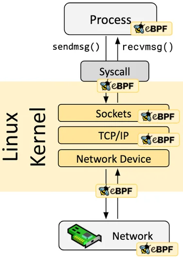
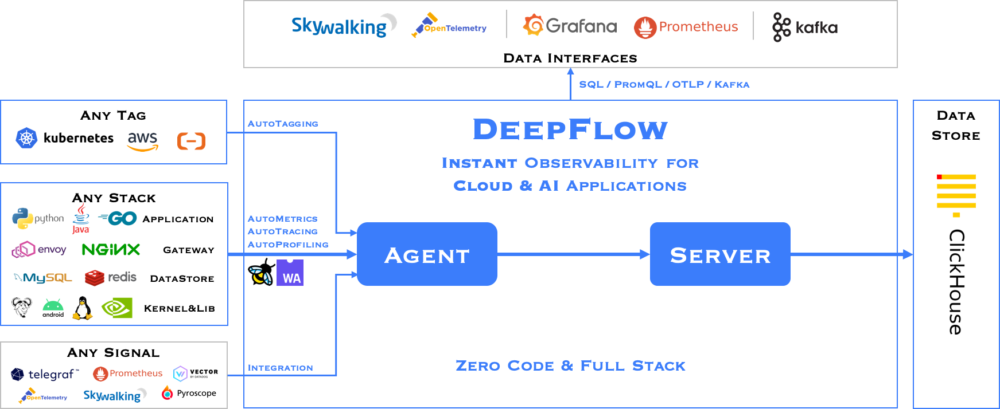

# Network Observability

## About DeepFlow

### What is DeepFlow

The DeepFlow open-source project aims to provide deep observability for complex cloud-native and AI applications.
DeepFlow implemented Zero Code data collection with eBPF for metrics, distributed tracing,
request logs and function profiling, and is further integrated with SmartEncoding to achieve Full Stack correlation
and efficient access to all observability data. With DeepFlow, cloud-native and AI applications automatically gain deep observability,
removing the heavy burden of developers continually instrumenting code and providing monitoring and diagnostic capabilities covering everything
from code to infrastructure for DevOps/SRE teams.

### Using eBPF Technology

Assuming you have a basic understanding of eBPF, it is a secure and efficient technology for extending kernel functionality
by running programs in a sandbox, a revolutionary innovation compared to traditional methods of modifying kernel source code
and writing kernel modules. eBPF programs are event-driven, and when the kernel or user programs pass through an eBPF Hook,
the corresponding eBPF program loaded at the Hook point will be executed.
The Linux kernel predefines a series of commonly used Hook points,
and you can also dynamically add custom Hook points in the kernel and applications using kprobe and uprobe technologies.
Thanks to Just-in-Time (JIT) technology, the execution efficiency of eBPF code can be comparable to native kernel code and kernel modules.
Thanks to the Verification mechanism, eBPF code will run safely without causing kernel crashes or entering infinite loops.

### Software Architecture

DeepFlow consists of two components, Agent and Server. An Agent runs in each K8s node, legacy host and cloud host,
and is responsible for AutoMetrics and AutoTracing data collection of all application processes on the host.
Server runs in a K8s cluster and provides Agent management, tag injection, data ingest and query services.

## Install DeepFlow

### Introduction

#### Kernel Requirements

The eBPF capabilities \(AutoTracing, AutoProfiling\) in DeepFlow have the following kernel version requirements:

<table>
  <thead>
    <tr>
      <th>Architecture</th>
      <th>Distribution</th>
      <th>Kernel Version</th>
      <th>kprobe</th>
      <th>Golang uprobe</th>
      <th>OpenSSL uprobe</th>
      <th>perf</th>
    </tr>
  </thead>
  <tbody>
    <tr>
      <td rowSpan={7}>X86</td>
      <td>CentOS 7.9</td>
      <td>
        3.10.0
        
          1
        
      </td>
      <td>Y</td>
      <td>
        Y
        
          2
        
      </td>
      <td>
        Y
        
          2
        
      </td>
      <td>Y</td>
    </tr>
    <tr>
      <td>RedHat 7.6</td>
      <td>
        3.10.0
        
          1
        
      </td>
      <td>Y</td>
      <td>
        Y
        
          2
        
      </td>
      <td>
        Y
        
          2
        
      </td>
      <td>Y</td>
    </tr>
    <tr>
      <td rowSpan={5}>*</td>
      <td>4.9-4.13</td>
      <td></td>
      <td></td>
      <td></td>
      <td>Y</td>
    </tr>
    <tr>
      <td>
        
          4.14
          
            3
          
        
      </td>
      <td>Y</td>
      <td>
        Y
        
          2
        
      </td>
      <td></td>
      <td>Y</td>
    </tr>
    <tr>
      <td>4.15</td>
      <td>Y</td>
      <td>
        Y
        
          2
        
      </td>
      <td></td>
      <td>Y</td>
    </tr>
    <tr>
      <td>4.16</td>
      <td>Y</td>
      <td>Y</td>
      <td></td>
      <td>Y</td>
    </tr>
    <tr>
      <td>4.17+</td>
      <td>Y</td>
      <td>Y</td>
      <td>Y</td>
      <td>Y</td>
    </tr>
    <tr>
      <td rowSpan={5}>ARM</td>
      <td>CentOS 8</td>
      <td>4.18</td>
      <td>Y</td>
      <td>Y</td>
      <td>Y</td>
      <td>Y</td>
    </tr>
    <tr>
      <td>EulerOS</td>
      <td>5.10+</td>
      <td>Y</td>
      <td>Y</td>
      <td>Y</td>
      <td>Y</td>
    </tr>
    <tr>
      <td>KylinOS V10 SP2</td>
      <td>4.19.90-25.24+</td>
      <td>Y</td>
      <td>Y</td>
      <td>Y</td>
      <td>Y</td>
    </tr>
    <tr>
      <td>KylinOS V10 SP3</td>
      <td>4.19.90-52.24+</td>
      <td>Y</td>
      <td>Y</td>
      <td>Y</td>
      <td>Y</td>
    </tr>
    <tr>
      <td>Other Distributions</td>
      <td>5.8+</td>
      <td>Y</td>
      <td>Y</td>
      <td>Y</td>
      <td>Y</td>
    </tr>
  </tbody>
</table>

Additional notes on kernel versions:

<Callouts>

1. CentOS 7.9 and RedHat 7.6 have backported some eBPF capabilities \(opens new window\)into the 3.10 kernel.
  In these two distributions, the detailed kernel versions supported by DeepFlow are as follows \(dependent hook points\):
    - 3.10.0-957.el7.x86_64
    - 3.10.0-1062.el7.x86_64
    - 3.10.0-1127.el7.x86_64
    - 3.10.0-1160.el7.x86_64
2. Golang/OpenSSL processes inside containers are not supported.
3. In kernel version 4.14, a tracepoint cannot be attached by multiple eBPF programs \(e.g., two or more deepflow-agents cannot run simultaneously\), this issue does not exist in other versions

</Callouts>

<Directive type="note" title="NOTE">
RedHat's statement:
> The eBPF in Red Hat Enterprise Linux 7.6 is provided as Tech Preview and
  thus doesn't come with full support and is not suitable for deployment in production.
  It is provided with the primary goal to gain wider exposure, and potentially move to full support in the future.
  eBPF in Red Hat Enterprise Linux 7.6 is enabled only for tracing purposes,
  which allows attaching eBPF programs to probes, tracepoints and perf events.
</Directive>

#### Deployment Topology

### Preparation

#### Storage Class

MySQL and ClickHouse in DeepFlow require Persistent Volume storage provisioned by Storage Class.

For more information on storage configuration, please refer to the [Storage documentation](../../storage/).

#### Package

##### Download the DeepFlow package

Visit the <Term name="company" /> Customer Portal to download the DeepFlow package.

If you don't have access to the <Term name="company" /> Customer Portal, contact technical support.

##### Upload the package to the platform

Use the violet tool to publish the package to the platform.

For detailed instructions on using this tool, refer to the [CLI](../../../extend/upload_package/).

### Install

1. Navigate to **Administrator** > **Marketplace** > **Cluster Plugins**.

2. Search for "**Alauda Container Platform Observability with DeepFlow**" in the plugin list.

3. Click **Install** to open the installation configuration page.

4. Fill in the configuration parameters as needed. For detailed explanations of each parameter, refer to the table below.

5. Wait for the plugin state to be **Installed**.

Table: Configuration Parameters

| **Parameter**                    | **Optional** |  **Description**                                                                                         |
| :------------------------------- | :----------: | :--------------------------------------------------------------------------------------------------- |
| **Replicas**                     | No           | The number of replicas for ClickHouse server and DeepFlow server. It is recommended to set it to an odd number greater than or equal to 3 to ensure high availability. |
| **Storage Class**                | Yes          | The Storage Class used to create Persistent Volumes for MySQL and ClickHouse. If not set, the default Storage Class will be used. |
| **MySQL Storage Size**           | No           | The size of the persistent volume for MySQL. |
| **ClickHouse Storage Size**      | No           | The storage size for ClickHouse storage. |
| **ClickHouse Data Storage Size** | No           | The storage size for ClickHouse data. |
| **Username**                     | No           | The username for Grafana web console. |
| **Password**                     | No           | The password for Grafana web console. It is strongly recommended to change this password after the first login. |
| **Confirm Password**             | No           | Confirm the password for Grafana web console. |
| **Ingress Class Name**           | Yes          | The Ingress Class name used to create Ingress for Grafana web console. If not set, the default Ingress Class will be used. |
| **Ingress Path**                 | No           | The Ingress serving path for Grafana web console. |
| **Ingress TLS Secret Name**      | Yes          | The name of the TLS secret used by Ingress for Grafana web console. |
| **Ingress Hosts**                | Yes          | The host list used by Ingress for Grafana web console. |
| **Agent Group Configuration**    | No           | The configuration of the default DeepFlow agent group. |

### Access the Grafana web UI

You can access the Grafana web UI via the hosts and serving path specified in the Ingress configuration,
and login with the username and password.

<Directive type="warning" title="NOTICE">

It's highly recommended to change the password after the first login.

</Directive>

## Additional resources

- [DeepFlow - Instant Observability for Cloud & AI Applications](https://deepflow.io/docs/)
- [DeepFlow Agent Configuration](https://deepflow.io/docs/configuration/agent/)
- [eBPF - Introduction, Tutorials & Community Resources](https://ebpf.io/)
