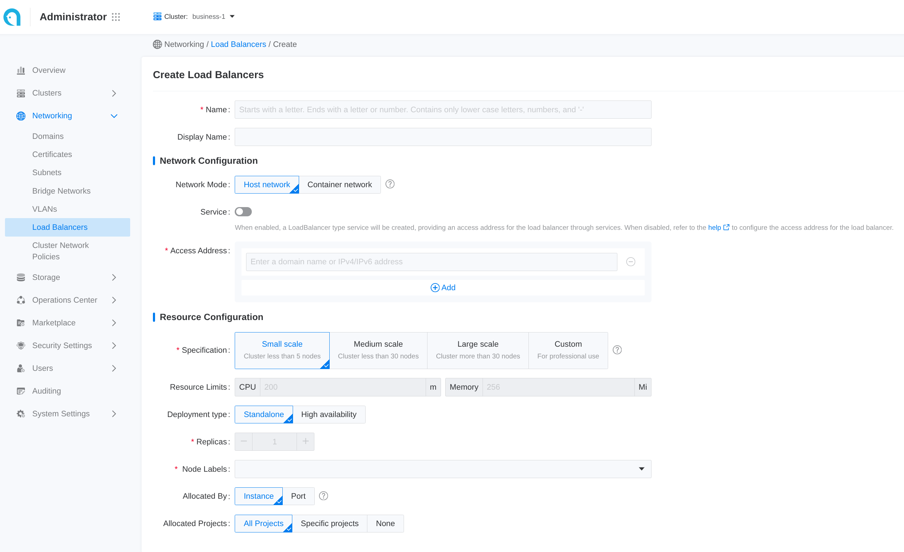
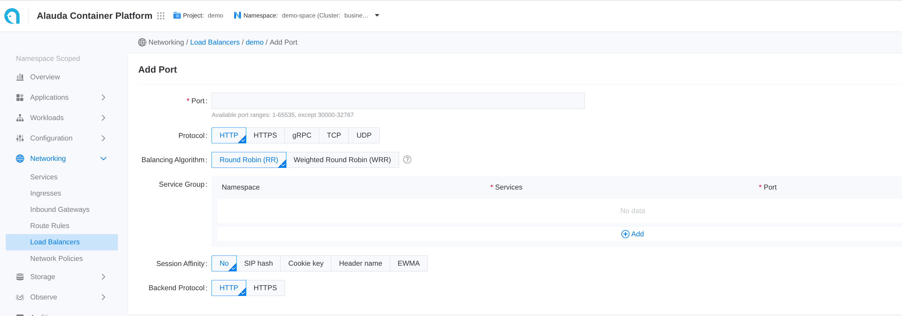

# Deploy ALB
## ALB
ALB is a custom resource that represents a load balancer. The alb-operator, which is embedded by default in all clusters, watches for create/update/delete operations on ALB resources and creates corresponding deployments and services in response.

For each ALB, a corresponding Deployment watches all Frontends and Rules attached to that ALB and routes requests to backends based on those configurations.

### Prerequisites

The high availability of the **Load Balancer** requires a VIP. Please refer to [Configure VIP](./deploy_high_available_vip_for_alb.mdx).
### Configure ALB
There are three parts to an ALB configuration.
```yaml
# test-alb.yaml
apiVersion: crd.alauda.io/v2beta1
kind: ALB2
metadata:
  name: alb-demo
  namespace: cpaas-system
spec:
  address: 192.168.66.215
  config:
    vip:
      enableLbSvc: false
      lbSvcAnnotations: {}
    networkMode: host
    nodeSelector:
      cpu-model.node.kubevirt.io/Nehalem: "true"
    replicas: 1
    resources:
      alb:
        limits:
          cpu: 200m
          memory: 256Mi
        requests:
          cpu: 200m
          memory: 256Mi
      limits:
        cpu: 200m
        memory: 256Mi
      requests:
        cpu: 200m
        memory: 256Mi
    projects:
      - ALL_ALL
  type: nginx
```
#### Resource Configuration 
resource related field describes the deployment configuration for the alb.
| Field | Type | Description |
|-------|------|-------------|
| `.spec.config.nodeSelector` |map[string]string | the node selector for the alb |
| `.spec.config.replicas` | int,optional default 3 | the number of replicas for the alb |
| `.spec.config.resources.limits` | k8s container-resource,optional |  limit of nginx container of alb |
| `.spec.config.resources.requests` | k8s container-resource,optional |  request of nginx container of alb |
| `.spec.config.resources.alb.limits` | k8s container-resource,optional |  limit of alb container of alb |
| `.spec.config.resources.alb.requests` | k8s container-resource,optional | request of alb container of alb |
| `.spec.config.antiAffinityKey` | string,optional default local | k8s antiAffinityKey |


#### Networking Configuration \{#alb_networking_configuration}
Networking fields describe how to access the ALB. For example, in `host` mode, alb will use hostnetwork, and you can access the ALB via the node IP.
| Field | Type | Description |
|-------|------|-------------|
| `.spec.config.networkMode` | string: `host` or `container`, optional, default `host` | In `container` mode, the operator creates a LoadBalancer Service and uses its address as the ALB address. |
| `.spec.address` | string,required | you could manually specify the address of alb |
| `.spec.config.vip.enableLbSvc` | bool, optional | Automatically true in `container` mode. |
| `.spec.config.vip.lbSvcAnnotations` | map[string]string, optional | Extra annotations for the LoadBalancer Service. |

#### project configuration
| Field | Type | 
|-------|------|
| `.spec.config.projects` | []string,required |
| `.spec.config.portProjects` | string,optional |
| `.spec.config.enablePortProject` | bool,optional |

Adding an ALB to a project means:
1. In the web UI, only users in the given project can find and configure this ALB.
2. This ALB will handle ingress resources belonging to this project. Please refer to [ingress-sync](../../functions/configure_alb_rule.mdx#alb_ingress_sync).
3. In the web UI, rules created in project X cannot be found or configured under project Y.

If you enable port project and assign a port range to a project, this means:
1. You cannot create ports that do not belong to the port range assigned to the project.

#### tweak configuration
there are some global config which can be tweaked in alb cr.
- [bind-nic](./bind_nic_in_alb.mdx)
- [ingress-sync](../../functions/configure_alb_rule.mdx#alb_ingress_sync)

### Operation On ALB
#### Creating
##### Using the web console.

Some common configuration is exposed in the web UI. Follow these steps to create a load balancer:
1. Navigate to **Administrator**.
2. In the left sidebar, click on **Network Management** > **Load Balancer**.
3. Click on **Create Load Balancer**.

Each input item in the web UI corresponds to a field of the CR:

|Parameter| Description|
|--|--|
|Assigned Address| `.spec.address`|
|Allocated By| `Instance` means project mode, and you could select project below, port means port-project mode, you could assign port-range after create alb |

##### Using the CLI.

```shell
kubectl apply -f test-alb.yaml -n cpaas-system
```

#### Update
##### Using the web console
:::note
Updating the load balancer will cause a service interruption for 3 to 5 minutes. Please choose an appropriate time for this operation!
:::

1. Enter **Administrator**.

2. In the left navigation bar, click **Network Management** > **Load Balancer**.

3. Click ⋮ > **Update**.

4. Update the network and resource configuration as needed.

   - Please set specifications reasonably according to business needs. You can also refer to the relevant [How to properly allocate CPU and memory resources](./decision_making_for_performance_selection_of_alb.mdx) for guidance.

   - **Internal routing** only supports updating from **Disabled** state to **Enabled** state.

5. Click **Update**.

#### Delete
##### Using the web console

:::note
After deleting the load balancer, the associated ports and rules will also be deleted and cannot be restored.
:::

1. Enter **Administrator**.

2. In the left navigation bar, click **Network Management** > **Load Balancer**.

3. Click ⋮ > **Delete**, and confirm.

##### Using the CLI

```shell
kubectl delete alb2 alb-demo -n cpaas-system
```

## Listener Ports (Frontend)

Frontend is a custom resource that defines the listener port and protocol for an ALB.
Supported protocols: L7 (http|https|grpc|grpcs) and L4 (tcp|udp).
In L4 Proxy use frontend to configure backend service directly.
In L7 Proxy use frontend to configure listener ports, and use [rule](../../functions/configure_alb_rule.mdx) to configure backend service.
If you need to add an HTTPS listener port, you should also contact the administrator to assign a TLS certificate to the current project for encryption.
{/* lint ignore no-duplicate-headings-in-section */}

### Prerequisites
Create a ALB first.

### Configure Frontend

```yaml
# alb-frontend-demo.yaml
apiVersion: crd.alauda.io/v1
kind: Frontend
metadata:
  labels:
    alb2.cpaas.io/name: alb-demo # [!code callout]
  name: alb-demo-00080 # [!code callout]
  namespace: cpaas-system
spec:
  port: 80  # [!code callout]
  protocol: http # [!code callout]
  certificate_name: "" # [!code callout]
  backendProtocol: "http" # [!code callout]
  serviceGroup: # [!code callout]
    session_affinity_policy: "" # [!code callout]
    services:
      - name: hello-world
        namespace: default
        port: 80
        weight: 100
```

<Callouts>

1. alb label: Required, indicate the ALB instance to which this `Frontend` belongs to.
2. frontend name: Format as `$alb_name-$port`.
3. port: which port which listen on.
4. protocol: what protocol this port uses.
   - L7 protocol https|http|grpcs|grpc and L4 protocol tcp|udp.  
   - When selecting HTTPS, a certificate must be added; adding a certificate is optional for the gRPC protocol.
   - When selecting the gRPC protocol, the backend protocol defaults to gRPC, which does not support session persistence.If a certificate is set for the gRPC protocol, the load balancer will unload the gRPC certificate and forward the unencrypted gRPC traffic to the backend service.
   - If using a Google GKE cluster, a load balancer of the same **container network type** cannot have both TCP and UDP listener protocols simultaneously.
  
5. certificate_name: for grpcs and https protocol which the default cert used, Format as `$secret_ns/$secret_name`.
6. backendProtocol: what protocol the backend service uses.
7. Default `serviceGroup`: 
   - L4 proxy: required. ALB forwards traffic to the default service group directly.  
   - L7 proxy: optional. ALB first matches Rules on this Frontend; if none match, it falls back to the default `serviceGroup`.
8. [session_affinity_policy](./load_balancing_session_affinity_policy_in_alb.mdx)

</Callouts>


### Operation On Frontend
#### Creating
##### using the web console

1. Go to **Container Platform**.

2. In the left navigation bar, click **Network** > **Load Balancing**.

3. Click the name of the load balancer to enter the details page.

4. Click **Add Port**.

Each input item on the webui corresponds to a field of the CR
|Parameter|Description|
|---|---|
|Session Affinity| `.spec.serviceGroup.session_affinity_policy`|


##### using the CLI

```shell
kubectl apply -f alb-frontend-demo.yaml -n cpaas-system
```

### Subsequent Actions

For traffic from HTTP, gRPC, and HTTPS ports, in addition to the default internal routing group, you can set more varied back-end service matching [rules](../../functions/configure_alb_rule.mdx). The load balancer will initially match the corresponding backend service according to the set rules; if the rule match fails, it will then match the backend services corresponding to the aforementioned internal routing group.

### Related Operations

You can click the ⋮ icon on the right side of the list page or click **Actions** in the upper right corner of the details page to update the default route or delete the listener port as needed.

:::note
If the resource allocation method of the load balancer is **Port**, only administrators can delete the related listener ports in the **Administrator** view.
:::

## Logs and Monitoring

By combining logs and monitoring data, you can quickly identify and resolve load balancer issues.

### Viewing Logs

1. Go to **Administrator**.

2. In the left navigation bar, click on **Network Management** > **Load Balancer**.

3. Click on **_Load Balancer Name_**.

4. In the **Logs** tab, view the logs of the load balancer's runtime from the container's perspective.

### Monitoring Metrics

:::note
The cluster where the load balancer is located must deploy monitoring services.
:::

1. Go to **Administrator**.

2. In the left navigation bar, click on **Network Management** > **Load Balancer**.

3. Click on **_Load Balancer Name_**.

4. In the **Monitoring** tab, view the metric trend information of the load balancer from the node's perspective.

   - **Usage Rate**: The real-time usage of CPU and memory by the load balancer on the current node.

   - **Throughput**: The overall incoming and outgoing traffic of the load balancer instance.

For more detailed information about monitoring metrics please refer to [ALB Monitoring](./alb_monitoring.mdx).