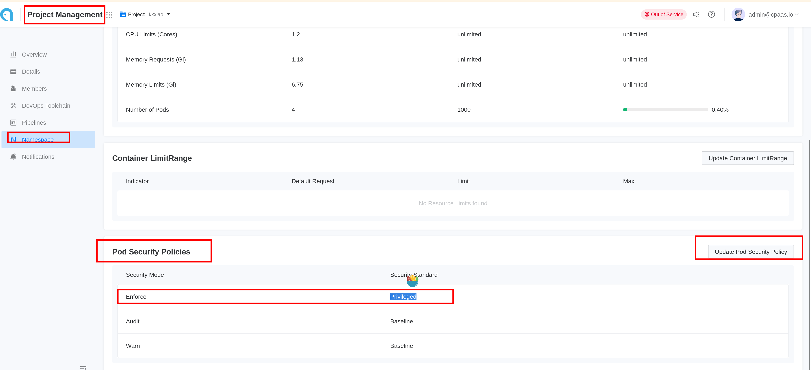
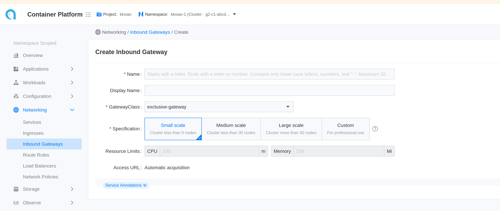

# Creating GatewayAPI Gateway

GatewayAPI is a new API for Kubernetes that provides a more flexible and extensible way to manage ingress traffic. It allows you to define routing rules, traffic policies, and other configurations in a more declarative manner.  
This document provides a step-by-step guide on how to create a GatewayAPI gateway in an ACP Kubernetes cluster.

# Requirements

## Deploy MetalLB
The GatewayAPI gateway requires MetalLB to allocate an IP address. Please refer to [Create MetalLB](../functions/create_metallb.mdx) for instructions on how to deploy MetalLB.

## Set Pod Security Policies to Privileged Mode
If the namespace where you want to deploy the gateway is created via the UI, you need to update its Pod Security Policy (PSP) to privileged mode.  

# Steps

1. Navigate to **Platform Management**.
2. In the left sidebar, click on **Network Management** > **Inbound Gateways**.
3. Click on **Create Inbound Gateways**.
4. Follow the instructions below to complete the network configuration:

   | Parameter       | Description                                                                                                                                                                                                                                                                                                                                                                                                                                                                                                       |
   |-----------------|-------------------------------------------------------------------------------------------------------------------------------------------------------------------------------------------------------------------------------------------------------------------------------------------------------------------------------------------------------------------------------------------------------------------------------------------------------------------------------------------------------------------|
   | **Name**        | The name of the gateway.                                                                                                                                                                                                                                                                                                                                                                                                                                                                                         |
   | **GatewayClass**| The embedded `exclusive-gateway` is provided by ACP and backed by ALB. It will create a container-network-mode ALB to implement the GatewayAPI gateway specification.                                                                                                                                                                                                                                                                                                                                             |
   | **Specification**| Set the specifications appropriately based on your business needs. You can also refer to [Load Balancer Selection and Planning](../how_to/decide_performance_selection.mdx) for guidance.                                                                                                                                                                                                                                                                                                                        |

5. Click **Create**. The creation process may take some time; please be patient.

