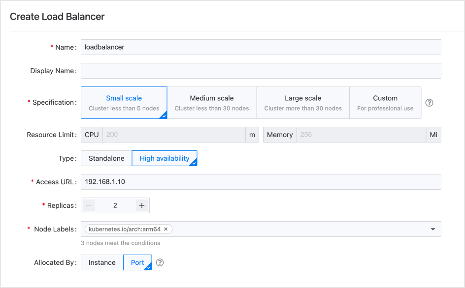
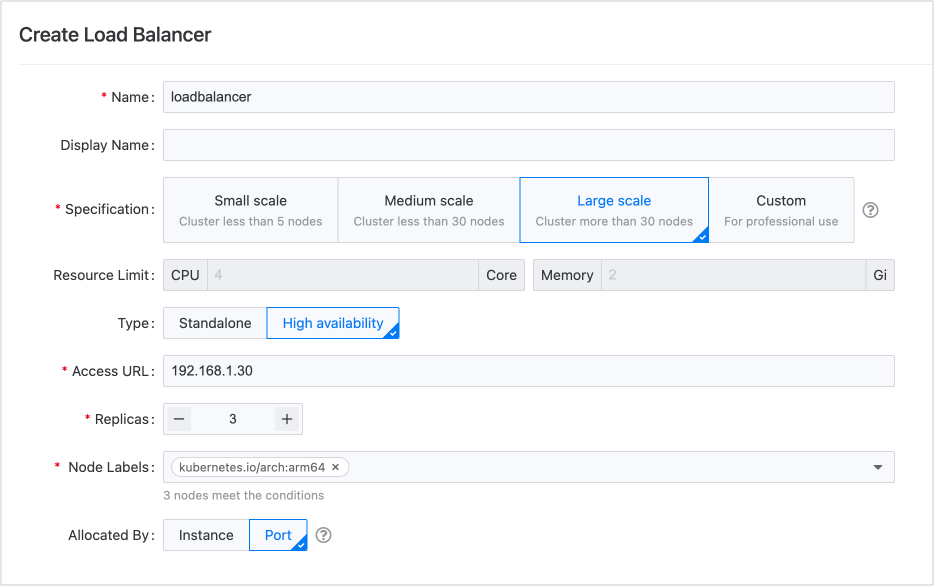

# How to properly allocate CPU and memory resources

For the platform's proposed specifications for **small**, **medium**, **large**, and **custom** production environments, as well as the resource allocation methods for **instances** and **ports**, the following suggestions can be referenced for deployment.

## Small Production Environment

For smaller business scales, such as having no more than 5 nodes in the cluster and only used for running standard applications, a **single** load balancer is sufficient. It is recommended to use it in a **high availability** mode with at least 2 replicas to ensure stability in the environment.

You can isolate the load balancer using **port** isolation, allowing multiple projects to share it.

The peak QPS measured in a lab environment for this specification is approximately 300 requests per second.

## Medium Production Environment

When the business volume reaches a certain scale, such as having no more than 30 nodes in the cluster and needing to handle high-concurrency business alongside running standard applications, a **single** load balancer will still be adequate. It is advisable to employ a **high availability** mode with at least 3 replicas to maintain stability in the environment.

You can utilize either **port** isolation or **instance** allocation methods to share the load balancer among multiple projects. Of course, you can also create new load balancers for dedicated use by core projects.

The peak QPS measured in a lab environment for this specification is around 10,000 requests per second.

## Large Production Environment

For larger business volumes, such as having more than 30 nodes in the cluster and needing to handle high-concurrency business as well as long-lived data connections, it is recommended to use **multiple** load balancers, each in a **high availability** type with at least 3 replicas to ensure stability in the environment.

You can isolate the load balancer using either **port** isolation or **instance** allocation methods for multiple projects to share it. You may also create new load balancers for exclusive use by core projects.

The peak QPS measured in a lab environment for this specification is approximately 20,000 requests per second.

## Special Scenario Deployment Recommendations

| Scenario                          | Deployment Recommendations                                                                                                                                                                                                                                                                                                                                                                                                                                                                                                                                                                     |
| --------------------------------- | ---------------------------------------------------------------------------------------------------------------------------------------------------------------------------------------------------------------------------------------------------------------------------------------------------------------------------------------------------------------------------------------------------------------------------------------------------------------------------------------------------------------------------------------------------------------------------------------------- |
| **Function Testing**              | It is advisable to deploy a **single instance** of the load balancer.                                                                                                                                                                                                                                                                                                                                                                                                                                                                                                                          |
| **Testing Environment**           | If the testing environment meets the definitions of **small** or **medium** as stated above, using a **single point** load balancer is sufficient. The load balancer **instance** can be shared among **multiple projects**.                                                                                                                                                                                                                                                                                                                                                                   |
| **Core Applications**             | It is recommended to use specific load balancers exclusively for core applications.                                                                                                                                                                                                                                                                                                                                                                                                                                                                                                            |
| **Transferring Large Scale Data** | Due to minimal memory consumption caused by the load balancer itself, it is sufficient to reserve 2Gi of memory even for the **large** specification. However, if the business requires transferring large-scale data, which will lead to substantial memory consumption, the memory allocation for the load balancer should be increased accordingly.    It is recommended to gradually expand the memory of the load balancer in **custom** specification scenarios, closely monitoring memory usage to ultimately arrive at an acceptable memory size for reasonable usage rates. |

## Load Balancer Usage Mode Selection

| Usage Mode                                                                                              | Advantages                                                                                                                                                                | Disadvantages                                                                                                                                                                                                                                                                                                                                                                                                                                                                                       |
| ------------------------------------------------------------------------------------------------------- | ------------------------------------------------------------------------------------------------------------------------------------------------------------------------- | --------------------------------------------------------------------------------------------------------------------------------------------------------------------------------------------------------------------------------------------------------------------------------------------------------------------------------------------------------------------------------------------------------------------------------------------------------------------------------------------------- |
| **(Recommended) Allocate the load balancer as an instance resource to a single project**                | <ul><li>Management is relatively simple.</li><li>Each project has its own load balancer, ensuring rule isolation and resource separation, with no interference.</li></ul> | In host network mode, the cluster must possess a significant number of nodes available for the load balancer, resulting in high resource consumption requirements.                                                                                                                                                                                                                                                                                                                                  |
| **Allocate the load balancer as an instance resource to multiple projects**                             | Management is relatively straightforward.                                                                                                                                 | Since all assigned projects hold full permissions for the load balancer instance, when one project configures the ports and rules of the load balancer, the following situations may arise: <ul><li>The rules configured by that project may affect other projects.</li><li>Mis-operations during load balancer configuration might alter other projects' settings.</li><li>Traffic requests from a particular business may impact the overall availability of the load balancer instance.</li></ul> |
| **Dynamically allocate load balancer resources by port, with different projects using different ports** | The rules between projects isolate them, ensuring no interference.                                                                                                        | <ul><li>Management complexity increases. Platform administrators must actively plan and allocate ports for projects and configure external service mappings.</li><li>The maturity of port-based allocation is lower. Currently, it is used by fewer clients and requires further refining of features.</li><li>Resource conflicts. All services using the same load balancer may face scenarios where a single service negatively impacts the entire load balancer.</li></ul>                       |
