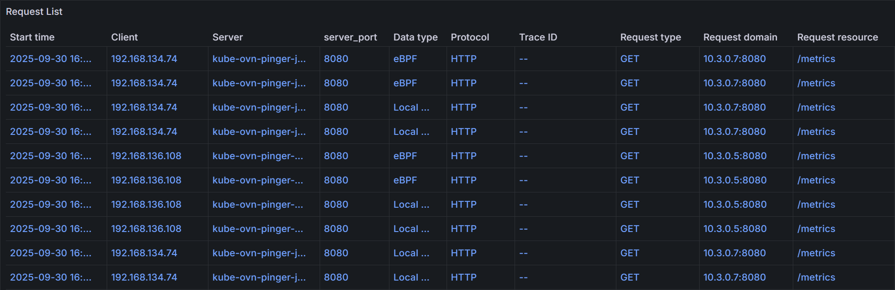
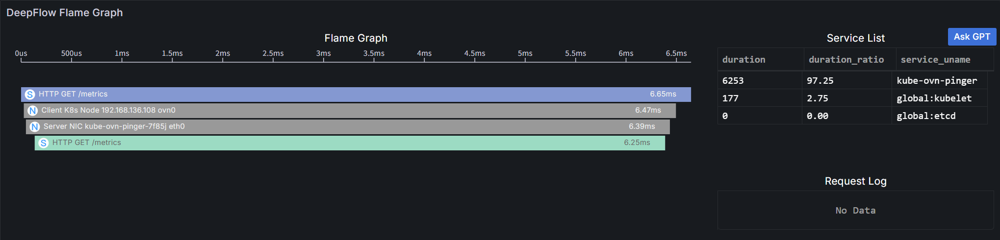

# DeepFlow User Guide

DeepFlow provides Grafana dashboards for visualizing network and application performance metrics,
as well as automatic tracing capabilities for applications using eBPF technology.
To access the DeepFlow Grafana dashboards, you need to install the DeepFlow plugin from the Marketplace.
After installation, you can access the Grafana web UI through the Ingress configured during installation.
Login credentials are required to access the Grafana web UI.

For more information about using Grafana dashboards,
refer to the [Grafana documentation](https://grafana.com/docs/grafana/latest/dashboards/use-dashboards/).

## Login

To log in to the Grafana web UI, you need the following information which is configured during the installation of the DeepFlow plugin:

- **Username**: The username for the Grafana web console.
- **Password**: The password for the Grafana web console.

After the first login, it is strongly recommended to change the password for security reasons.

## Use Dashboards

Navigate to the **Dashboards** section in the Grafana web UI to access various pre-configured dashboards provided by DeepFlow.
Dashboards are placed in two folders: **DeepFlow System** and **DeepFlow Template**.

- **DeepFlow System**: This folder contains system-level dashboards that provide insights into the overall health and performance of the DeepFlow system.
- **DeepFlow Templates**: This folder contains application-level dashboards that can be customized based on specific application requirements.

### DeepFlow System

This folder contains a dashboard named **DeepFlow Agent**, which provides insights into the status and performance of nodes where DeepFlow agents are deployed.

As to network observability, it includes metrics such as:

<table>
  <thead>
    <tr>
      <th>Metric</th>
      <th>Panels</th>
    </tr>
  </thead>
  <tbody>
    <tr>
      <td rowSpan={3}>Bandwidth Statistics of All Selected Agents</td>
      <td>Bandwidth</td>
    </tr>
    <tr>
      <td>Top &lt;agent, signal&gt; by avg bandwidth</td>
    </tr>
    <tr>
      <td>Top agents by total bandwidth</td>
    </tr>
    <tr>
      <td rowSpan={3}>NIC Kernel Counters (FYI Only)</td>
      <td>Drops on Interfaces</td>
    </tr>
    <tr>
      <td>bps on Interfaces</td>
    </tr>
    <tr>
      <td>pps on Interfaces</td>
    </tr>
    <tr>
      <td rowSpan={3}>[dispatcher] AF_PACKET/cBPF Collector</td>
      <td>Packets per Second</td>
    </tr>
    <tr>
      <td>🔥[CAUTION] Packet Drops in Kernel (Agent Can't Process)</td>
    </tr>
    <tr>
      <td>Kernel Timestamp Backwards > 1ms (FYI Only)</td>
    </tr>
    <tr>
      <td rowSpan={3}>TCP Performance Quantify</td>
      <td>Ignored TCP Packets with abnormal TCP Flags</td>
    </tr>
    <tr>
      <td>TCP Retransmission Ineligible Packet</td>
    </tr>
    <tr>
      <td>Unrecognized L7 Protocol Packets</td>
    </tr>
  </tbody>
</table>

<Directive type="note" title="NOTE">
CAUTION: The panels marked with 🔥 indicate potential issues that may require attention.
</Directive>

### DeepFlow Templates

This folder contains various dashboards including network/L4 metrics, application/L7 metrics, and automatic tracing dashboards.

Here are dashboards related to network observability:

<table>
  <thead>
    <tr>
      <th>Catalog</th>
      <th>Dashboards</th>
      <th>Description</th>
      <th>Metrics/Panels</th>
    </tr>
  </thead>
  <tbody>
    <tr>
      <td rowSpan={28}>Network/L4</td>
      <td rowSpan={4}>Network - Cloud Host</td>
      <td rowSpan={4}>Provides network/L4 metrics for cluster hosts, including bandwidth, packets, flows, and TCP performance.</td>
      <td>Throughput (bps)</td>
    </tr>
    <tr>
      <td>Retrans rate</td>
    </tr>
    <tr>
      <td>TCP conn. establishment fail rate</td>
    </tr>
    <tr>
      <td>TCP conn. establishment latency</td>
    </tr>
    <tr>
      <td rowSpan={5}>Network - Cloud Host Map</td>
      <td rowSpan={5}>Visualizes the network topology of cluster hosts, showing connections and traffic flows between them.</td>
      <td>Cloud Host Map</td>
    </tr>
    <tr>
      <td>Throughput (bps)</td>
    </tr>
    <tr>
      <td>TCP retrans rate (%)</td>
    </tr>
    <tr>
      <td>TCP conn. establishment fail (%)</td>
    </tr>
    <tr>
      <td>TCP conn. establishment delay (ms)</td>
    </tr>
    <tr>
      <td rowSpan={4}>Network - K8s Pod</td>
      <td rowSpan={4}>Provides network/L4 metrics for Kubernetes Pods, including bandwidth, packets, flows, and TCP performance.</td>
      <td>Throughput (bps)</td>
    </tr>
    <tr>
      <td>Retrans rate</td>
    </tr>
    <tr>
      <td>TCP conn. establishment fail rate</td>
    </tr>
    <tr>
      <td>TCP conn. establishment latency</td>
    </tr>
    <tr>
      <td rowSpan={5}>Network - K8s Pod Map</td>
      <td rowSpan={5}>Visualizes the network topology of Kubernetes Pods, showing connections and traffic flows between them.</td>
      <td>Pod Map</td>
    </tr>
    <tr>
      <td>Throughput (bps)</td>
    </tr>
    <tr>
      <td>TCP retrans rate (%)</td>
    </tr>
    <tr>
      <td>TCP conn. establishment fail (%)</td>
    </tr>
    <tr>
      <td>TCP conn. establishment delay (ms)</td>
    </tr>
    <tr>
      <td rowSpan={5}>Network - Flow Log</td>
      <td rowSpan={5}>Displays detailed flow logs for network traffic in Kubernetes Pods, including source and destination IPs, ports, protocols, and more.</td>
      <td>Summary count</td>
    </tr>
    <tr>
      <td>Error count</td>
    </tr>
    <tr>
      <td>TCP est.conn latency distribution</td>
    </tr>
    <tr>
      <td>TCP data latency distribution</td>
    </tr>
    <tr>
      <td>Flow log</td>
    </tr>
    <tr>
      <td rowSpan={5}>Network - Flow Log - Cloud</td>
      <td rowSpan={5}>Displays detailed flow logs for network traffic in cluster hosts, including source and destination IPs, ports, protocols, and more.</td>
      <td>Summary count</td>
    </tr>
    <tr>
      <td>Error count</td>
    </tr>
    <tr>
      <td>TCP est.conn latency distribution</td>
    </tr>
    <tr>
      <td>TCP data latency distribution</td>
    </tr>
    <tr>
      <td>Flow log</td>
    </tr>
    <tr>
      <td rowSpan={61}>Application/L7</td>
      <td rowSpan={3}>Application - Cloud Host</td>
      <td rowSpan={3}>Provides application/L7 metrics for cluster hosts, including request rates, error rates, and latency for various protocols such as HTTP, DNS, MySQL, Redis, and MongoDB.</td>
      <td>Request</td>
    </tr>
    <tr>
      <td>Server error</td>
    </tr>
    <tr>
      <td>Latency</td>
    </tr>
    <tr>
      <td rowSpan={4}>Application - Cloud Host Map</td>
      <td rowSpan={4}>Visualizes the application topology of cluster hosts, showing connections and traffic flows between different applications.</td>
      <td>Cloud Host Map</td>
    </tr>
    <tr>
      <td>Request</td>
    </tr>
    <tr>
      <td>Server error</td>
    </tr>
    <tr>
      <td>Latency</td>
    </tr>
    <tr>
      <td rowSpan={3}>Application - K8s Pod</td>
      <td rowSpan={3}>Provides application/L7 metrics for Kubernetes Pods, including request rates, error rates, and latency for various protocols such as HTTP, DNS, MySQL, Redis, and MongoDB.</td>
      <td>Request</td>
    </tr>
    <tr>
      <td>Server error</td>
    </tr>
    <tr>
      <td>Latency</td>
    </tr>
    <tr>
      <td rowSpan={4}>Application - K8s Pod Map</td>
      <td rowSpan={4}>Visualizes the application topology of Kubernetes Pods, showing connections and traffic flows between different applications.</td>
      <td>Pod Map</td>
    </tr>
    <tr>
      <td>Request</td>
    </tr>
    <tr>
      <td>Server error</td>
    </tr>
    <tr>
      <td>Latency</td>
    </tr>
    <tr>
      <td rowSpan={4}>Application - Request Log</td>
      <td rowSpan={4}>Displays detailed request logs for applications running in Kubernetes Pods, including source and destination IPs, URLs, response codes, and more.</td>
      <td>Summary count</td>
    </tr>
    <tr>
      <td>Error count</td>
    </tr>
    <tr>
      <td>Latency histogram</td>
    </tr>
    <tr>
      <td>Request log</td>
    </tr>
    <tr>
      <td rowSpan={4}>Application - Request Log - Cloud</td>
      <td rowSpan={4}>Displays detailed request logs for applications running in host networks, including source and destination IPs, URLs, response codes, and more.</td>
      <td>Summary count</td>
    </tr>
    <tr>
      <td>Error count</td>
    </tr>
    <tr>
      <td>Latency histogram</td>
    </tr>
    <tr>
      <td>Request log</td>
    </tr>
    <tr>
      <td rowSpan={5}>Application - K8s Ingress</td>
      <td rowSpan={5}>Provides application/L7 metrics for Kubernetes Ingress resources, including request rates, error rates, and latency for HTTP traffic.</td>
      <td>Upstream Request Map</td>
    </tr>
    <tr>
      <td>Request</td>
    </tr>
    <tr>
      <td>Delay</td>
    </tr>
    <tr>
      <td>Error</td>
    </tr>
    <tr>
      <td>Throughput</td>
    </tr>
    <tr>
      <td rowSpan={5}>Application - DNS Monitoring</td>
      <td rowSpan={5}>Monitors DNS queries and responses, providing insights into DNS performance and potential issues.</td>
      <td>DNS Topology</td>
    </tr>
    <tr>
      <td>Delay</td>
    </tr>
    <tr>
      <td>Error Ratio</td>
    </tr>
    <tr>
      <td>Request</td>
    </tr>
    <tr>
      <td>Log Analysis</td>
    </tr>
    <tr>
      <td rowSpan={6}>Application - SQL Monitoring - K8S</td>
      <td rowSpan={6}>Monitors SQL queries and performance for databases running in Kubernetes Pods, e.g., MySQL, PostgreSQL, and MongoDB.</td>
      <td>SQL Topology</td>
    </tr>
    <tr>
      <td>Connection</td>
    </tr>
    <tr>
      <td>Delay</td>
    </tr>
    <tr>
      <td>Error</td>
    </tr>
    <tr>
      <td>Throughput</td>
    </tr>
    <tr>
      <td>SQL Analysis</td>
    </tr>
    <tr>
      <td rowSpan={6}>Application - SQL Monitoring - Cloud</td>
      <td rowSpan={6}>Monitors SQL queries and performance for databases running in host networks, e.g MySQL, PostgreSQL, and MongoDB.</td>
      <td>SQL Topology</td>
    </tr>
    <tr>
      <td>Connection</td>
    </tr>
    <tr>
      <td>Delay</td>
    </tr>
    <tr>
      <td>Error</td>
    </tr>
    <tr>
      <td>Throughput</td>
    </tr>
    <tr>
      <td>SQL Analysis</td>
    </tr>
    <tr>
      <td rowSpan={6}>Application - Redis Monitoring - K8S</td>
      <td rowSpan={6}>Monitors Redis commands and performance for Redis instances running in Kubernetes Pods.</td>
      <td>Redis Topology</td>
    </tr>
    <tr>
      <td>Connection</td>
    </tr>
    <tr>
      <td>Delay</td>
    </tr>
    <tr>
      <td>Error</td>
    </tr>
    <tr>
      <td>Throughput</td>
    </tr>
    <tr>
      <td>Log Analysis</td>
    </tr>
    <tr>
      <td rowSpan={6}>Application - Redis Monitoring - Cloud</td>
      <td rowSpan={6}>Monitors Redis commands and performance for Redis instances running in host networks.</td>
      <td>Redis Topology</td>
    </tr>
    <tr>
      <td>Connection</td>
    </tr>
    <tr>
      <td>Delay</td>
    </tr>
    <tr>
      <td>Error</td>
    </tr>
    <tr>
      <td>Throughput</td>
    </tr>
    <tr>
      <td>Log Analysis</td>
    </tr>
    <tr>
      <td rowSpan={5}>Application - Dubbo Monitoring - K8S</td>
      <td rowSpan={5}>Monitors Dubbo RPC calls and performance for Dubbo services running in Kubernetes Pods.</td>
      <td>Dubbo Topology</td>
    </tr>
    <tr>
      <td>Connection</td>
    </tr>
    <tr>
      <td>Delay</td>
    </tr>
    <tr>
      <td>Error</td>
    </tr>
    <tr>
      <td>Log Analysis</td>
    </tr>
    <tr>
      <td rowSpan={4}>Auto Tracing</td>
      <td rowSpan={2}>Distributed Tracing</td>
      <td rowSpan={2}>Provides distributed tracing capabilities for applications running in Kubernetes Pods, allowing you to trace requests as they propagate through various services and components.</td>
      <td>Request List</td>
    </tr>
    <tr>
      <td>Flame Graph</td>
    </tr>
    <tr>
      <td rowSpan={2}>Distributed Tracing - Cloud</td>
      <td rowSpan={2}>Provides distributed tracing capabilities for applications running in host networks, allowing you to trace requests as they propagate through various services and components.</td>
      <td>Request List</td>
    </tr>
    <tr>
      <td>Flame Graph</td>
    </tr>
  </tbody>
</table>

In summary, DeepFlow offers a comprehensive set of dashboards for monitoring and analyzing network
and application performance in both Kubernetes Pods and host networks.

- Dashboards with a prefix **Network** provide L4-level metrics, while those with a prefix **Application** offer L7-level insights.
- Dashboards with a suffix **Cloud** or containing **Cloud Host** in their names focus on host networks, while those with a suffix **K8s** or without suffix **Cloud** focus on Kubernetes Pods.
- Dashboards with a suffix **Map** visualize the topology of network or application components.
- Dashboards containing **Log** in their names display detailed logs for network flows or application requests.
- Dashboards with **Monitoring** in their names focus on specific protocols or services, such as DNS, SQL, Redis, and Dubbo.
- Distributed Tracing dashboards provide automatic tracing capabilities for applications requests.

#### Distributed Tracing

DeepFlow's Distributed Tracing feature allows you to trace requests as they propagate through various services and components in your applications.
This helps you identify performance bottlenecks, understand service interactions, and optimize application performance.

##### Panels

In the Distributed Tracing dashboards, you can view detailed information about each request, including:

- **Request List**: A list of all traced requests, including their IDs, timestamps, durations, and statuses.
- **Flame Graph**: A visual representation of the call stack for each request, showing the time spent in each service or component.

You can filter and search for specific requests based on various criteria, such as namespace, workload, trace ID, span ID, request resource, and time range.
Here is an example of a request list:



Click on a specific request to view its detailed trace information in the Flame Graph:



A flame graph consists of multiple bar-shaped blocks, each representing a span.
The x-axis represents time, and the y-axis represents call stack depth. Spans are displayed from top to bottom in the order they are called.

Details are as follows:

- **Length**: Along the x-axis, represents the execution time of a span, with each end corresponding to the start and end times.
- **Service List**: Shows the proportion of latency consumed by each service. Clicking a service will highlight the corresponding spans in the flame graph.
  - **Color**: Application spans and system spans use a unique color for each service; all network spans are gray (as they do not belong to any service).
- **Display Information**: Each bar&#39;s display information consists of an icon, call information and execution time.
  - **Icon**: Differentiates span types:
    - <span
        style={{
          color: "#fff",
          backgroundColor: "#06c",
          borderRadius: "50%",
          justifyContent: "center",
          alignItems: "center",
          width: "20px",
          height: "20px",
          marginLeft: "4px",
          display: "inline-flex",
        }}
      >A</span> Application span, collected via the OpenTelemetry protocol, covering business code and framework code.
    - <span
        style={{
          color: "#fff",
          backgroundColor: "#06c",
          borderRadius: "50%",
          justifyContent: "center",
          alignItems: "center",
          width: "20px",
          height: "20px",
          marginLeft: "4px",
          display: "inline-flex",
        }}
      >S</span> System span, collected via eBPF with zero intrusion, covering system calls, application functions (e.g., HTTPS), API Gateway, and service mesh Sidecar.
    - <span
        style={{
          color: "#fff",
          backgroundColor: "#06c",
          borderRadius: "50%",
          justifyContent: "center",
          alignItems: "center",
          width: "20px",
          height: "20px",
          marginLeft: "4px",
          display: "inline-flex",
        }}
      >N</span> Network span, collected from network traffic via BPF, covering container network components such as iptables, ipvs, OvS, and LinuxBridge.
  - **Call Information**: Varies by span type:
    - **Application Span** and **System Span**: Application protocol, request type, and request resource.
    - **Network Span**: Observation point.
  - **Execution Time**: Total time consumed from span start to end.
- **Operations**: Supports hover and click.
  - **Hover**: Displays call information, instance information and execution time in a tooltip.
    - **Instance Information**: Varies by span type:
      - **Application Span**: Service and resource instance.
      - **System Span**: Process and resource instance.
      - **Network Span**: Network interface and resource instance.
    - **Execution Time**: The total execution time of the span and its proportion of self-execution time.
  - **Click**: Highlights the span and its parent span, and allows viewing detailed information of the clicked span.

##### Configuration

DeepFlow supports parsing unique Request IDs injected by applications (e.g., almost all gateways inject X-Request-ID) and associating different requests with the same Request ID into a single trace.
To add your Request ID header for parsing, you can modify the DeepFlow agent group configuration while installing or updating the DeepFlow plugin.

The configuration item is `processors.request_log.tag_extraction.tracing_tag.x_request_id`, which accepts a list of header names.
Here is an example configuration snippet:

```yaml
processors:
  request_log:
    tag_extraction:
      tracing_tag:
        x_request_id:
          - x-request-id
          - x-bfe-log-id
          - stgw-request-id
          - x-blb-request-id
```

For more details on configuring the DeepFlow agent, refer to the [DeepFlow Agent Configuration](https://deepflow.io/docs/configuration/agent/) documentation.

## User Cases

- **Network Performance Monitoring**: Use the Network/L4 dashboards to monitor bandwidth, packet loss, and TCP performance across your cluster hosts and Kubernetes Pods. Identify bottlenecks and optimize network configurations.
- **Application Performance Monitoring**: Use the Application/L7 dashboards to monitor request rates, error rates, and latency for various applications running in your cluster. Identify slow endpoints and optimize application performance.
- **Topology Visualization**: Use the Map dashboards to visualize the network and application topology, helping you understand the relationships and dependencies between different components.
- **Log Analysis**: Use the Log dashboards to analyze detailed flow logs and request logs, helping you troubleshoot issues and gain insights into traffic patterns.
- **Protocol Monitoring**: Use the Monitoring dashboards to monitor specific protocols and services, such as DNS queries, SQL database performance, Redis commands, and Dubbo RPC calls.
- **Distributed Tracing**: Use the Distributed Tracing dashboards to trace requests as they propagate through various services and components, helping you identify performance bottlenecks and optimize service interactions.

## Additional resources

- [DeepFlow - Instant Observability for Cloud & AI Applications](https://deepflow.io/docs/)
- [DeepFlow Agent Configuration](https://deepflow.io/docs/configuration/agent/)
- [eBPF - Introduction, Tutorials & Community Resources](https://ebpf.io/)
