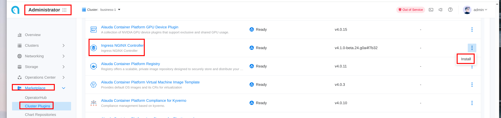

# Install Ingress-Nginx via Cluster Plugin 
## Overview
The NGINX Ingress Controller is deployed as a cluster plugin in the `cpaas-system` namespace. This guide covers installation, configuration, and best practices for managing the Ingress NGINX Controller in your Kubernetes cluster.

## Installation
1. Navigate to `Administrator -> Marketplace -> Cluster Plugin`
2. Locate the Ingress NGINX plugin and click `Install`


## Configuration Management

### Updating Configuration
1. Configure kubectl to use the **global** cluster context
2. Retrieve the ModuleInfo name for your cluster:
   ```bash
   kubectl get minfo | grep ingress | grep $CLUSTER_NAME
   ```
3. Edit the ModuleInfo configuration:
   ```bash
   kubectl edit minfo $MINFO
   ```
   The `spec.config` section corresponds to the Ingress NGINX Helm chart values.

### Common Configuration Scenarios

#### Exposing via LoadBalancer
To expose the Ingress Controller using a LoadBalancer service:
```yaml
spec:
  config:
    controller:
      service:
        type: LoadBalancer
```

#### MetalLB Integration
To specify LoadBalancer VIP when using MetalLB:
```yaml
spec:
  config:
    controller:
      service:
        annotations:
          metallb.universe.tf/loadBalancerIPs: "192.168.2.2"  # Desired VIP
          metallb.universe.tf/address-pool: "pool-name"        # MetalLB address pool
```

#### Advanced Controller Deployment Settings
Configure network mode, replicas, resource limits, and node selection:
```yaml
spec:
  config:
    controller:
      hostNetwork: false
      replicaCount: 1
      nodeSelector:
        kubernetes.io/os: linux
      resources:
        limits:
          cpu: 200m
          memory: 256Mi
        requests:
          cpu: 200m
          memory: 256Mi
```

#### SSL Passthrough
Enable SSL passthrough functionality:
```yaml
spec:
  config:
    controller:
      extraArgs:
        enable-ssl-passthrough: ""
```

#### IPv6 Single-Stack Support
Configure for IPv6-only environments:
```yaml
spec:
  config:
    controller:
      service:
        ipFamilies:
          - IPv6
```

## Performance Tuning

### Resource Allocation Guidelines

#### Small Scale (< 300 QPS)
```yaml
spec:
  config:
    controller:
      resources:
        limits:
          cpu: 200m
          memory: 256Mi
        requests:
          cpu: 200m
          memory: 256Mi
```

#### Medium Scale (< 10,000 QPS)
```yaml
spec:
  config:
    controller:
      resources:
        limits:
          cpu: "2"
          memory: 1Gi
        requests:
          cpu: "2"
          memory: 1Gi
```

#### Large Scale (< 20,000 QPS)
```yaml
spec:
  config:
    controller:
      resources:
        limits:
          cpu: "4"
          memory: 2Gi
        requests:
          cpu: "4"
          memory: 2Gi
```

#### High Performance (Unlimited)
For maximum performance with no CPU limits:
```yaml
spec:
  config:
    controller:
      resources:
        requests:
          cpu: "4"
          memory: 2Gi
```

## Important Notes

### Limitations
- Only one Ingress NGINX Controller instance is supported per cluster

### Version Compatibility
Current version mapping:
ACP Ingress-NGINX 4.1.x corresponds to the official chart 4.12.3 (controller v1.12.3)

### Related Resources
[tasks for ingress-nginx](./tasks_for_ingress_nginx.mdx)  
[official Ingress NGINX chart](https://github.com/kubernetes/ingress-nginx/tree/controller-v1.12.3/charts/ingress-nginx)  
[official Ingress NGINX documentation](https://kubernetes.github.io/ingress-nginx/)  