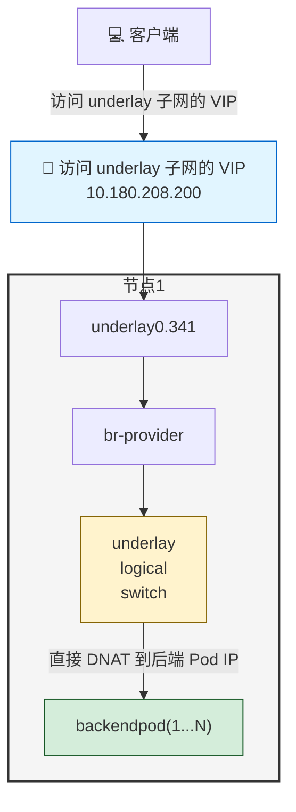

# Kube-OVN Underlay + MetalLB LoadBalancer Service 配置

---

## 方案说明

该方案主要为了解决 MetalLB L2 模式下和 Kube-OVN Underlay 适配的场景。可以让用户使用 Underlay 子网下的 IP 作为 MetalLB 的 LoadBalancer Service 的 VIP，将流量直接转发到后端 Pod。

### 流量路径

访问 LB Service IP 的流量会直接走 Underlay 网络到业务 Pod

**流量示意图**：


---

## 配置步骤

### 1. 配置 ProviderNetwork 启用 VLAN 子网卡

**注意**：必须使用 VLAN 子网卡。

为 Kube-OVN 的 Underlay 网络配置自动创建 VLAN 子接口：
```yaml
apiVersion: kubeovn.io/v1
kind: ProviderNetwork
metadata:
  name: provider
spec:
  defaultInterface: underlay0.341
  autoCreateVlanSubinterfaces: true

---
apiVersion: kubeovn.io/v1
kind: Vlan
metadata:
  name: ovn-vlan
spec:
  id: 0    # id 全部改为0，因为vlan子网卡会自动打上tag
  provider: provider
status:
  subnets:
  - ovn-default
```

### 2. 修改 kube-ovn-controller 参数

调整 `kube-ovn-controller` 的启动参数，启用必要的特性：

```bash
--ls-ct-skip-dst-lport-ips=false        # 不允许跳过 conntrack
--enable-ovn-lb-prefer-local=true       # 启用本地优先的负载均衡
```

### 3. 配置 Underlay 子网的外部地址功能

编辑 Underlay 子网，预留一段 IP 地址供 LoadBalancer 使用：

> **重要**：外部地址池的 IP 必须在 Underlay 的子网下。

修改 Underlay 子网参数 `spec.enableExternalLBAddress: true`：
```yaml
apiVersion: kubeovn.io/v1
kind: Subnet
metadata:
  name: underlay-subnet
spec:
  enableExternalLBAddress: true       # 启用外部 LB 地址功能
```

### 4. 创建 MetalLB 外部地址池

```yaml
# underlay-ippool.yaml
kind: IPAddressPool
apiVersion: metallb.io/v1beta1
metadata:
  name: underlay-lb-pool
  namespace: metallb-system
spec:
  addresses:
    - 10.180.208.200-10.180.208.250  # Underlay 子网 IP 范围
  avoidBuggyIPs: true
---
kind: L2Advertisement
apiVersion: metallb.io/v1beta1
metadata:
  name: underlay-lb-pool
  namespace: metallb-system
spec:
  ipAddressPools:
    - underlay-lb-pool
```

部署地址池：
```shell
kubectl apply -f underlay-ippool.yaml
```

### 创建 LoadBalancer Service

```yaml
# application-with-loadbalancer.yaml
apiVersion: apps/v1
kind: Deployment
metadata:
  name: backend-app
spec:
  replicas: 3
  selector:
    matchLabels:
      app: backend
  template:
    metadata:
      labels:
        app: backend
    spec:
      containers:
        - name: backend
          image: nginx:1.25
          ports:
            - containerPort: 80
---
apiVersion: v1
kind: Service
metadata:
  name: backend-lb-service
spec:
  type: LoadBalancer
  externalTrafficPolicy: Local  # 保持源 IP，直接路由到 Pod
  selector:
    app: backend
  ports:
    - port: 80
      targetPort: 80
```

部署应用：
```shell
kubectl apply -f application-with-loadbalancer.yaml
```

### 验证配置

检查 Service 状态：
```shell
kubectl get svc backend-lb-service
```

期望输出：
```shell
NAME                TYPE           CLUSTER-IP      EXTERNAL-IP      PORT(S)        AGE
backend-lb-service   LoadBalancer   10.96.123.45    10.180.208.200   80:30005/TCP   30s
```

测试外部访问：
```shell
curl http://10.180.208.200
```

### 配置要点

- **externalTrafficPolicy: Local**: 确保源 IP 保持和直接 Pod 路由
- **地址池**: IP 必须在 Underlay 子网范围内
- **enableExternalLBAddress**: 必须在 Underlay 子网上启用此功能
- **节点选择**: 确保选择的节点具有 Underlay 网络连接

### 5. 验证配置

检查 Service 状态：
```shell
kubectl get svc backend-lb-service
```

期望输出：
```shell
NAME                TYPE           CLUSTER-IP      EXTERNAL-IP      PORT(S)        AGE
backend-lb-service   LoadBalancer   10.96.123.45    10.180.208.200   80:30005/TCP   30s
```

测试外部访问：
```shell
curl http://10.180.208.200
```

### 配置要点

- **externalTrafficPolicy: Local**: 确保源 IP 保持和直接 Pod 路由
- **地址池**: IP 必须在 Underlay 子网范围内
- **enableExternalLBAddress**: 必须在 Underlay 子网上启用此功能
- **节点选择**: 确保选择的节点具有 Underlay 网络连接

## 总结

通过以上配置步骤，可以实现：
1. 流量直接走 Underlay 网络，避免绕路管理网络
2. 使用标准的 LoadBalancer Service 直接暴露服务
3. 保持源 IP 地址，实现直接 Pod 路由
4. 简化网络架构，提升性能