# Kube-OVN Underlay + MetalLB LoadBalancer Service Configuration

## Overview

This solution addresses the integration of MetalLB L2 mode with Kube-OVN Underlay networking. It allows users to utilize Underlay subnet IPs as MetalLB LoadBalancer Service VIPs, directly forwarding traffic to backend business Pods.

## Prerequisites

### Environment Requirements
- **ACP version**: >= 4.3

### Traffic Flow

**Traffic Diagram**:

```mermaid
flowchart TB
    Client["💻 Client"]
    VIP["🔀 Access Underlay Subnet VIP<br/>10.180.208.200"]
    Interface["underlay0.341"]
    BrProvider["br-provider"]
    LogicalSwitch["underlay<br/>logical<br/>switch"]
    BackendPod["backendpod(1...N)"]

    Client -->|"Access Underlay Subnet VIP"| VIP
    VIP --> Interface
    Interface --> BrProvider
    BrProvider --> LogicalSwitch
    LogicalSwitch -->|"Direct DNAT to backend Pod IP"| BackendPod

    subgraph Node["Node 1"]
        BackendPod
        LogicalSwitch
        BrProvider
        Interface
    end

    style Node fill:#f5f5f5,stroke:#333,stroke-width:2px
    style VIP fill:#e1f5ff,stroke:#0066cc
    style LogicalSwitch fill:#fff3cd,stroke:#856404
    style BackendPod fill:#d4edda,stroke:#155724
```


---

## Configuration Steps

### 1. Configure ProviderNetwork with VLAN Sub-interfaces

**Important**: VLAN sub-interfaces must be used.

Configure Kube-OVN Underlay network to automatically create VLAN sub-interfaces:
```yaml
apiVersion: kubeovn.io/v1
kind: ProviderNetwork
metadata:
  name: provider
spec:
  defaultInterface: underlay0.341
  autoCreateVlanSubinterfaces: true  # Automatically creates VLAN sub-interfaces (e.g., underlay0.341) if only parent interface (underlay0) exists

---
apiVersion: kubeovn.io/v1
kind: Vlan
metadata:
  name: ovn-vlan
spec:
  id: 0    # Use 0 because autoCreateVlanSubinterfaces creates the VLAN sub-interface (underlay0.341) which handles VLAN tagging, not Kube-OVN directly
  provider: provider
status:
  subnets:
  - ovn-default
```

### 2. Configure Kube-OVN Controller Parameters

Configure the Kube-OVN controller with the required parameters for LoadBalancer functionality:

**Using Web Console:**
1. Navigate to **Administrator** > **Marketplace** > **Cluster Plugins**, then search for `ovn` to locate **Alauda Container Platform Networking for Kube-OVN**
2. In the plugin row, click the action menu (vertical ⋮) and select **Update** to open the configuration dialog
3. Configure the following settings:
   - **Skip CT for Dst LPort IPs**: **No**
   - **Enable OVN LB Local**: **Yes**

### 3. Configure Underlay Subnet External Address Feature

Edit the Underlay subnet to reserve an IP range for LoadBalancer usage:

> **Important**: External address pool IPs must be within the Underlay subnet.

Modify the Underlay subnet parameter `spec.enableExternalLBAddress: true`:
```yaml
apiVersion: kubeovn.io/v1
kind: Subnet
metadata:
  name: underlay-subnet
spec:
  enableExternalLBAddress: true       # Indicates this subnet has IP range for LB service VIP
  excludeIps:
  - 10.180.208.200..10.180.208.220    # Reserve IP range for external address pool
```

### 4. Create MetalLB External Address Pool

```yaml
# underlay-ippool.yaml
apiVersion: metallb.io/v1beta1
kind: IPAddressPool
metadata:
  name: underlay-lb-pool
  namespace: metallb-system
spec:
  addresses:
    - 10.180.208.200-10.180.208.220  # Underlay subnet IP range
  avoidBuggyIPs: true
  autoAssign: true
---
apiVersion: metallb.io/v1beta1
kind: L2Advertisement
metadata:
  name: underlay-lb-pool
  namespace: metallb-system
spec:
  ipAddressPools:
    - underlay-lb-pool
  nodeSelectors: []
```

Deploy the address pool:
```shell
kubectl apply -f underlay-ippool.yaml
```

### 5. Create Sample Application and LoadBalancer Service

```yaml
# application-with-loadbalancer.yaml
apiVersion: apps/v1
kind: Deployment
metadata:
  name: backend-app
  labels:
    app: backend
spec:
  replicas: 3
  selector:
    matchLabels:
      app: backend
  template:
    metadata:
      labels:
        app: backend
    spec:
      containers:
        - name: backend
          image: nginx:1.25
          ports:
            - containerPort: 80
---
apiVersion: v1
kind: Service
metadata:
  name: backend-lb-service
spec:
  type: LoadBalancer
  externalTrafficPolicy: Local  # **IMPORTANT**: Required for preserving source IP and enabling direct Pod routing
  selector:
    app: backend
  ports:
    - port: 80
      targetPort: 80
```

Deploy the application:
```shell
kubectl apply -f application-with-loadbalancer.yaml
```

### 6. Verify Configuration

```bash
# Check service status
kubectl get svc backend-lb-service -o wide

# Test external access
curl http://10.180.208.200
```
