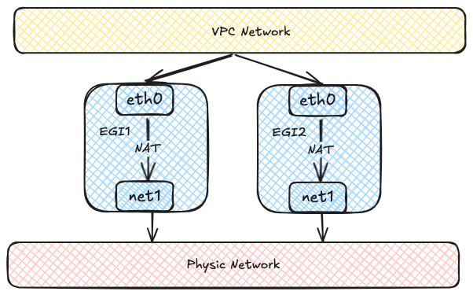
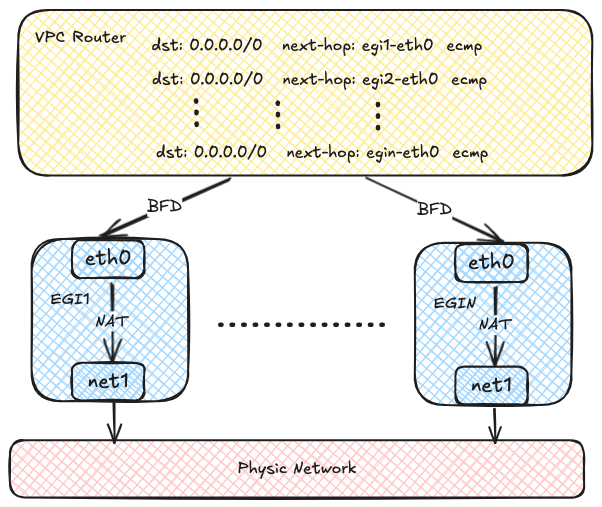
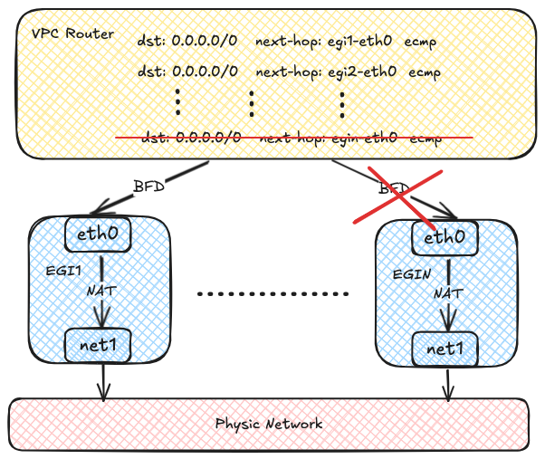

# Configure Egress Gateway

## Overview

Egress Gateway, also called VPC Egress Gateway, provides stable outbound addresses for Pods in an overlay network.
It routes selected workloads through dedicated gateway Pods before the traffic leaves the cluster.

Use Egress Gateway when you need:

- Stable source IP addresses for specific workloads
- Workload-level egress control instead of subnet-level control
- Higher throughput through horizontal scaling
- Faster failover for outbound traffic

Main capabilities:

- Active-Active high availability through ECMP, with horizontal throughput scaling
- Fast failover through BFD, typically in less than 1 second
- Support for IPv4, IPv6, and dual-stack environments
- Fine-grained traffic matching through NamespaceSelector and PodSelector
- Flexible scheduling through node selectors and tolerations

Current limitations:

- Multi-replica deployments require multiple egress IPs
- Source NAT mapping records are not retained

## Egress Gateway vs. Centralized Gateway

Use this section to choose the gateway model that best fits your scenario.
For centralized mode details, refer to [Configure Centralized Gateway](./configure_centralized_gateway).

| Dimension | Egress Gateway | Centralized Gateway |
| --- | --- | --- |
| Granularity | Fine-grained control by `selectors` and `policies` (Namespace/Pod/Subnet/IPBlock). | Applied at subnet level (`gatewayType: centralized`). |
| Egress Address Source | Uses dedicated gateway Pods with external subnet IPs. | Uses designated gateway nodes; with `natOutgoing: true`, egress uses node IPs. |
| Data Path | Traffic is routed to VPC Egress Gateway Pods, then SNATed to the external network. | Traffic is routed to designated nodes (`ovn0`) and then forwarded by host routing/NAT rules. |
| HA and Failover | Active-Active ECMP; supports BFD fast failover (sub-second). | Supports ECMP and primary-backup; failover is generally slower than BFD-based Egress Gateway. |
| Scheduling Control | Supports node scheduling controls for gateway workloads (`nodeSelector`, `tolerations`). | Gateway nodes are selected by `gatewayNode` or `gatewayNodeSelectors`. |
| Typical Use Cases | Tenant-level or workload-level egress isolation, fine-grained policy control, higher performance and faster failover. | Simpler subnet-level fixed-source egress, auditing, IP allowlists, and firewall source-IP management. |

Selection guidance:

- Choose **Egress Gateway** when you need workload-level policy control, scalable throughput, and fast failover.
- Choose **Centralized Gateway** when subnet-level fixed egress and simple operations are sufficient.

## How Egress Gateway Works

An Egress Gateway runs as one or more Pods. Each Pod uses two network interfaces:

- One interface connects to the overlay network inside the cluster.
- The other interface connects to the external underlay network.

Traffic from selected Pods is first forwarded to the gateway Pods and then sent to the external network through the underlay interface.



Each Egress Gateway instance registers its address in the OVN routing table.
When a Pod in the overlay network accesses the external network, OVN uses source-address hashing to distribute traffic across multiple gateway instances.
This provides load balancing and lets throughput scale horizontally as more instances are added.



OVN can use BFD to probe multiple gateway instances.
If one instance fails, OVN marks the corresponding route as unavailable and quickly redirects traffic to a healthy instance.



## Before You Begin

Before you start, make sure the following prerequisites are met:

- _Multus CNI Plugin_ __MUST__ already be installed on the cluster.
- The external underlay network, VLAN, and bridge network are already planned and available.
- You have identified which workloads should use the gateway and whether they require SNAT.

To install _Multus CNI Plugin_, refer to [Deploying the Multus CNI Plugin](./multiple_networks#deploying-the-multus-cni-plugin).

## Configuration Workflow

Configure Egress Gateway in the following order:

1. Prepare the external network attachment, including the subnet and Network Attachment Definition.
2. Create a VPC Egress Gateway resource and specify the external subnet and policies.
3. Verify resource status, routes, and traffic forwarding.
4. Optionally scale out replicas and enable BFD-based fast failover.

### Step 1: Prepare the External Network Attachment

Egress Gateway uses multiple interfaces to connect to both the internal and external networks.
Before creating the gateway, prepare the following resources:

- An external subnet
- A Network Attachment Definition (NAD) for that subnet

The following example uses a Kube-OVN underlay subnet as the external network.

:::note
  This example assumes that the bridge network and VLAN resource `external-vlan` have already been created for the underlay network.
:::

```yaml
apiVersion: k8s.cni.cncf.io/v1
kind: NetworkAttachmentDefinition
metadata:
  name: underlay-ext
  namespace: default
spec:
  config: |-
    {
      "cniVersion": "0.3.0", [!code callout]
      "type": "kube-ovn", [!code callout]
      "server_socket": "/run/openvswitch/kube-ovn-daemon.sock", [!code callout]
      "provider": "underlay-ext.default.ovn"
    }
---
apiVersion: kubeovn.io/v1
kind: Subnet
metadata:
  name: underlay-ext
spec:
  protocol: IPv4
  provider: underlay-ext.default.ovn # [!code callout]
  cidrBlock: 172.17.0.0/16 # [!code callout]
  gateway: 172.17.0.1 # [!code callout]
  vlan: external-vlan # [!code callout]
  excludeIps: # [!code callout]
    - 172.17.0.11..172.17.0.20
```

<Callouts>

1. Use the Kube-OVN CNI plugin for the secondary network.
2. Kube-OVN daemon socket used by the CNI plugin.
3. Provider name in the format `<network attachment definition name>.<namespace>.ovn`.
4. The provider used by the subnet. This value MUST match the provider in the NetworkAttachmentDefinition.
5. CIDR of the external underlay network.
6. Gateway of the external underlay network.
7. VLAN resource used by the underlay subnet.
8. IP range excluded from automatic allocation. For details, refer to [Example Subnet custom resource (CR) with Kube-OVN Underlay Network](../../functions/configure_subnet.mdx#kube_ovn_underlay_network).

</Callouts>

:::tip
  Before using an underlay subnet, make sure the physical network, VLAN, and bridge network are prepared correctly.
  For environment planning details, refer to [Preparing Kube-OVN Underlay Physical Network](./kubeovn_underlay_py).
:::

### Step 2: Create a VPC Egress Gateway

Create a VPC Egress Gateway resource and define which workloads should use it.

```yaml
apiVersion: kubeovn.io/v1
kind: VpcEgressGateway
metadata:
  name: gateway1
  namespace: default # [!code callout]
spec:
  replicas: 1 # [!code callout]
  internalSubnet: ovn-default # [!code callout]
  externalSubnet: underlay-ext # [!code callout]
  externalIPs: # [!code callout]
    - 172.17.0.11
    - 172.17.0.12
  resources: # [!code callout]
    requests:
      cpu: 100m
      memory: 128Mi
    limits:
      cpu: 200m
      memory: 256Mi
      ephemeral-storage: 2Gi
  nodeSelector: # [!code callout]
    - matchExpressions:
        - key: kubernetes.io/hostname
          operator: In
          values:
            - node1
            - node2
  tolerations: # [!code callout]
    - key: node-role.kubernetes.io/control-plane
      operator: Exists
      effect: NoSchedule
  selectors: # [!code callout]
    - namespaceSelector:
        matchLabels:
          kubernetes.io/metadata.name: ns1
    - namespaceSelector:
        matchLabels:
          kubernetes.io/metadata.name: ns2
      podSelector:
        matchLabels:
          app: myapp
  policies: # [!code callout]
    - snat: true # [!code callout]
      subnets: # [!code callout]
        - subnet1
    - snat: false
      ipBlocks: # [!code callout]
        - 10.18.0.0/16
```

<Callouts>

1. Namespace where the VPC Egress Gateway instances are created.
2. Number of VPC Egress Gateway instances.
3. Internal subnet that connects to the internal network. The subnet MUST be an overlay subnet in the same VPC and have enough free IPs for the gateway instances.
If not specified, the gateway Pods will use the default internal subnet of the VPC.
4. External subnet that connects to the external network.
5. External IPs used by the gateway Pods on the underlay network. Each gateway instance is allocated one IP from this list.
These IPs MUST be within the CIDR of the external subnet and should be included in the `excludeIps` range of the subnet.
It's recommended to reserve _.spec.replicas + 1_ IPs so that a gateway Pod can still obtain an IP in edge cases.
6. Resource requests and limits for each VPC Egress Gateway instance.
If not specified, the default resource requests and limits defined in the VPC Egress Gateway controller will be applied.
7. Node selectors used for scheduling the VPC Egress Gateway instances.
8. Tolerations used for scheduling the VPC Egress Gateway instances.
9. Namespace selectors and Pod selectors used to select Pods that access the external network via the VPC Egress Gateway.
10. Policies for the VPC Egress Gateway, including SNAT and subnets/ipBlocks to be applied.
11. Whether to enable SNAT for the policy.
12. Subnets to which the policy applies.
13. IP blocks to which the policy applies.

</Callouts>

This example creates a VPC Egress Gateway named _gateway1_ in the `default` namespace.
Traffic that matches the selectors and policies is forwarded through the external subnet _underlay-ext_.
In this example, that includes:

- Pods in the _ns1_ namespace
- Pods in the _ns2_ namespace with the label `app: myapp`
- Traffic related to the _subnet1_ subnet
- Traffic related to the CIDR _10.18.0.0/16_

:::note
  Pods matching _.spec.selectors_ are always SNATed by the gateway.
:::

### Step 3: Validate the Gateway

After creating the gateway, confirm that it is ready and forwarding traffic as expected.

#### 1. Check the resource status

Start with the basic resource status:

```shell
$ kubectl get veg gateway1
NAME       VPC           REPLICAS   BFD ENABLED   EXTERNAL SUBNET   PHASE       READY   AGE
gateway1   ovn-cluster   1          false         underlay-ext      Completed   true    13s
```

Then check the detailed gateway information:

```shell
kubectl get veg gateway1 -o wide
NAME       VPC           REPLICAS   BFD ENABLED   EXTERNAL SUBNET   PHASE       READY   INTERNAL IPS     EXTERNAL IPS      WORKING NODES   AGE
gateway1   ovn-cluster   1          false         underlay-ext      Completed   true    ["10.16.0.12"]   ["172.17.0.11"]   ["node1"]       82s
```

Finally, verify that the gateway workloads are running:

```shell
$ kubectl get deployment -n default -l ovn.kubernetes.io/vpc-egress-gateway=gateway1
NAME       READY   UP-TO-DATE   AVAILABLE   AGE
gateway1   1/1     1            1           4m40s

$ kubectl get pod -n default -l ovn.kubernetes.io/vpc-egress-gateway=gateway1 -o wide
NAME                       READY   STATUS    RESTARTS   AGE     IP           NODE    NOMINATED NODE   READINESS GATES
gateway1-b9f8b4448-76lhm   1/1     Running   0          4m48s   10.16.0.12   node1   <none>           <none>
```

#### 2. Inspect networking inside the gateway Pod

Inspect IP addresses, routing entries, and iptables rules inside the gateway Pod:

```shell
$ kubectl exec -n default gateway1-b9f8b4448-76lhm -c gateway -- ip address show
1: lo: <LOOPBACK,UP,LOWER_UP> mtu 65536 qdisc noqueue state UNKNOWN group default qlen 1000
    link/loopback 00:00:00:00:00:00 brd 00:00:00:00:00:00
    inet 127.0.0.1/8 scope host lo
       valid_lft forever preferred_lft forever
    inet6 ::1/128 scope host
       valid_lft forever preferred_lft forever
2: net1@if13: <BROADCAST,MULTICAST,UP,LOWER_UP> mtu 1500 qdisc noqueue state UP group default qlen 1000
    link/ether 62:d8:71:90:7b:86 brd ff:ff:ff:ff:ff:ff link-netnsid 0
    inet 172.17.0.11/16 brd 172.17.255.255 scope global net1
       valid_lft forever preferred_lft forever
    inet6 fe80::60d8:71ff:fe90:7b86/64 scope link
       valid_lft forever preferred_lft forever
17: eth0@if18: <BROADCAST,MULTICAST,UP,LOWER_UP> mtu 1400 qdisc noqueue state UP group default
    link/ether 36:7c:6b:c7:82:6b brd ff:ff:ff:ff:ff:ff link-netnsid 0
    inet 10.16.0.12/16 brd 10.16.255.255 scope global eth0
       valid_lft forever preferred_lft forever
    inet6 fe80::347c:6bff:fec7:826b/64 scope link
       valid_lft forever preferred_lft forever

$ kubectl exec -n default gateway1-b9f8b4448-76lhm -c gateway -- ip rule show
0:      from all lookup local
1001:   from all iif eth0 lookup default
1002:   from all iif net1 lookup 1000
1003:   from 10.16.0.12 iif lo lookup 1000
1004:   from 172.17.0.11 iif lo lookup default
32766:  from all lookup main
32767:  from all lookup default

$ kubectl exec -n default gateway1-b9f8b4448-76lhm -c gateway -- ip route show
default via 172.17.0.1 dev net1
10.16.0.0/16 dev eth0 proto kernel scope link src 10.16.0.12
10.17.0.0/16 via 10.16.0.1 dev eth0
10.18.0.0/16 via 10.16.0.1 dev eth0
172.17.0.0/16 dev net1 proto kernel scope link src 172.17.0.11

$ kubectl exec -n default gateway1-b9f8b4448-76lhm -c gateway -- ip route show table 1000
default via 10.16.0.1 dev eth0

$ kubectl exec -n default gateway1-b9f8b4448-76lhm -c gateway -- iptables -t nat -S
-P PREROUTING ACCEPT
-P INPUT ACCEPT
-P OUTPUT ACCEPT
-P POSTROUTING ACCEPT
-N VEG-MASQUERADE
-A PREROUTING -i eth0 -j MARK --set-xmark 0x4000/0x4000
-A POSTROUTING -d 10.18.0.0/16 -j RETURN
-A POSTROUTING -s 10.18.0.0/16 -j RETURN
-A POSTROUTING -j VEG-MASQUERADE
-A VEG-MASQUERADE -j MARK --set-xmark 0x0/0xffffffff
-A VEG-MASQUERADE -j MASQUERADE --random-fully
```

#### 3. Confirm traffic forwarding

Capture packets in the gateway Pod to confirm that traffic is forwarded through the gateway:

```shell
$ kubectl exec -n default gateway1-b9f8b4448-76lhm -c gateway -- tcpdump -i any -nnve icmp and host 172.17.0.1
tcpdump: data link type LINUX_SLL2
tcpdump: listening on any, link-type LINUX_SLL2 (Linux cooked v2), snapshot length 262144 bytes
06:50:58.936528 eth0  In  ifindex 17 92:26:b8:9e:f2:1c ethertype IPv4 (0x0800), length 104: (tos 0x0, ttl 63, id 30481, offset 0, flags [DF], proto ICMP (1), length 84)
    10.17.0.9 > 172.17.0.1: ICMP echo request, id 37989, seq 0, length 64
06:50:58.936574 net1  Out ifindex 2 62:d8:71:90:7b:86 ethertype IPv4 (0x0800), length 104: (tos 0x0, ttl 62, id 30481, offset 0, flags [DF], proto ICMP (1), length 84)
    172.17.0.11 > 172.17.0.1: ICMP echo request, id 39449, seq 0, length 64
06:50:58.936613 net1  In  ifindex 2 02:42:39:79:7f:08 ethertype IPv4 (0x0800), length 104: (tos 0x0, ttl 64, id 26701, offset 0, flags [none], proto ICMP (1), length 84)
    172.17.0.1 > 172.17.0.11: ICMP echo reply, id 39449, seq 0, length 64
06:50:58.936621 eth0  Out ifindex 17 36:7c:6b:c7:82:6b ethertype IPv4 (0x0800), length 104: (tos 0x0, ttl 63, id 26701, offset 0, flags [none], proto ICMP (1), length 84)
    172.17.0.1 > 10.17.0.9: ICMP echo reply, id 37989, seq 0, length 64
```

#### 4. Confirm OVN routing policies

OVN Logical Router policies are created automatically for the selected traffic:

```shell
$ kubectl ko nbctl lr-policy-list ovn-cluster
Routing Policies
     31000                            ip4.dst == 10.16.0.0/16   allow
     31000                            ip4.dst == 10.17.0.0/16   allow
     31000                           ip4.dst == 100.64.0.0/16   allow
     30000                              ip4.dst == 172.18.0.2  reroute  100.64.0.4
     30000                              ip4.dst == 172.18.0.3  reroute  100.64.0.3
     30000                              ip4.dst == 172.18.0.4  reroute  100.64.0.2
     29100                  ip4.src == $VEG.8ca38ae7da18.ipv4  reroute  10.16.0.12 # [!code callout]
     29100                   ip4.src == $VEG.8ca38ae7da18_ip4  reroute  10.16.0.12 # [!code callout]
     29000 ip4.src == $ovn.default.kube.ovn.control.plane_ip4  reroute  100.64.0.3
     29000       ip4.src == $ovn.default.kube.ovn.worker2_ip4  reroute  100.64.0.2
     29000        ip4.src == $ovn.default.kube.ovn.worker_ip4  reroute  100.64.0.4
     29000     ip4.src == $subnet1.kube.ovn.control.plane_ip4  reroute  100.64.0.3
     29000           ip4.src == $subnet1.kube.ovn.worker2_ip4  reroute  100.64.0.2
     29000            ip4.src == $subnet1.kube.ovn.worker_ip4  reroute  100.64.0.4
```

<Callouts>

1. Logical Router Policy used by the VPC Egress Gateway to forward traffic matched by _.spec.policies_.
2. Logical Router Policy used by the VPC Egress Gateway to forward traffic matched by _.spec.selectors_.

</Callouts>

### Optional: Enable Multi-Replica Load Balancing

:::note
Before scaling out replicas, make sure to prepare enough external IPs in the external subnet and specify them in _.spec.externalIPs_.
:::

To enable ECMP load balancing and scale throughput horizontally, increase _.spec.replicas_:

```shell
$ kubectl scale veg -n default gateway1 --replicas=2
vpcegressgateway.kubeovn.io/gateway1 scaled

$ kubectl get veg -n default gateway1
NAME       VPC           REPLICAS   BFD ENABLED   EXTERNAL SUBNET   PHASE       READY   AGE
gateway1   ovn-cluster   2          false         underlay-ext      Completed   true    39m

$ kubectl get pod -n default -l ovn.kubernetes.io/vpc-egress-gateway=gateway1 -o wide
NAME                       READY   STATUS    RESTARTS   AGE   IP           NODE    NOMINATED NODE   READINESS GATES
gateway1-b9f8b4448-76lhm   1/1     Running   0          40m   10.16.0.12   node1   <none>           <none>
gateway1-b9f8b4448-zd4dl   1/1     Running   0          64s   10.16.0.13   node2   <none>           <none>

$ kubectl ko nbctl lr-policy-list ovn-cluster
Routing Policies
     31000                            ip4.dst == 10.16.0.0/16    allow
     31000                            ip4.dst == 10.17.0.0/16    allow
     31000                           ip4.dst == 100.64.0.0/16    allow
     30000                              ip4.dst == 172.18.0.2  reroute  100.64.0.4
     30000                              ip4.dst == 172.18.0.3  reroute  100.64.0.3
     30000                              ip4.dst == 172.18.0.4  reroute  100.64.0.2
     29100                  ip4.src == $VEG.8ca38ae7da18.ipv4  reroute  10.16.0.12, 10.16.0.13
     29100                   ip4.src == $VEG.8ca38ae7da18_ip4  reroute  10.16.0.12, 10.16.0.13
     29000 ip4.src == $ovn.default.kube.ovn.control.plane_ip4  reroute  100.64.0.3
     29000       ip4.src == $ovn.default.kube.ovn.worker2_ip4  reroute  100.64.0.2
     29000        ip4.src == $ovn.default.kube.ovn.worker_ip4  reroute  100.64.0.4
     29000     ip4.src == $subnet1.kube.ovn.control.plane_ip4  reroute  100.64.0.3
     29000           ip4.src == $subnet1.kube.ovn.worker2_ip4  reroute  100.64.0.2
     29000            ip4.src == $subnet1.kube.ovn.worker_ip4  reroute  100.64.0.4
```

### Optional: Enable BFD-based High Availability

BFD-based failover depends on the VPC BFD LRP.
Enable it in the following order.

#### 1. Enable a BFD Port on the VPC

First, enable a BFD Port on the VPC:

```yaml
apiVersion: kubeovn.io/v1
kind: Vpc
metadata:
  name: ovn-cluster
spec:
  bfdPort:
    enabled: true # [!code callout]
    ip: 10.255.255.255 # [!code callout]
    nodeSelector: # [!code callout]
      matchLabels:
        kubernetes.io/os: linux
```

<Callouts>

1. Whether to enable the BFD Port.
2. IP address of the BFD Port, which MUST be a valid IP address that does not conflict with ANY other IPs/Subnets.
3. Node selector used to select the nodes where the BFD Port runs in Active-Backup mode.

</Callouts>

:::tip
  The Vpc resource _ovn-cluster_ exists by default. You can edit it directly to enable the BFD Port.
:::

After the BFD Port is enabled, a dedicated BFD LRP is automatically created on the OVN Logical Router:

```shell
$ kubectl ko nbctl show ovn-cluster
router 0c1d1e8f-4c86-4d96-88b2-c4171c7ff824 (ovn-cluster)
    port bfd@ovn-cluster # [!code callout]
        mac: "8e:51:4b:16:3c:90"
        networks: ["10.255.255.255"]
    port ovn-cluster-join
        mac: "d2:21:17:71:77:70"
        networks: ["100.64.0.1/16"]
    port ovn-cluster-ovn-default
        mac: "d6:a3:f5:31:cd:89"
        networks: ["10.16.0.1/16"]
    port ovn-cluster-subnet1
        mac: "4a:09:aa:96:bb:f5"
        networks: ["10.17.0.1/16"]
```

<Callouts>

1. BFD Port created on the OVN Logical Router.

</Callouts>

#### 2. Enable BFD on the VPC Egress Gateway

Then enable BFD on the VPC Egress Gateway by setting _.spec.bfd.enabled_ to _true_:

```yaml
apiVersion: kubeovn.io/v1
kind: VpcEgressGateway
metadata:
  name: gateway2
  namespace: default
spec:
  vpc: ovn-cluster # [!code callout]
  replicas: 2
  internalSubnet: ovn-default # [!code callout]
  externalSubnet: underlay-ext # [!code callout]
  externalIPs: # [!code callout]
    - 172.17.0.11
    - 172.17.0.12
    - 172.17.0.13
  bfd:
    enabled: true # [!code callout]
    minRX: 100 # [!code callout]
    minTX: 100 # [!code callout]
    multiplier: 5 # [!code callout]
  policies:
    - snat: true
      ipBlocks:
        - 10.18.0.0/16
```

<Callouts>

1. VPC to which the Egress Gateway belongs.
2. Internal subnet to which the Egress Gateway instances are connected.
3. External subnet to which the Egress Gateway instances are connected.
4. External IPs assigned to the Egress Gateway instances.
5. Whether to enable BFD for the Egress Gateway.
6. Minimum receive interval for BFD, in milliseconds.
7. Minimum transmit interval for BFD, in milliseconds.
8. Multiplier for BFD, which determines the number of missed packets before declaring a failure.

</Callouts>

This example creates a VPC Egress Gateway named _gateway2_ with two replicas and BFD enabled.
If one instance fails, the BFD session goes down, OVN marks the route as unavailable, and redirects traffic to the healthy instance.

Failover detection time depends on the BFD settings.
Use the following formula: _break time = (multiplier + 1) * max(minRX, minTX)_.
With this sample configuration, failover detection is approximately 500-600 ms.

:::note
  Existing connections may be interrupted during failover and require reconnection. New connections can still be established normally.
:::

#### 3. Verify BFD status

Check the VPC Egress Gateway status:

```shell
$ kubectl get veg -n default gateway2 -o wide
NAME       VPC           REPLICAS   BFD ENABLED   EXTERNAL SUBNET   PHASE       READY   INTERNAL IPS                  EXTERNAL IPS                    WORKING NODES       AGE
gateway2   ovn-cluster   2          true          underlay-ext      Completed   true    ["10.16.0.12","10.16.0.13"]   ["172.17.0.11","172.17.0.12"]   ["node1","node2"]   58s

$ kubectl get pod -n default -l ovn.kubernetes.io/vpc-egress-gateway=gateway2 -o wide
NAME                       READY   STATUS    RESTARTS   AGE     IP           NODE    NOMINATED NODE   READINESS GATES
gateway2-fcc6b8b87-8lgvx   1/1     Running   0          2m18s   10.16.0.13   node2   <none>           <none>
gateway2-fcc6b8b87-wmww6   1/1     Running   0          2m18s   10.16.0.12   node1   <none>           <none>

$ kubectl ko nbctl lr-policy-list ovn-cluster
Routing Policies
     31000                            ip4.dst == 10.16.0.0/16    allow
     31000                            ip4.dst == 10.17.0.0/16    allow
     31000                           ip4.dst == 100.64.0.0/16    allow
     30000                              ip4.dst == 172.18.0.2  reroute  100.64.0.4
     30000                              ip4.dst == 172.18.0.3  reroute  100.64.0.3
     30000                              ip4.dst == 172.18.0.4  reroute  100.64.0.2
     29100                  ip4.src == $VEG.8ca38ae7da18.ipv4  reroute  10.16.0.12, 10.16.0.13  bfd
     29100                   ip4.src == $VEG.8ca38ae7da18_ip4  reroute  10.16.0.12, 10.16.0.13  bfd
     29090                  ip4.src == $VEG.8ca38ae7da18.ipv4     drop
     29090                   ip4.src == $VEG.8ca38ae7da18_ip4     drop
     29000 ip4.src == $ovn.default.kube.ovn.control.plane_ip4  reroute  100.64.0.3
     29000       ip4.src == $ovn.default.kube.ovn.worker2_ip4  reroute  100.64.0.2
     29000        ip4.src == $ovn.default.kube.ovn.worker_ip4  reroute  100.64.0.4
     29000     ip4.src == $subnet1.kube.ovn.control.plane_ip4  reroute  100.64.0.3
     29000           ip4.src == $subnet1.kube.ovn.worker2_ip4  reroute  100.64.0.2
     29000            ip4.src == $subnet1.kube.ovn.worker_ip4  reroute  100.64.0.4

$ kubectl ko nbctl list bfd
_uuid               : 223ede10-9169-4c7d-9524-a546e24bfab5
detect_mult         : 5
dst_ip              : "10.16.0.12"
external_ids        : {af="4", vendor=kube-ovn, vpc-egress-gateway="default/gateway2"}
logical_port        : "bfd@ovn-cluster"
min_rx              : 100
min_tx              : 100
options             : {}
status              : up

_uuid               : b050c75e-2462-470b-b89c-7bd38889b758
detect_mult         : 5
dst_ip              : "10.16.0.13"
external_ids        : {af="4", vendor=kube-ovn, vpc-egress-gateway="default/gateway2"}
logical_port        : "bfd@ovn-cluster"
min_rx              : 100
min_tx              : 100
options             : {}
status              : up
```

Then check the BFD sessions:

```shell
$ kubectl exec -n default gateway2-fcc6b8b87-8lgvx -c bfdd -- bfdd-control status
There are 1 sessions:
Session 1
 id=1 local=10.16.0.13 (p) remote=10.255.255.255 state=Up

$ kubectl exec -n default gateway2-fcc6b8b87-wmww6 -c bfdd -- bfdd-control status
There are 1 sessions:
Session 1
 id=1 local=10.16.0.12 (p) remote=10.255.255.255 state=Up
```

:::note
  If all gateway instances are down, egress traffic handled by the VPC Egress Gateway is dropped.
:::

## Operations That May Interrupt Traffic

The following operations may briefly interrupt egress traffic because they delete or recreate gateway instances:

1. Changing the number of replicas
2. Changing configuration such as internal or external IPs, node selectors, or BFD settings
3. Upgrading or downgrading Kube-OVN if _.spec.image_ is not specified
4. Manually deleting an Egress Gateway Pod

## Additional Resources

- [RFC 5880 - Bidirectional Forwarding Detection \(BFD\)](https://datatracker.ietf.org/doc/rfc5880/)
