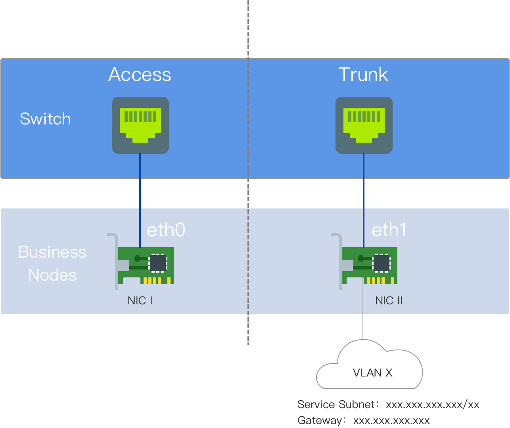

# Preparing Kube-OVN Underlay Physical Network

The container network under Kube-OVN Underlay transport mode relies on physical network support. Before deploying the Kube-OVN Underlay network, please collaborate with the network administrator to plan and complete the relevant configurations of the physical network in advance, ensuring network connectivity.

## Usage Instructions

Kube-OVN Underlay requires deployment with multiple network interface cards (NICs), and the Underlay subnet must exclusively use one NIC. No other types of traffic, such as SSH, should be on that NIC; they should utilize other NICs.

Before use, ensure that the node server has at least a **dual-NIC** environment, and it is recommended that the NIC speed is **at least 10 Gbps or higher** (e.g., 10 Gbps, 25 Gbps, 40 Gbps).

- NIC One: The NIC with the default route, configured with an IP address, interconnected with the external switch interface, which is set to Access mode.

- NIC Two: The NIC without the default route and not configured with an IP address, interconnected with the external switch interface, which is set to Trunk mode. The Underlay subnet exclusively uses NIC Two.



## Terminology Explanation

VLAN (Virtual Local Area Network) is a technology that logically divides a local area network into multiple segments (or smaller LANs) to facilitate data exchange for virtual workgroups.

The emergence of VLAN technology allows administrators to logically segment different users within the same physical local area network into distinct broadcast domains based on actual application needs. Each VLAN comprises a group of computer workstations with similar requirements and possesses the same properties as a physically formed LAN. Since VLANs are logically divided rather than physically, workstations within the same VLAN are not confined to the same physical area; they can exist across different physical LAN segments.

The main advantages of VLANs include:

- Port Segmentation. Even on the same switch, ports in different VLANs cannot communicate with each other. A physical switch can function as multiple logical switches. This is commonly used to control mutual access between different departments and sites in a network.

- Network Security. Different VLANs cannot communicate directly, eliminating the insecurity of broadcast information. Broadcast and unicast traffic within a VLAN will not be forwarded to other VLANs, helping control traffic, reduce equipment investments, simplify network management, and improve network security.

- Flexible Management. When changing a user's network affiliation, there's no need to replace ports or cables; it merely requires a software configuration change.

## Environment Requirements

In Underlay mode, Kube-OVN bridges a physical NIC to OVS and sends packets directly to the external through that physical NIC. The L2/L3 forwarding capability relies on the underlying network devices. The corresponding gateway, VLAN, and security policies need to be pre-configured on the underlying network devices.

- **Network Configuration Requirements**

  - Kube-OVN checks the gateway's connectivity via ICMP protocol when starting containers; the underlying gateway must respond to ICMP requests.

  - For service access traffic, Pods will first send packets to the gateway, which must have the ability to forward packets back to the local subnet.

  - When the switch or bridge has Hairpin functionality enabled, **Hairpin must be disabled**. If using a VMware virtual machine environment, set **Net.ReversePathFwdCheckPromisc** on the VMware host to **1**, and Hairpin does not need to be disabled.

  - The bridging NIC **cannot** be a **Linux Bridge**.

  - NIC bonding modes support Mode 0 (balance-rr), Mode 1 (active-backup), Mode 4 (802.3ad), Mode 6 (balance-alb), with a recommendation to use 0 or 1. Other bonding modes have not been tested; please use them with caution.

- **IaaS (Virtualization) Layer Configuration Requirements**

  - For OpenStack VM environments, the **PortSecurity** for the corresponding network port needs to be disabled.

  - For VMware's vSwitch network, **MAC Address Changes**, **Forged Transmits**, and **Promiscuous Mode Operation** must all be set to **Accept**.

  - For public clouds such as AWS, GCE, and Alibaba Cloud, Underlay mode networks cannot be supported due to their lack of user-defined MAC address capabilities.

## Configuration Example

The nodes in this example are dual-NIC physical machines. NIC One is the NIC with the default route; NIC Two is the NIC without the default route and is not configured with an IP address, exclusively used for the Underlay subnet. NIC Two is interconnected with the external switch.

- On the switch side, the interface connected to NIC Two should be configured in Trunk mode, allowing the corresponding VLANs to pass through.

- Configure the gateway address of the cluster subnet on the corresponding vlan-interface interface. If dual-stack is needed, the IPv6 gateway address can also be configured simultaneously.

- If the gateway is behind a firewall, access from node nodes to the cluster-cidr network must be permitted.

- No configuration is needed for server NICs.

### Switch Configuration

Configure the VLAN Interface:

```
#
interface Vlan-interface74
  ip address 192.168.74.254 255.255.255.0   //IPv4 gateway address
  ipv6 address 2074::192:168:74:254/64  //IPv6 gateway address
#
```

Configure the interface connected to NIC Two:

```
#
interface Ten-GigabitEthernet1/0/19
  port link mode bridge
  port link-type trunk  // Configure the interface to Trunk mode
  undo port trunk permit vlan 1
  port trunk permit vlan 74  // Allow the corresponding VLAN to pass through
#
```

### Check Network Connectivity

Test if NIC Two can communicate with the gateway address:

```
ip link add ens224.74 link ens224 type vlan id 74  // The NIC name is ens224, and the VLAN ID is 74
ip link set ens224.74 up
ip addr add 192.168.74.200/24 dev ens224.74  // Select a test address within the Underlay subnet, here it's 192.168.74.200/24
ping 192.168.74.254  // If able to ping the gateway, it confirms that the physical environment meets deployment requirements
ip addr del 192.168.74.200/24 dev ens224.74  // Delete the test address after testing
ip link del ens224.74  // Delete the sub-interface after testing
```

### Platform Configuration

In the left navigation bar, click **Cluster Management > Cluster**, then click **Create Cluster**. For specific configuration steps, please refer to the [Create Cluster]() document, with container network configuration shown in the image below.

**Note**: The Join subnet has no practical significance in the Underlay environment and primarily serves to create an Overlay subnet later, providing the IP address range necessary for communication between nodes and container groups.


