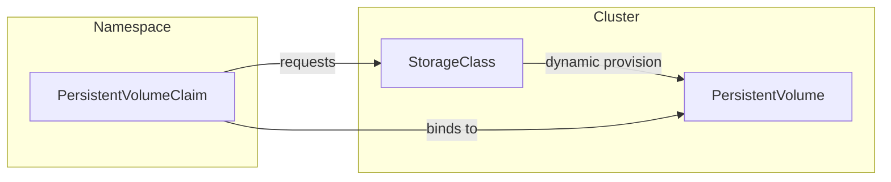

# Key Concepts

Kubernetes storage is centered on three key concepts: **PersistentVolume (PV)**, **PersistentVolumeClaim (PVC)**, and **StorageClass**. These define how storage is requested, allocated, and configured within a cluster. Under the hood, **CSI** (Container Storage Interface) drivers frequently handle the actual provisioning and attachment of storage. Let’s briefly look at each component and then highlight the CSI Driver’s role.

## Persistent Volume (PV)

A **PersistentVolume (PV)** is a piece of storage in the cluster that has been provisioned (either statically by an administrator or dynamically through a StorageClass). It represents the underlying storage—such as a disk on a cloud provider or a network-attached filesystem—and is treated as a resource in the cluster, similar to a node.

## Persistent Volume Claim (PVC)

A **PersistentVolumeClaim (PVC)** is a request for storage. Users define how much storage they need and the access mode (e.g., read-write). If an appropriate PV is available or can be dynamically provisioned (via a StorageClass), the PVC becomes “bound” to that PV. Once bound, Pods can reference the PVC to persist or share data.

## StorageClass

A **StorageClass** describes _how_ volumes should be dynamically provisioned. It maps to a specific provisioner (often a CSI driver) and can include parameters such as storage tiers, performance characteristics, or other backend configurations. By creating multiple StorageClasses, you can offer various types of storage to developers.

_Diagram: Relationship between PVC, PV, and StorageClass._

## Container Storage Interface (CSI)

The **Container Storage Interface (CSI)** is a standard API that Kubernetes uses to integrate with storage drivers. It allows third-party storage providers to build out-of-tree plugins, meaning you can install or update a storage driver without modifying Kubernetes itself.

A CSI **driver** typically has two components:

1. **Controller component**: Runs in the cluster (often as a Deployment) and handles high-level operations, such as **creating** or **deleting** volumes. For networked storage, it may also handle attaching and detaching volumes to nodes.
    
2. **Node component**: Runs on each node (often as a DaemonSet) and is responsible for **mounting** and **unmounting** the volume on that particular node. It communicates with the kubelet to ensure the volume is accessible to Pods.
    

When a user creates a PVC referring to a StorageClass that uses a CSI driver, the CSI driver observes that request and provisions storage accordingly (if dynamic provisioning is required). Once the storage is created, the driver notifies Kubernetes, which creates a corresponding PV and binds it to the PVC. Whenever a Pod uses that PVC, the node component of the driver handles the volume mount, making the storage available inside the container.

---

By leveraging **PV**, **PVC**, **StorageClass**, and **CSI**, Kubernetes enables a powerful, declarative approach to storage management. Administrators can define one or more StorageClasses to represent different storage backends or performance tiers, while developers simply request storage using PVCs—without worrying about the underlying infrastructure.