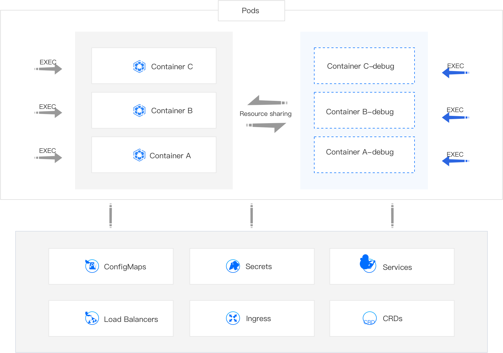

# Containers

## Understanding Containers

Refer to the official Kubernetes website documentation: [Containers](https://kubernetes.io/docs/concepts/containers/).

A **container** is a lightweight, executable package of software that includes everything needed to run an application: code, runtime, system tools, system libraries, and settings. While Pods are the smallest deployable units, containers are the core components within Pods.

## Understanding Ephemeral Containers

Debugging Containers with
Refer to the official Kubernetes website documentation: [Ephemeral Containers](https://kubernetes.io/docs/concepts/workloads/pods/ephemeral-containers/)

The Kubernetes Ephemeral Containers feature provides a robust way to debug running containers by injecting specialized debugging tools (system, network, and disk utilities) into an existing Pod.

While you can often execute commands directly within a running container using kubectl exec, many production container images are intentionally minimal and may lack essential debugging utilities (e.g., bash, net-tools, tcpdump) to reduce image size and attack surface. Ephemeral Containers address this limitation by providing a pre-configured environment with a rich set of debugging tools, making them ideal for the following scenarios:

- **Fault Diagnosis**: When a primary application container experiences issues (e.g., unexpected crashes, performance degradation, network connectivity problems), beyond checking standard Pod events and logs, you often need to perform deeper, interactive troubleshooting directly within the Pod's runtime environment.
- **Configuration Tuning and Experimentation**: If the current application configuration exhibits suboptimal behavior, you might want to temporarily adjust component settings or test new configurations directly within the running container to observe immediate effects and devise improved solutions.

### Implementation Principle: Leveraging Ephemeral Containers

The debugging functionality is implemented using **Ephemeral Containers**. An Ephemeral Container is a special type of container designed for introspection and debugging. It shares the Pod's network namespace and process namespace (if enabled) with the existing primary `containers`, allowing it to directly interact with and observe the application processes.

You can dynamically add an Ephemeral Container (e.g., `my-app-debug`) to a running Pod and utilize its pre-installed debugging tools. The diagnostic results from this Ephemeral Container are directly relevant to the behavior and state of the primary application `containers` within the same Pod.



:::Notes

- You cannot add an Ephemeral Container by directly modifying a Pod's static manifest (PodSpec). The Ephemeral Containers feature is designed for dynamic injection into running Pods, typically via API calls (like kubectl debug).

- **Ephemeral Containers** created via the debug feature do not have resource (CPU/Memory) or scheduling guarantees (i.e., they don't block Pod startup or get their own QoS class) and will not automatically restart if they exit. Therefore, avoid running persistent business applications within them; they are strictly for debugging purposes.

- Exercise caution when using the debug feature if the Node where the Pod is located is experiencing high resource utilization or is nearing resource exhaustion. Injecting an Ephemeral Container, even with minimal resource footprint, could potentially contribute to Pod eviction under severe resource pressure.

:::

### Debugging Ephemeral Containers by using CLI

Kubernetes 1.25+ offers the `kubectl debug` command for creating ephemeral containers. This method provides a powerful command-line alternative for debugging.

**Command**

```bash
kubectl debug -it <pod-name> --image=<debug-image> --target=<target-container-name> -n <namespace>
# --image: Specifies the debug image (e.g., busybox, ubuntu, nicolaka/netshoot) containing necessary tools.
# --target: (Optional) Specifies the name of the container in the Pod to target. If omitted, and there's only one container, it defaults to that. If multiple, it defaults to the first.
# -n: Specifies the namespace.
```

[Pod YAML file example](./pod.mdx#podyaml)

**Example**: Debugging `nginx` in `my-nginx-pod`

- First, ensure you have a Pod running:

  ```bash
  kubectl apply -f pod-example.yaml
  ```

- Now, create an ephemeral debug container named `debugger` inside `my-nginx-pod`, targeting my-nginx-container, using the `busybox` image:

  ```bash
  kubectl debug -it my-nginx-pod --image=busybox --target=nginx -- /bin/sh
  ```

  This command will attach you to a shell inside the debugger ephemeral container. You can now use busybox tools to debug my-nginx-container.

- To view the ephemeral containers attached to a Pod:

  ```bash
  kubectl describe pod my-nginx-pod
  ```

  Look for the `Ephemeral Containers` section in the output.

### Debugging Ephemeral Containers by using web console

1. **Container Platform**, and navigate to **Workloads** > **Pods** in the left sidebar.

2. Locate the Pod you wish to view, and click ⋮ > **Debug**.

3. Choose the specific container within the Pod you wish to debug.

4. (Optional) If the interface prompts that **initialization is required** (e.g., for setting up necessary debug environment), click **Initialize**.

   :::info
   After initializing the Debug feature, as long as the pod is not recreated, you can directly enter the Ephemeral Container (for example, _Container A-debug_) for debugging.
   ::::

5. Wait for the debugging terminal window to become ready, then begin your debugging operations.
   Tip: Click the "Command Query" option in the upper right corner of the terminal to view a list of common debugging tools and their usage examples.

   :::info
   Click the command query in the upper right corner to view common tools and their usage.
   :::

6. Once debugging is complete, close the terminal window.

## Interacting with Containers

You can directly interact with the internal instance of a running container using the `kubectl exec` command, allowing you to execute arbitrary command-line operations. Additionally, Kubernetes provides convenient features for uploading and downloading files to and from containers.

### Interacting with Containers by using CLI

#### Exec

To execute a command inside a specific container within a Pod (useful for getting a shell, running diagnostic commands, etc.):

```bash
kubectl exec -it <pod-name> -c <container-name> -n <namespace> -- <command>
# -it: Ensures interactive mode and a TTY (pseudo-terminal) for a shell session.
# -c: Specifies the target container name within the Pod. Omit if the Pod has only one container.
# --: Separates kubectl arguments from the command to be executed in the container.
```

- **Example**: Getting a Bash shell in the `nginx` of `my-nginx-pod`

  ```bash
  kubectl exec -it my-nginx-pod -c nginx -n default -- /bin/bash
  ```

- **Example**: Listing files in `/tmp` of a container

  ```bash
  kubectl exec my-nginx-pod -c nginx -n default -- ls /tmp
  ```

#### Transfer Files

- To copy files from your local machine to a container within a Pod:

  ```bash
  kubectl cp <local-file-path> <namespace>/<pod-name>:<container-file-path> -c <container-name>
  # -c: (Optional) Specifies the target container name if the Pod has multiple containers.

  # Example: Uploading `my-config.txt` to Nginx's HTML directory
  kubectl cp my-config.txt default/my-nginx-pod:/usr/share/nginx/html/my-config.txt -c nginx
  ```

- To copy files from a container within a Pod to your local machine:

  ```bash
  kubectl cp <namespace>/<pod-name>:<container-file-path> <local-file-path> -c <container-name>

  # Example: Downloading Nginx access logs
  kubectl cp default/my-nginx-pod:/var/log/nginx/access.log ./nginx_access.log -c nginx
  ```

### Interacting with Containers by using web console

#### Entering the Container through Applications

You can enter the internal instance of the container using the `kubectl exec` command, allowing you to execute command-line operations in the Web console window. Additionally, you can easily upload and download files within the container using the file transfer feature.

1. **Container Platform**, and navigate to **Application** > **Applications** in the life sidebar.

2. Click on **_Application Name_**.

3. Locate the associated workload (e.g., Deployment, StatefulSet), click **EXEC**, and then select the specific _Pod Name_ you wish to enter. **EXEC** > **_Contianer Name_**.

4. Enter the command you wish to execute.

5. Click **OK** to enter the Web console window and execute command-line operations.

6. Click **File Transfer**.
   - Enter an **Upload Path** to upload local files into the container (e.g., configuration files for testing).
   - Enter a **Download Path** to download logs, diagnostic data, or other files from the container to your local machine for analysis.

#### Entering the Container through the Pod

1. **Container Platform**, and navigate to **Workloads** > **Pods**.

2. Locate the target Pod, click the vertical ellipsis (⋮) next to it, select EXEC, and then choose the specific Container Name within that Pod you wish to enter.

3. Enter the command you wish to execute.

4. Click **OK** to enter the Web console window and execute command-line operations.

5. Click **File Transfer**.
   - Enter an **Upload Path** to upload local files into the container (e.g., configuration files for testing).
   - Enter a **Download Path** to download logs, diagnostic data, or other files from the container to your local machine for analysis.
