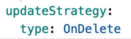

# Creating a StatefulSet

A StatefulSet is a controller in Kubernetes that allows you to create a StatefulSet on the platform to run an application. You can also create multiple StatefulSets within an application as computing components to provide specific services for the application.

## Prerequisites

### Obtaining Images

Image sources include image repositories integrated by the platform administrator through the toolchain or third-party platform image repositories.

- For the former, platform administrators typically assign image repositories to your project, and you can then use images from them. If it’s a third-party platform's image repository, ensure that the images can be pulled from it in the current cluster.

- If the pulled images require credentials, you must create credentials (secret dictionary) in the current namespace first.

## Step 1 - Configure Basic Information

1. Access the **Container Platform**.

2. In the left navigation bar, click on **Compute Components** > **StatefulSet**.

3. Click on **Create StatefulSet**.

4. Configure the image and click **Confirm**.

   **Note**: You can filter images by selecting only when using images from the integrated image repository of this platform. For example, the integrated project name such as *containers (docker-registry-projectname)* includes the project name *projectname* from this platform and the project name *containers* from the image repository.

5. In the **Basic Information** section, configure the relevant information according to the following descriptions.

   | Parameter       | Description                                                                                                                                                                                                                                                                                                                                                                                                                                                                                                                                                                                                                   |
   | ----------- | -------------------------------------------------------------------------------------------------------------------------------------------------------------------------------------------------------------------------------------------------------------------------------------------------------------------------------------------------------------------------------------------------------------------------------------------------------------------------------------------------------------------------------------------------------------------------------------------------------------------- |
   | **Instance Count**  | The number of Pods that the StatefulSet expects to run, defaulting to 1. Please set this according to the actual business request volume.                                                                                                                                                                                                                                                                                                                                                                                                                                                                                                                            |
   | **Update Strategy** | Enter the value of `partition` to control which Pods are updated during rolling updates. A value greater than the number of instances for partition is invalid and defaults to `0`. For example, if the number of Pod instances is 5 (with Pod indices being 0, 1, 2, 3, 4), setting partition to 3 means that after updating the StatefulSet’s `spec.template`, it will roll out updates to the StatefulSet and only update Pods with indices 3 and 4; other Pods will not be allowed to roll out updates. Even if Pods with indices 0, 1, and 2 are deleted and recreated, they can only be recreated based on the previous `spec.template` before the update.  **Note**: StatefulSet also supports the `OnDelete` update strategy, which can only be set by clicking on the **YAML** in the upper right corner of the page to access the YAML orchestration file. Set the `.spec.updateStrategy.type` of the StatefulSet to `OnDelete`, as shown in the figure below.     **Caution**: After setting the StatefulSet's update strategy to `OnDelete`, when clicking on the **Form** in the upper right corner of the page to access the form creation page, the update strategy will display as `OnDelete` and will be non-editable. |

## Step 2 - Configure Pod and Container

The operations to configure Pods and Containers are similar to those when creating a Deployment, please refer to [Creating a Deployment](./deployment_create.mdx).
