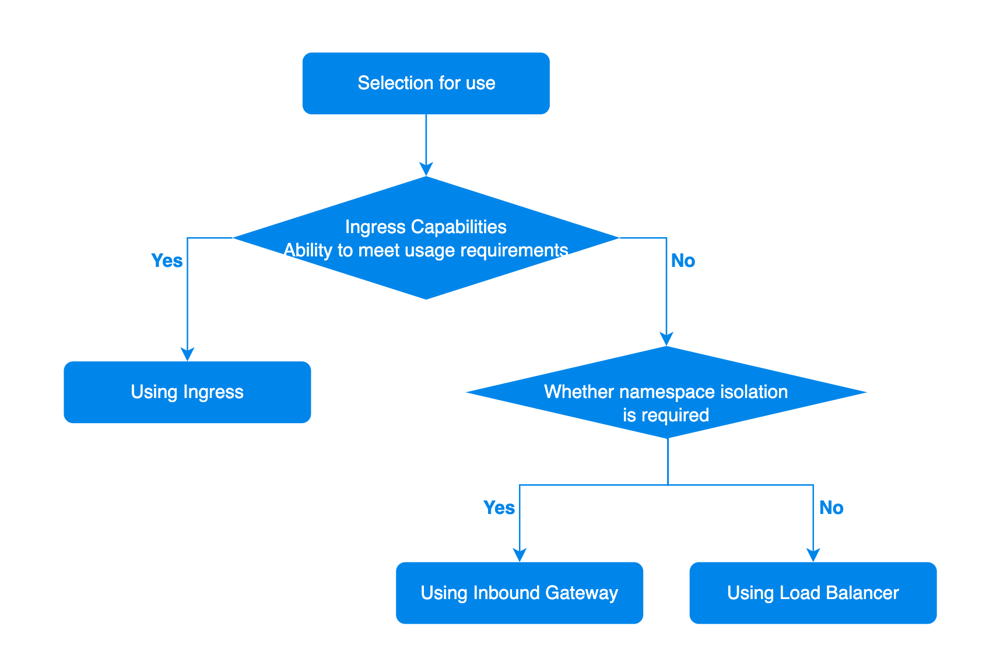

# Comparison and Selection

## The Relationship between Service, Ingress, and Loadbalancer

A Service is typically used in conjunction with inbound rules (Kubernetes Ingress) or the port forwarding rules of a load balancer and can distribute external access traffic to the Pods of the backend services on the platform, thereby providing the internal discovery capability for computation components.

This means that when [creating inbound rules](./ingress/create_ingress.mdx) or [adding rules](./loadbalancer/add_rule.mdx) for the load balancer's HTTP/HTTPS ports, it is necessary to pre-create the corresponding internal routes on the platform.

## Functionality Comparison

Inbound rules (Ingress) are the standard specification adopted by the Kubernetes community and are recommended for default use. However, the functionality exposed by inbound rules is limited. For richer routing capabilities, it is possible to combine with the platform's **load balancer** or use the community's next-generation standard for inbound rules, the **Ingress Gateway (Gateway API)**, to extend the functions of inbound rules.

<table>
  <thead>
    <tr>
      <th />

      <th>Common Functionality</th>
      <th>Functionality Differences</th>
      <th>Is it a Community Standard?</th>
      <th className="w-80">Resource Level</th>
      <th>Notes</th>
    </tr>
  </thead>

  <tbody>
    <tr>
      <td><b>Inbound Rules (Ingress)</b></td>
      <td rowSpan={3}>All support layer 7 business publishing to the external cluster.</td>
      <td>Primarily used for routing and load balancing HTTP and HTTPS traffic, supporting only path matching, with relatively weak functionality.</td>
      <td>Yes, it is a standard specification adopted by the Kubernetes community.</td>
      <td>Namespace</td>
      <td>-</td>
    </tr>

    <tr>
      <td><b>Routing Rules + Ingress Gateway</b></td>
      <td>Supports HTTPRoute (which can be published to HTTP and HTTPS listeners), TCPRoute, and UDPRoute routing types, providing more complex message matching and operational capabilities, with functionality stronger than Ingress.</td>
      <td>Yes, it is a standard specification adopted by the Kubernetes community, based on the community Gateway API standard; see <a href="https://gateway-api.sigs.k8s.io/">Kubernetes Gateway API</a> for more details.</td>
      <td>Namespace</td>
      <td>The Ingress Gateway and its underlying resources are stored in the corresponding namespace.</td>
    </tr>

    <tr>
      <td><b>Load Balancer</b></td>
      <td>Supports HTTPS, HTTP, gRPC, TCP, UDP protocols, and various rules, providing more complex message matching and operational capabilities, with functionality stronger than Ingress.</td>
      <td>No, it is not a standard specification adopted by the Kubernetes community; it is developed in-house by the platform.</td>
      <td>Cluster</td>
      <td>Deployed by platform administrators and allocated for use by namespaces, which only have usage permissions.</td>
    </tr>
  </tbody>
</table>

## Usage Selection

The specific usage selection advice for the inbound rules, Ingress Gateway, and load balancer provided by the platform is as follows.

