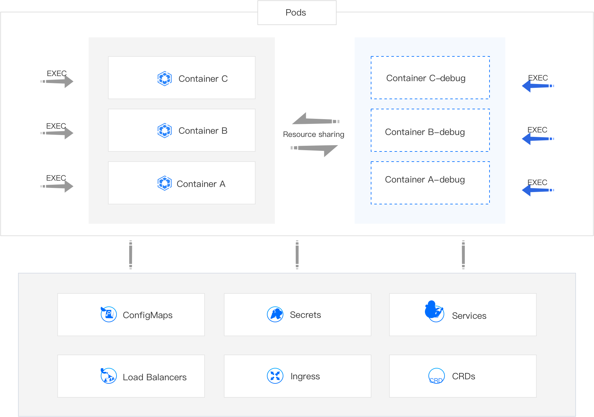

# Debug Container (Alpha)

The Debug feature provides relevant tools for debugging running containers, including system, network, and disk utilities.

## Implementation Principle

The Debug feature is implemented through Ephemeral Containers. An Ephemeral Container is a type of container that shares resources with business containers. You can add an Ephemeral Container (for example, *Container A-debug*) to a pod and use debugging tools within that container. The debugging results will be directly applied to the business container (such as *Container A*).

## Notes

- You cannot add an Ephemeral Container by directly updating the pod configuration; make sure to enable the Ephemeral Container through the Debug feature.

- The Ephemeral Containers enabled by the Debug feature do not have resource or scheduling guarantees and will not restart automatically. Please avoid running business applications in them, except for debugging purposes.

- Please use the Debug feature cautiously if the resources on the node where the pod is located are about to be exhausted, as it may lead to the eviction of the pod.

## Use Cases

Although you can also log into containers and debug using the EXEC feature, many container images do not include the required debugging tools (such as bash, net-tools, etc.) for the sake of image size reduction. In contrast, the Debug feature, which comes pre-installed with debugging tools, is more suitable for the following scenarios.

- Fault Diagnosis: If a business container encounters an issue, in addition to checking events and logs, you may need to conduct more detailed troubleshooting and resolution within the container.

- Configuration Tuning: If there are flaws in the current business solution, you might want to perform configuration tuning on the business components within the container to devise a new configuration scheme that helps the business run more effectively.

## Procedure

1. Enter the **Container Platform**.

2. In the left navigation bar, click **Workloads** > **Pods**.

3. Locate the pod and click ⋮ > **Debug**.

4. Select the container you wish to debug.

5. (Optional) If prompted by the interface that **initialization is required**, click **Initialize**.

   **Note**: After initializing the Debug feature, as long as the pod is not recreated, you can directly enter the Ephemeral Container (for example, *Container A-debug*) for debugging.

6. Wait for the debugging window to be ready, and then begin debugging.

   **Tip**: Click the command query in the upper right corner to view common tools and their usage.

7. Once finished, close the debugging window.