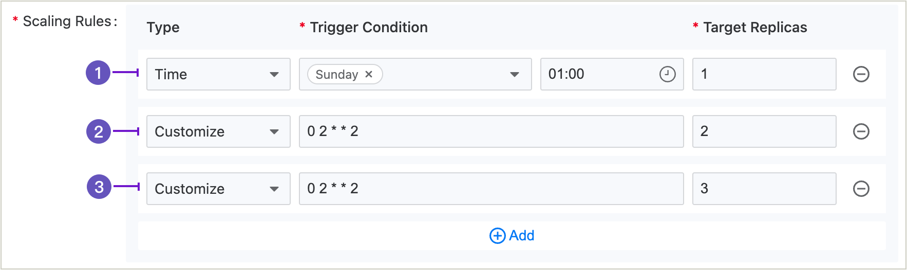

# Configuring CronHPA

For stateless applications with periodic fluctuations in business usage, CronHPA (Cron Horizontal Pod Autoscaler) supports adjusting the number of pods based on the time policies you set, allowing you to optimize resource usage according to predictable business patterns.

## Understanding Cron Horizontal Pod Autoscalers

You can create a cron horizontal pod autoscaler to specify the number of pods you want to run at specific times according to a schedule, allowing you to prepare for predictable traffic patterns or reduce resource usage during off-peak hours.

After you create a cron horizontal pod autoscaler, the platform begins to monitor the schedule and automatically adjusts the number of pods at the specified times. This time-based scaling occurs independently of resource utilization metrics, making it ideal for applications with known usage patterns.

The CronHPA works by defining one or more schedule rules, each specifying a time (using crontab format) and a target number of replicas. When a scheduled time is reached, the CronHPA adjusts the pod count to match the specified target, regardless of the current resource utilization.

### How Does the CronHPA Work?

The cron horizontal pod autoscaler (CronHPA) extends the concept of pod auto-scaling with time-based controls. The CronHPA lets you define specific times when the number of pods should change, allowing you to prepare for predictable traffic patterns or reduce resource usage during off-peak hours.

The CronHPA works by continuously checking the current time against the defined schedules. When a scheduled time is reached, the controller adjusts the number of pods to match the target replica count specified for that schedule. If multiple schedules trigger at the same time, the platform will use the rule with higher priority (the one defined earlier in the configuration).

## Prerequisites

Please ensure that the monitoring components are deployed in the current cluster and are functioning properly. You can check the deployment and health status of the monitoring components by clicking on the top right corner of the platform <span style={{ display: 'inline-flex', alignItems: 'center', gap: '4px', verticalAlign: 'middle' }}> <span>  > **Platform Health Status**.</span></span>.

## Creating a Cron Horizontal Pod Autoscaler

### Using the CLI

You can create a cron horizontal pod autoscaler using the command line interface by defining a YAML file and using the `kubectl create` command. The following example shows scheduled scaling for a Deployment object:

1. Create a YAML file named `cronhpa.yaml` with the following content:

```yaml
apiVersion: tkestack.io/v1 # [!code callout]
kind: CronHPA # [!code callout]
metadata:
  name: my-deployment-cronhpa # [!code callout]
  namespace: default
spec:
  scaleTargetRef:
    apiVersion: apps/v1 # [!code callout]
    kind: Deployment # [!code callout]
    name: my-deployment # [!code callout]
  crons:
  - schedule: "0 0 * * *" # [!code callout]
    targetReplicas: 0 # [!code callout]
  - schedule: "0 8 * * 1-5" # [!code callout]
    targetReplicas: 3 # [!code callout]
  - schedule: "0 18 * * 1-5" # [!code callout]
    targetReplicas: 1 # [!code callout]
```

<Callouts>
    1. Use the tkestack.io/v1 API.
    2. The name of the CronHPA resource.
    3. The name of the deployment to scale.
    4. Specify the API version of the object to scale.
    5. Specify the type of object. The object must be a Deployment, ReplicaSet, or StatefulSet.
    6. The target resource to which the CronHPA applies.
    7. The cron schedule in standard crontab format (minute hour day month weekday).
    8. The target number of replicas to scale to when the schedule is triggered.
</Callouts>

This example configures the deployment to:
- Scale down to 0 replicas at midnight every day
- Scale up to 3 replicas at 8:00 AM on weekdays (Monday-Friday)
- Scale down to 1 replica at 6:00 PM on weekdays

2. Apply the YAML file to create the CronHPA:

```bash
$ kubectl create -f cronhpa.yaml
```

### Using the Web Console

1. Enter **Container Platform**.

2. In the left navigation bar, click **Workloads** > **Deployments**.

3. Click on ***Deployment Name***.

4. Scroll down to the **Elastic Scaling** section and click **Update** on the right.

5. Select **Scheduled Scaling**, and configure the scaling rules. When the type is **Custom**, you must provide a Crontab expression for the trigger condition, formatted as `minute hour day month week`. For detailed introduction, please refer to [Writing Crontab Expressions](../../building_application/how_to/cronjob_rules.mdx).

6. Click **Update**.

## Schedule Rule Explanation



1. Indicates that starting from 01:00 AM every Monday, only 1 pod will be retained.
2. Indicates that starting from 02:00 AM every Tuesday, only 2 pods will be retained.
3. Indicates that starting from 02:00 AM every Tuesday, only 3 pods will be retained.

**Important Notes**:

- When multiple rules have the same trigger time (Examples 2 and 3), the platform will execute automatic scaling based only on the rule that is higher in priority (Example 2).
- CronHPA operates independently of HPA. If both are configured for the same workload, they may conflict with each other. Consider your scaling strategy carefully.
- The schedule uses the crontab format (`minute hour day month week`) and follows the same rules as Kubernetes CronJobs.
- Time is based on the cluster's timezone setting.
- For workloads with critical availability requirements, ensure that your scheduled scaling doesn't unexpectedly reduce capacity during high-traffic periods.
