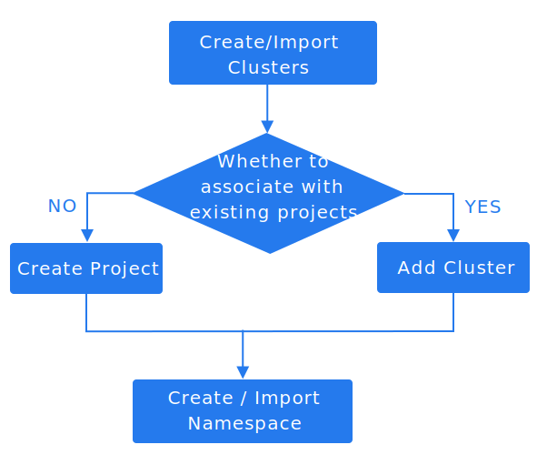

# Import Namespaces

**Namespace Management Capabilities**:
- **Cross-Cluster Namespace Import**
  - Importing namespaces into a project enables centralized management of Kubernetes namespaces across all clusters provisioned on the platform. This allows administrators to unify resource governance and monitoring across distributed environments.

- **Namespace Disassociation**
  - The Disassociate Namespace feature allows you to unlink a namespace from its current project, resetting its association for reassignment or cleanup.

Importing a namespace into the project grants it equivalent capabilities to namespaces natively created on the platform. This includes access to project-level policies (e.g., resource quotas), unified monitoring, and governance controls.

**Note**:
- A namespace can only be associated with one project at any time.
- If a namespace is already linked to a project, it cannot be imported into or reassigned to another project without first disassociating it from the original project.

## Use Cases

Common use cases include:

- When a new cluster connects to the platform, you can use the namespace import feature to sequentially import the existing Kubernetes namespaces under the cluster into the project's management. The operational process is illustrated in the diagram below.

  

  **Reference content**: [Create Project]() , [Add Project Linked Cluster]().

- A namespace that has been removed from a project can be imported into another project for management through the import namespace feature.

- Namespaces created for unassociated projects on the platform (for example: created via scripts on the cluster) must be assigned to a specific project through the import namespace feature before they can be viewed and managed on the platform.

## Prerequisites

- The namespace does not belong to any project on the platform.

- You can only import namespaces into projects that are associated with the **Cluster for the Namespace**. If there are no projects in the platform associated with the **Cluster for the Namespace**, you need to create a project that meets this condition first.

## Steps

1. In the **Project Management** view, click on the ***Project Name*** where the namespace to be imported is located.

2. In the left navigation bar, click **Namespaces** > **Namespaces**.

3. Click the button next to **Create Namespace**,   > **Import Namespace**.

4. Refer to the [Create Namespace](./create_namespace.mdx) parameter description to configure the relevant parameters.

5. Click **Import**.
