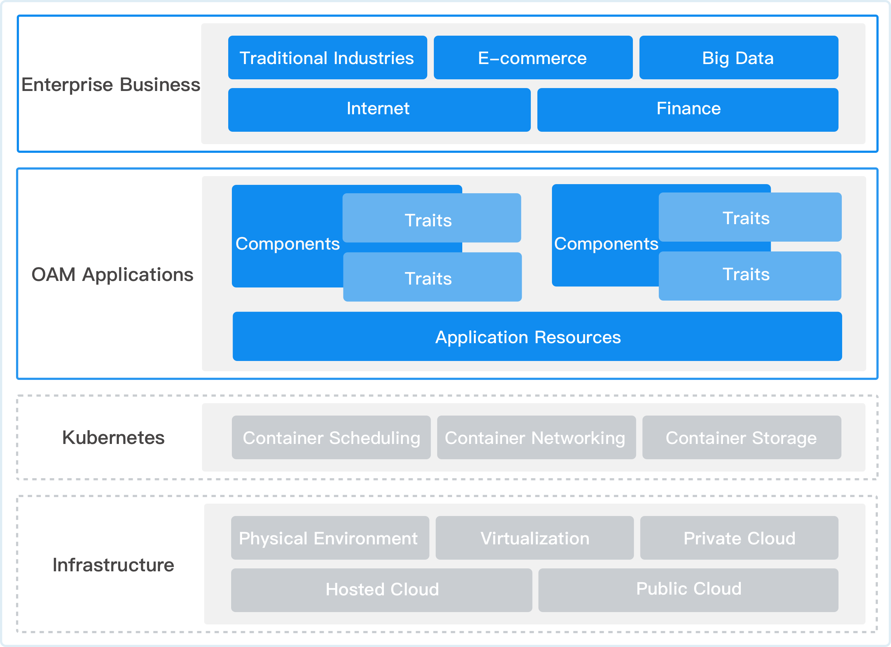
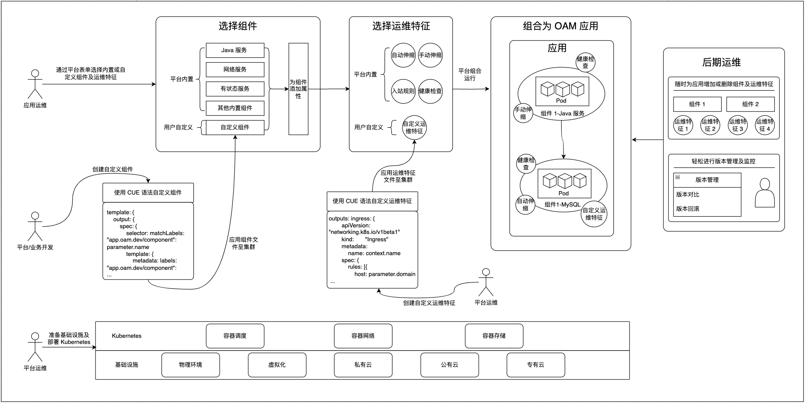

# Architecture

The OAM application significantly reduces the processes and workload associated with deployment and operations, enhancing reusability and scalability. Even if it is not possible to divide roles among multiple teams as shown in the diagram, the same team can be used for development, management, and delivery. Therefore, users with declarative descriptions of the entire application delivery process, lightweight, customizable, and scalable needs can utilize OAM applications. The application architecture and scenario architecture are as follows.

## OAM Application Architecture

This architectural design enables OAM applications to better support various enterprise needs across industries, including traditional sectors, e-commerce, big data, internet, and finance. It can run on infrastructure ranging from physical environments to various cloud platforms, and consists of the following components:

- **Components**: Consists of multiple component units, each with its specific operational characteristics (Traits). Components are the basic building blocks of applications.

- **Operational Characteristics**: Strategies and configurations for managing operations attached to components, allowing for the customization of operational characteristics for different components, which define the operational behavior and strategies of the components.

- **Application Resources**: The underlying resource layer that uniformly manages various resources required by applications.

Based on its components, OAM applications have the following features:

- **Modular Design**: Breaks applications into independent components that can be managed and maintained separately.

- **Separation of Operational Characteristics**: Separates operational configuration from application logic, supporting flexible operational strategy configuration.

- **Unified Resource Management**: A unified resource management layer ensures the effective allocation and utilization of application resources.

## OAM Scenario Architecture

This architectural design achieves complete lifecycle management of application development, deployment, and operations, demonstrating good scalability and maintainability, capable of meeting the needs of modern cloud-native applications. It is suitable for scenarios where multiple teams manage a microservice application together, with each team responsible for one or more services. Each team can define the services they are responsible for using OAM. Through OAM, other teams can comprehend the requirements and dependencies of each service to better collaborate and integrate.

- **Component Selection Phase**: The platform provides various built-in components for users, and users can also customize components using CUE syntax.

- **Operational Characteristics Configuration Phase**: The platform offers multiple built-in operational characteristics for users, and users can also customize operational characteristics via CUE syntax.

- **Application Composition Phase**: Users can compose multiple components and operational characteristics through OAM to form a complete application.

- **Post-Operation Management Phase**: Users can monitor, adjust, and maintain applications through the post-operation management features of OAM applications.

- **Support for Multiple Deployment Environments**: Physical environment, virtualization environment, private cloud, public cloud, and proprietary cloud.

- **Role Division**:
  - Platform Business Developers: Select components and operational characteristics.
  - Platform Operations Personnel: Responsible for maintaining infrastructure and the Kubernetes environment.
  - Application Operations Personnel: Responsible for post-operation management.
