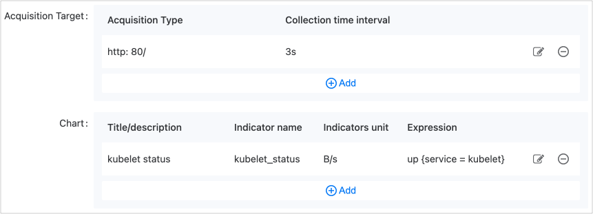
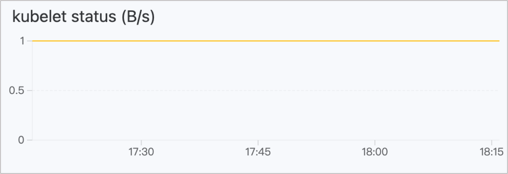

# Operation and Maintenance Features

Operation and maintenance features refer to a series of characteristics related to application operations and maintenance, which enhance the functionalities of components by adding extra capabilities and have different implementations in varying environments: scaling policies, ingress rules, and environment variables, among others. As long as the necessary conditions for operation and maintenance features are met, applications can run uniformly in different deployment environments (e.g., X86 architecture clusters and ARM architecture clusters) following the same rules without adjustments required for the deployment environment by the operation and maintenance personnel.

## Types of Operation and Maintenance Features

By selecting operation and maintenance feature types, you can quickly choose the necessary operational features, with different component types having different selectable operational features.

| Type of Operation and Maintenance Feature | Included Operation and Maintenance Features                                                                                                                                                                                      | Description                             |
| ----------------------------------------- | -------------------------------------------------------------- | --------------------------------------- |
| Dynamic Features                          | <ul><li>[Auto-scaling](#autosca)</li><li>[Manual scaling](#manual)</li></ul>                                                                                                                                      | Mandatory and mutually exclusive; a component must and can only add either auto-scaling or manual scaling. |
| Additional Configuration                  | <ul><li>[Environment Variables](#env)</li><li>[Patches](#patch)</li></ul>                                                                                                                         | Optional                                |
| Networking                                | <ul><li>[Ingress Rules](#ingress)</li></ul>                                                                                                                                                            | Optional                                |
| Monitoring and Analysis                   | <ul><li>[Health Checks](#check)</li><li>[Custom Monitoring](#custom)</li></ul>                                                                                                                                  | Optional                                |
| KubeVela Community                        | <ul><li>[Annotations](#anno)</li><li>[HostAliases](#hostalias)</li><li>[Labels](#label)</li><li>[Lifecycle](#lifecycle)</li><li>[Pure Ingress](#pure)</li><li>[Resources](#resource)</li></ul> | Optional                                |

## Operation and Maintenance Features

### Annotations \{#anno}

Annotations add metadata to components, and if the workloads within the component (such as Deployment, StatefulSet, etc.) create and manage Pods, the annotations added to the workload will be inherited by each Pod created by that workload.

Annotations are key-value pairs attached to the object's metadata. This additional information can be recognized and utilized to enhance and simplify the management of various aspects of Kubernetes resources. Annotations can be non-functional explanatory texts, specify configurations or behaviors used by cloud providers, or set configuration parameters and tools, making them quite powerful.

**Parameter Description**

| Parameter | Description         |
| --------- | ------------------- |
| Key, Value| A string type key-value pair. |

**Example YAML After Configuration**

```yaml
traits:
  - properties:
      cloud-provider-config: aws-config.yaml
      config-param: debug-mode
      description: This deployment manages the frontend service.
      monitoring-tool: prometheus
      version-info: v1.2.3
    type: annotations
```

### Environment Variables \{#env}

Environment variables provide a flexible, secure, and configurable way for containerized applications to run in different environments and adapt to changes in configuration dynamically. By configuring environment variables, you can add environment variables to all runtime containers of this component. If a key is duplicated, the value referenced in the operation and maintenance feature will take precedence. The main features of environment variables are as follows:

- Flexible Configuration: Environment variables allow you to pass configuration information to application containers without hard coding it into the application code, making configuration changes more flexible without needing to rebuild the container image.

- Sensitive Information Isolation: For configurations containing sensitive information (like database passwords, API keys, etc.), using environment variables can more securely pass this information. By storing sensitive information in Kubernetes secrets and injecting it into the container via environment variables, the risk of exposing sensitive information can be reduced.

- Dynamic Adaptation and Configuration: Environment variables allow applications to dynamically adjust to different environments at runtime. For example, you can switch to different database connections using environment variables to adapt to development, testing, and production environments.

**Operation Instructions**

| Operation    | Description                                                                                                                                                                                                                                     |
| ------------ | --------------------------------------------------------------------------------------------------------------------------------------------------------------------------------------------------------------------------------------------- |
| **Add**      | Add an environment variable in key-value pair form.                                                                                                                                                                                                                     |
| **Reference**| Reference fields in **config maps or Opaque, username/password-type secrets** as environment variables. For related configuration parameters, please refer to [Config Map](/developer/building_application/functions/preparation_before_creating/add_configmap.mdx) or [Secrets](/developer/building_application/functions/preparation_before_creating/add_secret.mdx). |

**Example YAML After Configuration**

```yaml
traits:
  - properties:
      env:
        - name: username
          value: admin
        - name: password
          valueFrom:
            secretKeyRef:
              key: password
              name: password-test
    type: env
```

### Patches \{#patch}

A Patch (JSON Patch) is a format used to describe differences between two JSON documents, which includes a series of operations such as add, remove, and replace. This makes JSON Patch a lightweight and extensible way to represent differences between two JSON documents. Each operation is represented by a JSON object that includes fields like OP (operation type) and Path (operation path).

In Kubernetes, JSON Patch is widely used to update resource objects via the kubectl patch command by applying a set of operations on resources for partial updates, which is very useful for modifying or adding specific fields without altering the entire resource object. For more details, please refer to [JSON Patch](https://jsonpatch.com/).

**Operation Instructions**

| Operation          | Description                                                                                                                        |
| ------------------ | -------------------------------------------------------------------------------------------------------------------------------- |
| **Add**            | The add operation allows you to add new elements in a JSON document, with the following field descriptions: <ul><li>OP: Select add to specify the operation type as addition.</li><li>Path: Specify the path to add the element.</li><li>Value: Specify the value to add.</li></ul>   |
| **Replace**        | The replace operation allows you to replace existing elements in a JSON document, with the following field descriptions: <ul><li>OP: Select replace to specify the operation type as replacement.</li><li>Path: Specify the path to replace the element.</li><li>Value: Specify the new value.</li></ul> |
| **Remove**         | The remove operation allows you to delete elements from a JSON document, with the following field descriptions: <ul><li>OP: Select remove to specify the operation type as removal.</li><li>Path: Specify the path to delete the element.</li><li>Value: Not required.</li></ul>       |

**Example YAML After Configuration**

```yaml
traits:
  - properties:
      patches:
        - patch:
            - '{"op":"add","path":"/biscuits/1","value":{"name":"Ginger Nut"}}'
          target:
            name: component
            resource: deployment
        - patch:
            - '{"op":"replace","path":"/biscuits/0/name","value":"Chocolate Digestive"}'
          target:
            name: component
            resource: deployment
        - patch:
            - '{"op":"remove","path":"/biscuits/0"}'
          target:
            name: component
            resource: service
    type: generic-patch
```

### Health Checks \{#check}

Health checks assess the component's liveliness and whether it can provide service. Health checks can be an HTTP request, a TCP health check, or an executed command.

- Liveness Check: Used to determine whether the container group under the component is still running and healthy. If the check results are abnormal, it will depend on the configuration of the health check to decide whether to restart the container group.

- Readiness Check: Checks whether the container group under the component has completed startup and is in a normal service state. If the health status of the container group is detected as abnormal, the container status will be updated.

**Parameter Description**

For health check parameter description, please refer to [Health Checks](/developer/building_application/functions/application_workloads/deployment_create.mdx).

**Example YAML After Configuration**

```yaml
traits:
  - properties:
      livenessProbe:
        failureThreshold: 5
        httpGet:
          path: /
          port: 80
          scheme: HTTP
        initialDelaySeconds: 300
        periodSeconds: 60
        successThreshold: 1
        timeoutSeconds: 30
      readinessProbe:
        failureThreshold: 5
        initialDelaySeconds: 300
        periodSeconds: 60
        successThreshold: 1
        tcpSocket:
          port: 80
        timeoutSeconds: 30
    type: healthcheck
```

### HostAliases \{#hostalias}

HostAlias is used to specify the mapping relationship between the Pod's hostname and IP address, adding host aliases for workloads on Pods. By using HostAlias, you can add additional hostnames and corresponding IP addresses to the Pod for applications within the Pod to access other services or resources using these hostnames.

Possible use cases for HostAlias include:

- Overriding hostname resolution at the Pod level by adding entries to the Pod's /etc/hosts file when DNS configuration and other options are inadequate.

- Accessing local services: In some scenarios, Pods might need to access services on the local host. Using HostAlias, you can map the hostname and IP address of local services to Pods, enabling applications to access local services using these hostnames.

- Using specific hostnames within containers: Some applications may depend on specific hostnames. With HostAlias, you can map these hostnames into Pods for applications to use these names within the container.

**Parameter Description**

| Parameter | Description                 |
| --------- | --------------------------- |
| IP        | Used for resolving hostnames within the Pod. |

**Example YAML After Configuration**

```yaml
traits:
  - properties:
      hostAliases:
        - ip: 192.168.1.1
        - ip: 192.168.1.2
    type: hostalias
```

### Auto-scaling \{#autosca}

Designed to automatically adjust the number of Pod replicas. After creating an application, it will run the designated minimum number of component replicas. If conditions are met subsequently, the platform will automatically scale the number of replicas up or down. This is commonly used for applications where business volume changes frequently, setting up scaling trigger policies beforehand can meet business needs more promptly, especially before a known or unknown business change (e.g., peak during month-end accounting settlement).

**Parameter Description**

For specific parameter descriptions, please refer to [Configuring Horizontal Scaling](/developer/building_application/functions/operation_after_creating/add_hpa.mdx).

**Example YAML After Configuration**

```yaml
traits:
  - properties:
      maxReplicas: 1
      metrics:
        - name: cpu
          type: resource
          value: "60"
      minReplicas: 1
      scalePolicy:
        down:
          periodSeconds: 15
          stabilizationWindowSeconds: 300
          type: Percent
          value: 100
        up:
          periodSeconds: 15
          stabilizationWindowSeconds: 0
          type: Percent
          value: 100
    type: hpa
```

### Ingress Rules \{#ingress}

Ingress rules (Kubernetes Ingress) expose external HTTP/HTTPS routes to internal routing (Kubernetes Service) within the cluster, achieving external access control for computing components through domain names open to network users.

**Parameter Description**

For specific parameter descriptions, please refer to [Creating Ingress Rules](/developer/building_application/functions/operation_after_creating/network_communications/ingress/create_ingress.mdx).

**Example YAML After Configuration**

```yaml
traits:
  - properties:
      domain: test-63117.test.com
      http:
        /: 90
      type: http
    type: ingress
```

### Labels \{#label}

Labels are a key element used to identify and organize resources. Labels are in the form of key-value pairs that can be attached to various resource objects in Kubernetes such as Pods, Services, Nodes, etc., helping you to more easily select and organize resources within the cluster.

**Parameter Description**

| Parameter | Description         |
| --------- | ------------------- |
| Key, Value| A string type key-value pair. |

**Example YAML After Configuration**

```yaml
traits:
  - properties:
      app: frontend
      region: us-east-1
      version: v2.0.0
    type: labels
```

### Lifecycle \{#lifecycle}

Defines operations that need to be executed at different stages of the container's lifecycle, including HTTP requests and TCP socket checks after the container starts and before it terminates.

- **PostStart**: This lifecycle event is executed immediately after container creation but does not guarantee its execution order will match that of other processes starting within the container. It is important to note that since this executes before the container's ENTRYPOINT, it is not the best solution for configuring applications prior to startup.

- **PreStop**: This lifecycle event is executed before the container is destroyed and is a blocking operation, meaning it is synchronous and must complete before the container deletion call is made. This is suitable for implementing graceful exit mechanisms for containers, defining a series of behaviors that release resources occupied by the container and achieve orderly, graceful shutdowns through notifications and alerts.

**Parameter Description**

<table>
  <thead>
    <tr>
      <th />

      <th>Category</th>
      <th>Parameter</th>
      <th>Description</th>
    </tr>
  </thead>

  <tbody>
    <tr>
      <td rowSpan={6}>postStart, preStop</td>
      <td rowSpan={4}>httpGet (Send HTTP GET Request)</td>
      <td>Host</td>
      <td>Requested hostname.</td>
    </tr>

    <tr>
      <td>Path</td>
      <td>Requested path.</td>
    </tr>

    <tr>
      <td>Port</td>
      <td>Requested port number.</td>
    </tr>

    <tr>
      <td>Scheme</td>
      <td>Protocol used (HTTP or HTTPS).</td>
    </tr>

    <tr>
      <td rowSpan={2}>tcpSocket (Execute TCP Socket Check)</td>
      <td>Host</td>
      <td>Hostname for TCP Socket.</td>
    </tr>

    <tr>
      <td>Port</td>
      <td>Port number for TCP Socket.</td>
    </tr>

    <tr>
      <td rowSpan={2}>Post Start, Pre Stop</td>
      <td rowSpan={2}>httpGet.httpHeaders (HTTP Request Headers)</td>
      <td>Name</td>
      <td>Request header name.</td>
    </tr>

    <tr>
      <td>Value</td>
      <td>Value of the request header.</td>
    </tr>
  </tbody>
</table>

**Example YAML After Configuration**

```yaml
traits:
  - properties:
      postStart:
        httpGet:
          host: example-host.com
          httpHeaders:
            - name: poststart
              value: custom-header-value
          path: /api/v1/start
          port: 8080
          scheme: HTTPS
        tcpSocket:
          host: another-host.com
          port: 2222
      preStop:
        httpGet:
          host: example-host.com
          httpHeaders:
            - name: prestop
              value: custom-header-value
          path: /api/v1/stop
          port: 8080
          scheme: HTTP
        tcpSocket:
          host: another-host.com
          port: 2222
    type: lifecycle
```

### Custom Monitoring \{#custom}

The platform comes with various built-in metrics and monitored resources. You can also define your own targets and metrics to collect, which will ultimately be presented in chart form.

**Parameter Description:**

<table border={1} cellSpacing={0}>
  <thead>
    <tr>
      <th>Category</th>
      <th>Parameter</th>
      <th>Description</th>
    </tr>
  </thead>

  <tbody>
    <tr>
      <td rowSpan={4}>Collection Target</td>
      <td>Protocol</td>
      <td>Choose to use HTTP or HTTPS protocol.</td>
    </tr>

    <tr>
      <td>Port</td>
      <td>Port exposed for the API from which this component collects monitoring data.<br /><br /><b>Description:</b> If no ports are available in the drop-down options, please click <b>Previous</b> to return to the <b>Properties</b> page, add <b>Network Access</b> for HTTP or HTTPS protocols, and after completion, click <b>Next</b> to select the corresponding port.</td>
    </tr>

    <tr>
      <td>Path</td>
      <td>Access path provided by this API, defaulting to the root directory (/).</td>
    </tr>

    <tr>
      <td>Collection Interval</td>
      <td>Time interval for collecting target data for monitoring metrics, in seconds (s).</td>
    </tr>

    <tr>
      <td rowSpan={5}>Chart</td>
      <td>Chart Title</td>
      <td>The title of the custom chart, which will be displayed in the top left corner of the chart once added.</td>
    </tr>

    <tr>
      <td>Description</td>
      <td>Add descriptive information.</td>
    </tr>

    <tr>
      <td>Metric Name</td>
      <td rowSpan={4}>For specific parameter descriptions, please refer to <a href="">Custom Metric Parameter Description</a>.</td>
    </tr>

    <tr>
      <td>Metric Unit</td>
    </tr>

    <tr>
      <td>Expression</td>
    </tr>
  </tbody>
</table>

**Example of Metric Configuration**



**Example of Metric Chart Effect**



**Example YAML After Configuration**

```yaml
traits:
  - properties:
      metrics:
        - description: When the curve value is 1, it indicates that the API can be accessed normally; when the curve value is 0, it indicates that the API cannot be accessed normally.
          expression: up{service="kubelet"}
          name: kubelet_status
          title: Kubelet Running Status
          uid: 24c0f195_5fbc_4572_b4ce_2a83cf909405
          unit: B/s
      sources:
        - interval: 3
          path: /
          port: 80
          scheme: http
    type: monitor
```

### Pure Ingress \{#pure}

Ingress (Ingress rules) is a type of resource in a Kubernetes cluster used to expose and publish services, defining how external traffic enters the cluster and routes to the corresponding services. Pure ingress signifies that this is a minimal ingress rule, defining only the most basic routing rules, as opposed to more complex ingress parameters, pure ingress is focused solely on the domain name without additional complex configurations.

**Parameter Description**

| Parameter | Description                                |
| --------- | ------------------------------------------ |
| Domain    | Specifies the domain bound to the exposed service. |

**Example YAML After Configuration**

```yaml
traits:
  - properties:
      domain: oamweb.test.com
    type: pure-ingress
```

### Resources \{#resource}

Adds resource requests and limits for Pods. Please refer to [Resource Requests and Limits](/developer/building_application/functions/application_workloads/deployment_create.mdx) for specific requests and limits descriptions.

**Parameter Description**

<table border={1} cellSpacing={0}>
  <thead>
    <tr>
      <th>Parameter</th>
      <th>Type</th>
      <th>Description</th>
    </tr>
  </thead>

  <tbody>
    <tr>
      <td>CPU</td>
      <td>number type, e.g., 8</td>
      <td>Specifies the size of the CPU request and limit values.</td>
    </tr>

    <tr>
      <td>Memory</td>
      <td>string type, e.g., 2048Mi</td>
      <td>Specifies the size of the memory request and limit values.</td>
    </tr>

    <tr>
      <td>Limit Values</td>
      <td>-</td>
      <td rowSpan={2}><ul><li>CPU: Specifies the size of the CPU request value.</li><li>Memory: Specifies the size of the memory request value.</li></ul></td>
    </tr>

    <tr>
      <td>Request Values</td>
      <td>-</td>
    </tr>
  </tbody>
</table>

### Manual Scaling \{#manual}

After the application is created, the corresponding number of component replicas will run. If you need to scale the number of replicas afterward, this operational feature must be manually updated.

**Parameter Description**

| Parameter   | Description                          |
| ----------- | ------------------------------------ |
| Replica Count | The number of running component replicas. |

**Example YAML After Configuration**

```yaml
traits:
  - properties:
      action: start
      replicas: 1
    type: scaler
```
