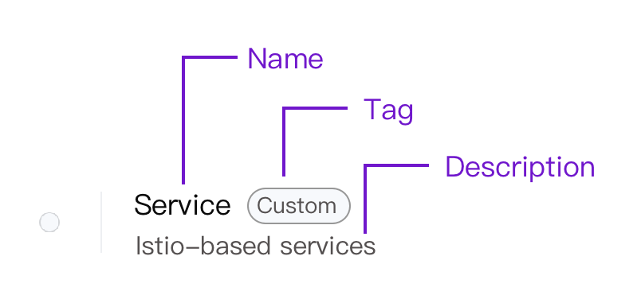

# Custom Platform-Specific Components and Operational Features Display Style

Create a component or operational feature with platform-specific styles by combining platform-specific labels and annotations to enhance visibility.

## Usage Scenarios

When selecting components or operational features, it's crucial to clearly understand their names and descriptions, making it easier to choose the appropriate ones. This is particularly suitable for environments where multiple custom components or operational features exist.

## Prerequisites

You have carefully read the relevant content in [Custom Components](https://kubevela.io/zh/docs/platform-engineers/components/custom-component/) or [Custom Operational Features](https://kubevela.io/zh/docs/platform-engineers/traits/customize-trait/).

## Notes

- If custom components have already been used in the application, do not delete related ComponentDefinition to avoid application exceptions.

- You must have the appropriate permissions when customizing components or operational features.

## Steps to Operate

### Plan Display Style

You can define the name, label, and description in the annotation field of the YAML file. The final display style of the custom component or operational feature is as follows.



**Field Description and Example**:

| Interface Element | Example                                                                                                   |
| ------------------ | ----------------------------------------------------------------------------------------------------- |
| **Name**           | `definition.oam.cpaas.io/name: '{"zh": "服务", "en": "Services"}'`                                     |
| **Label**          | `definition.oam.cpaas.io/tag: '{"zh": "自定义", "en": "Custom"}'`                                       |
| **Description**    | `definition.oam.cpaas.io/description: '{"zh": "基于 Istio 的微服务架构下的服务", "en": "Istio-based services"}'` |

### Custom Components

This document uses custom components as an example. The operational method for custom operational features is similar to that of custom components and will not be repeated here.

1. Access **Administrator**.

2. In the left navigation bar, click **Cluster Management** > **Resource Management**.

3. Click **Create Resource Object**.

4. Copy the following YAML file of the custom component into the page. The example YAML in this document only demonstrates how to use annotations to customize the name, label, and description style of the component, and does not include specific functionality. For specific field descriptions in the YAML, please refer to [CUE](../concepts/cue.mdx).

   ```yaml
   apiVersion: core.oam.dev/v1beta1
   kind: ComponentDefinition
   metadata:
     name: service    # It is recommended to be related to the component name; must start and end with a-z, 0-9; supports using a-z, 0-9, -, .
     namespace: kube-public  # Required, please do not modify
     annotations:
       definition.oam.cpaas.io/name: '{"zh": "服务", "en": "Services"}'
       definition.oam.cpaas.io/tag: '{"zh": "自定义", "en": "Custom"}'    
       definition.oam.cpaas.io/description: '{"zh": "基于 Istio 的微服务架构下的服务", "en": "Istio-based services"}'
     labels:
       definition.oam.cpaas.io/provider: user # Required, please do not modify
       definition.oam.cpaas.io/tag: Service
   spec:
     workload:  # Indicates that this component will create a Kubernetes Deployment resource
       definition:
         kind: Deployment
         apiVersion: apps/v1
     schematic: # Component description, please modify as necessary
       cue:
         template: |
           parameter: { # CUE template parameter definition
               // +usage=Which image would you like to use for your service
               // +short=i
               image: string # Container image address
        
               // +usage=Commands to run in the container
               cmd?: [...string] # Container start command
        
               cpu?:    string # Container CPU resource request
               memory?: string # Container memory resource request
        
               // +usage=Optional duration in seconds the pod needs to terminate gracefully
               podShutdownGraceSeconds: *30 | int # Container graceful shutdown time
        
               // If addRevisionLabel is true, the appRevision label will be added to the underlying pods
               addRevisionLabel: *false | bool # Whether to add application version label
        
               // +usage=Define arguments by using environment variables
               env?: [string]: string # Environment variables
           }
           _matchLabels: { # Label selector
               "app.oam.dev/name": context.name
               "app.oam.dev/component": context.name
               if parameter.addRevisionLabel {
                   "app.oam.dev/appRevision": "v\(context.appRevisionNum)"
                   version: "v\(context.appRevisionNum)"
               }
           }
           // Deployment
           // output is validated by Deployment.
           // output: apps.#Deployment
           output: { # Define the basic structure of the Deployment resource
               apiVersion: "apps/v1"
               kind:       "Deployment"
               metadata: {
                   name:      context.name
                   namespace: context.namespace
                   labels:    _matchLabels
               }
               spec: {
                   selector: matchLabels: _matchLabels
                   template: {
                       metadata: labels: _matchLabels
                       spec: {
                           terminationGracePeriodSeconds: parameter.podShutdownGraceSeconds
                           containers: [{
                               name: context.name
                               image: parameter.image
                               if parameter["cmd"] != _|_ {
                                   command: parameter.cmd
                               }
                           }]
                       }
                   }
               }
           }
           // output parameter env
           // output: apps.#Deployment
           output: { # When environment variables are provided, convert them into container environment variable configurations
               if parameter.env != _|_ {
                   // patchKey=name
                   spec: template: spec: containers: [{
                       name: context.name
                       env: [
                           for k, v in parameter.env {
                               name:  "\(k)"
                               value: "\(v)"
                           },
                       ]
                   }]
               }
           }
           // Deployment
           // output parameter cpu and memory
           // output: apps.#Deployment
           output: { # Resource request configuration
               // patchKey=name
               spec: template: spec: containers: [{
                   name: context.name
        
                   resources: requests: {
                       if parameter.cpu != _|_ {
                           cpu: parameter.cpu
                       }
                       if parameter.memory != _|_ {
                           memory: parameter.memory
                       }
                   }
        
               }]
           }
   ```

5. Click **Create**.

   **Note**: You can search for **ComponentDefinition** in the search box to find the created custom component.

### View Custom Component Style

1. Enter **Container Platform**.

2. In the left navigation bar, click **Application Management** > **OAM Applications**.

3. Click **Create Application**.

4. Click **Create from Image**.

5. After entering basic information, click **Add Component**.

6. Click **More** to see the customized components and styles in the list.
