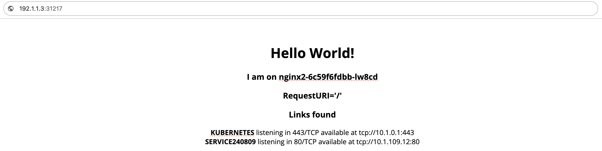

# Creating OAM Applications Using Built-in Components and Operational Features

There are three ways to create an OAM application: **Creating Applications Using Built-in Components and Operational Features**, **Creating Applications Using Custom Components and Operational Features**, and **Creating Applications Using YAML Files**. This document aims to quickly guide you in creating a simple OAM application using built-in components and operational features.

## Introduction

### Applicable Scenarios

You are a new user just getting started with OAM, interested in OAM applications, and wish to quickly learn about the configuration process and usage of OAM applications.

### Estimated Reading Time

The estimated time to complete the reading and operations of this document is about 5-10 minutes.

## Notes

This document does not provide detailed explanations and configurations for the parameters in the configuration process, serving only as a quick reference guide for beginners. For specific explanations and configuration steps, please refer to relevant documentation.

## Prerequisites

- You have read the core concepts document carefully and have a basic understanding of OAM-related concepts.

- You have enabled OAM-related features.

## Process Overview

| No | Operation Steps                  | Description                                 |
| -- | ------------------------------ | ----------------------------------------- |
| 1  | [Configure Basic Information](#basic-info)  | Configure the basic information of the application, including the application name, description, labels, annotations, etc. |
| 2  | [Add Component](#add-component) | Select a component and configure its properties.                   |
| 3  | [Add Operational Features](#add-trait)   | Add appropriate operational features to the component.           |

## Operational Steps

### Configure Basic Information\{#basic-info}

1. Enter **Container Platform**.

2. In the left navigation bar, click **Application Management** > **OAM Applications**.

3. Click **Create Application**.

4. Choose the creation method **By Image**.

5. Fill in the application name and set labels or annotations.

   | Parameter  | Description                                                                                                                                                                                       |
   | ------- | ----------------------------------------------------------------------------------------------------------------------------------------------------------------------------------------------- |
   | **Labels**  | Used to select objects and find sets of objects that meet certain conditions. Must be key-value pairs, for example *app.kubernetes.io/name: hello-app*.                                                                                           |
   | **Annotations** | Used to provide any information to the development and operation teams. Must be key-value pairs, for example: *cpaas.io/maintainer: kim*. **Note**: If the annotation value is a clickable link, set the key as **app.\{display text}.url**, then clicking the display text in the interface will complete the jump, for example *app.Docs.url: [https://example.com/docs/](https://example.com/docs/)*. |

6. Click **Add Component**.

### Add Component\{#add-component}

1. Select the **Network Service** component. By default, the platform provides two preset components: **Network Service** and **Stateful Service**. This document takes **Network Service** as an example for illustration.

2. Click **Next**.

3. Use the following parameters to configure the component properties:

   | Parameter          | Description                                                               |
   | ---------------- | ------------------------------------------------------------------ |
   | **Mode and Image URL** | This document uses the input method to enter the image URL. This document takes the open-source image HelloWorld as an example for illustration.                     |
   | **Network Access**    | Used to configure the network access method for the component. This document takes **TCP**, with the port as **80**, and the type as **Supports both internal and external access** as an example for illustration. |
   | **Other Parameters**    | Fill in as needed or keep the defaults.                                                       |

4. Click **Next**.

### Add Operational Features\{#add-trait}

1. Select the preset operational features. This document retains defaults without any configuration.

2. Click **Add**.

## Expected Results

After completing the above configurations, you can see a similar **External Access Address** in the detail information page of OAM in the form of `tcp://<Node IP Address>:<Host Port>`. You can successfully access the application by visiting this address in a browser. The external access address in this document is 192.1.1.3:31217, and the access result is shown in the figure below.

