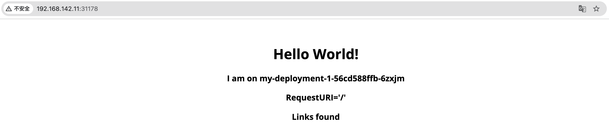

# Creating OAM Applications Using Custom Components and Operational Traits

There are three methods to create an OAM application: **Creating Applications with Built-in Components and Operational Traits**, **Creating Applications with Custom Components and Operational Traits**, and **Creating Applications with YAML Files**. This document aims to guide you through understanding and creating a simple OAM application using custom components and operational traits.

## Introduction

### Applicable Scenarios

This guide is for users who are proficient in configuring OAM applications and have a good understanding of built-in components and operational traits, but find that built-in functionalities no longer meet their usage needs.

### Estimated Reading Time

The estimated time to read and perform the operations in this document is approximately 15-20 minutes.

## Caution

This document will not provide detailed explanations and configurations for the parameters used during the configuration process. It serves only as a quick reference for getting started. For detailed instructions and configuration steps, please refer to the relevant documentation.

## Prerequisites

- Proficiency in configuring built-in components and operational traits.

- OAM-related functionalities must be enabled.

## Overview of Steps

| Step No. | Procedure                     | Description                                     |
| -------- | ----------------------------- | ----------------------------------------------- |
| 1        | [Create Custom Component](#comp)     | Create a custom component using YAML.            |
| 2        | [Create Custom Operational Trait](#traits) | Create a custom operational trait using YAML.     |
| 3        | [Create OAM Application](#app)    | Create an OAM application using the custom components and operational traits. |
| 4        | [Add Internal Routing](#service)   | Add internal routing for the application to enable network access. |

## Steps to Follow

To create a simple OAM application using custom components and operational traits, follow the steps below.

### Create Custom Component\{#comp}

1. Navigate to **Administrator**.

2. In the left navigation bar, click **Cluster Management** > **Resource Management**.

3. Click **Create Resource Object**.

4. Copy the YAML file for the custom component into the page. In this document, we define a component that allows specifying raw Kubernetes objects. The YAML file is as follows:

   ```yaml
   apiVersion: core.oam.dev/v1beta1
   kind: ComponentDefinition
   metadata:
     annotations:
       definition.oam.cpaas.io/name: '{"zh": "Kubernetes 对象", "en": "Kubernetes Object"}'
       definition.oam.cpaas.io/tag: '{"zh": "自定义", "en": "Custom"}'
       definition.oam.cpaas.io/description: '{"zh": "Kubernetes 对象允许用户在属性中指定原始 Kubernetes 对象", "en": "K8s-objects allow users to specify raw K8s objects in properties"}'
     labels:
       definition.oam.cpaas.io/provider: user # Required, do not modify
       definition.oam.cpaas.io/tag: k8s-objects
     name: k8s-objects-test
     namespace: kube-public
   spec:
     schematic:
       cue:
         template: |
           output: parameter.objects[0]

           outputs: {
           	for i, v in parameter.objects {
           		if i > 0 {
           			"objects-\(i)": v
           		}
           	}
           }
           parameter: objects: [...{}]
   ```

5. Click **Create**.

### Create Custom Operational Trait\{#traits}

1. Navigate to **Administrator**.

2. In the left navigation bar, click **Cluster Management** > **Resource Management**.

3. Click **Create Resource Object**.

4. Copy the YAML file for the custom operational trait into the page. In this document, we define an operational trait that generates labels. The YAML file is as follows:

   ```yaml
   apiVersion: core.oam.dev/v1beta1
   kind: TraitDefinition
   metadata:
     annotations:
       definition.oam.cpaas.io/description: '{"zh": "生成标签的表述信息", "en": "Generate description information for labels."}'
       definition.oam.cpaas.io/name: '{"zh": "生成标签", "en": "Generate Labels"}'
     name: labels-test
     namespace: kube-public
     labels:
       definition.oam.cpaas.io/provider: user # Required, do not modify
       definition.oam.cpaas.io/tags: config
   spec:
     appliesToWorkloads:
       - '*'
     podDisruptive: true
     schematic:
       cue:
         template: |
           // +patchStrategy=jsonMergePatch
           patch: {
           	metadata: labels: {
           		for k, v in parameter {
           			(k): v
           		}
           	}
           	if context.output.spec != _|_ && context.output.spec.template != _|_ {
           		spec: template: metadata: labels: {
           			for k, v in parameter {
           				(k): v
           			}
           		}
           	}
           }
           parameter: [string]: string | null
   ```

5. Click **Create**.

### Create OAM Application\{#app}

1. Navigate to **Container Platform**.

2. In the left navigation bar, click **Application Management** > **OAM Application**.

3. Click **Create Application**.

4. Select **Create from Image**.

5. Provide the necessary basic information and click **Add Component**.

6. Click **More** to expand more components and select the created [Custom Component](#comp).

7. Click **Next**.

8. Enter *Name* and switch to YAML, replacing the `properties: {}` section with the content below.

   **Note**: In the custom component, the development team can abstract parameters and expose only a few properties that can be filled out via forms as needed. Since the defined component allows specifying Kubernetes objects and uses basic Deployment and ConfigMap, filling the information directly via YAML is more convenient.

   ```yaml
   properties:
     objects:
       - apiVersion: apps/v1
         kind: Deployment
         metadata:
           name: my-deployment-1
         spec:
           replicas: 3
           selector:
             matchLabels:
               app: my-app
           template:
             metadata:
               labels:
                 app: my-app
             spec:
               containers:
                 - name: my-container
                   image: nginx:latest
                   ports:
                     - containerPort: 80
                   env:
                     - name: MY_CONFIG_MAP_KEY
                       valueFrom:
                         configMapKeyRef:
                           name: my-configmap-1
                           key: key1

       - apiVersion: v1
         kind: ConfigMap
         metadata:
           name: my-configmap-1
         data:
           key1: value1
           key2: value2
   ```

9. Switch to **Form**.

10. Click **Next**.

11. Add the previously created [Custom Operational Trait](#traits) and fill in the parameters.

12. Add **Manual Scaling**.

    **Note**: Automatic and Manual Scaling are built-in operational traits that are mutually exclusive and required; users can fill them according to their own situation.

13. Click **Add**. At this point, a simple OAM application with a Deployment and ConfigMap, along with **Manual Scaling** and **Label Specification** operational traits, has been successfully created. You can add new components and operational traits at any time, facilitating management and operations.

### Add Internal Routing\{#service}

Since no network access was added in the component, we will implement network access for the application by adding internal routing.

1. Navigate to **Container Platform**.

2. In the left navigation bar, click **Network** > **Internal Routing**.

3. Click **Create Internal Routing**.

4. Refer to the parameters below to configure **Basic Information**, keeping other parameters at their defaults.

   | Parameter | Description                                                                                       |
   | --------- | ------------------------------------------------------------------------------------------------- |
   | Name      | Enter the name of the Service.                                                                   |
   | Type      | Choose NodePort.                                                                                 |
   | Component Name | Choose the previously created deployment.                                                      |
   | Port      | <ul><li>Service Port: The port number exposed by the internal routing within the cluster, i.e., Port. For example, 8080.</li><li>Container Port: The target port number (or name) mapped to the service port, i.e., targetPort. For example, 80.</li></ul> |

5. Click **Create**. At this point, the internal routing has been successfully created.

## Expected Results

1. Navigate to the internal routing details page.

2. Copy the **Node IP Address** from the container group region.

3. Copy the **Host Port** from the port region.

4. Enter `<Node IP Address>:<Host Port>` in a browser to successfully access the application. In this document, the Node IP Address is 192.168.142.11, and the Host Port is 31178. The access result is shown in the following image.

   
