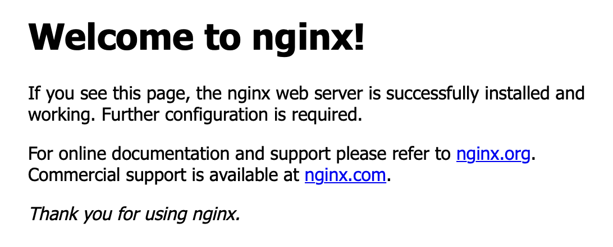

# Quickly create a simple application via image

This document provides guidance on how to quickly create, manage, and access applications in <Term name="product" textCase="lower" />.

## Introduction

### Applicable Scenarios

- You are a new user who has just started exploring the container platform and would like to quickly understand how to deploy a containerized web application to the platform and expose it for external access.
- You want to learn the platform's basic functionalities through a simple and complete example, including: creating projects, namespaces, deploying applications, and using internal routes to expose applications.

### Estimated Reading Time

It is estimated that it will take 10-15 minutes to read and complete the operations in this document.

## Notes

- This document does not provide detailed explanations or configurations for parameters during the configuration process; it serves only as a quick start reference. For specific explanations and configuration steps, please refer to the relevant documentation.
- You must have appropriate permissions to create projects, namespaces, and integrate image repositories.

## Prerequisites

- You have carefully read the platform overview and basic concepts documentation and have a preliminary understanding of the platform and basic terminology.
- You have created a project by referring to the project creation documentation.

## Overview of the Process

| No. | Operation Steps                      | Description                                                                                   |
| -- | ----------------------------------- | --------------------------------------------------------------------------------------------- |
| 1  | [Create Namespace](#namespace)      | Create a namespace for isolating and managing different applications.                         |
| 2  | [Prepare Image](#image)            | Before creating an application, prepare the container image. The platform supports two ways to obtain images: **through an integrated image repository via toolchain** and **using third-party image repository services**. This document uses the open-source HelloWorld image as an example. |
| 3  | [Create a Simple Application using Deployment](#deployment) | Create a simple application using deployment and the prepared image, and manage it accordingly. |
| 4  | [Expose Application using Internal Route](#service)      | Expose the application using an internal route for external access.                             |
| 5  | [Access Application](#application)  | Access the application through the port exposed by the internal route.                        |

## Operation Steps

### Create Namespace {#namespace}

A namespace is the foundation for implementing multi-tenancy, allowing the division of cluster resources into isolated user groups, and合理分配资源 and application management according to the needs of different user groups. The steps to create a namespace are as follows:

**Prerequisites**

- You must have permissions to create, update, and delete namespaces (e.g., cluster administrator or project administrator rights).

- Use the platform's Kubectl tool or a third-party CLI tool to connect to the master's node of the cluster.

**Operation Steps**

1. Click on the view name behind the **Platform Logo** in the upper left corner of the page to switch to the **Project Management** view.

2. In the left navigation bar, click on **Project Management** > **Namespaces**.

3. Click on **Create Namespace**.

4. Configure the **Basic Information** based on the parameters below, keeping other parameters at their defaults.

   | Parameter      | Description                                                                                  |
   | ------------- | ----------------------------------------------------------------------------------------- |
   | Cluster       | Select a cluster from the associated clusters in the project where the namespace will be created. |
   | Namespace     | Name of the namespace, with a prefix fixed to the project name.                          |

5. Click on **Create**. A namespace without any resource usage restrictions is now successfully created.

### Prepare Image {#image}

Before creating an application, you need to prepare the container image. The platform supports the following two ways to obtain images:

- Through an integrated image repository via toolchain.
- Using third-party image repository services.

#### Through Integrated Image Repository via Toolchain

1. Click on the view name behind the **Platform Logo** in the upper left corner of the page to switch to the **Platform Management** view.

2. In the left navigation bar, click on **Toolchain Management** > **Toolchain Integration**.

3. Click on **Integrate**.

4. After selecting a tool, configure the relevant parameters based on the description below.

   | Parameter      | Description                                                                                                                           |
   | -------------- | ----------------------------------------------------------------------------------------------------------------------------------- |
   | Integration Name | Enter the name of the integration tool; this name must not duplicate existing tool integration names.                                                   |
   | Access URL     | Enter the access URL of the tool.                                                                                                   |
   | API Address    | Enter the service address of the integration tool. The address format is: HTTP/HTTPS protocol + IP + port or HTTP/HTTPS protocol + domain name. Public code repositories do not support modifying the default API address. |
   | Credentials    | Select a pre-created credential or add a new one.                                                                                   |

5. Click on **Integrate**.

6. Click on the created tool's card.

7. Click on the ⋮ next to the project name for the corresponding tool in the list > **Allocate Platform Project**.

8. Select the platform project you wish to use this tool project with.

9. Click on **Allocate**.

#### Using Third-party Image Repository Services

Ensure the image address can be accessed by the cluster; otherwise, it cannot be used properly.

### Create a Simple Application using Deployment {#deployment}

Deployment is one of the most commonly used workloads within the platform, providing a declarative way to manage Pods. Through deployments, you can define the desired state of the application (e.g., number of replicas, container images, etc.), achieve rolling updates and rollbacks for applications, and automatically handle scaling and failure recovery of Pods.

#### Create Application

1. Click on the view name behind the **Platform Logo** in the upper left corner of the page to switch to the **Container Platform** view.

2. Click on the area behind the view name to select **Namespace**.

3. In the left navigation bar, click on **Compute Components** > **Deployment**.

4. Click on **Create Deployment**.

5. Select the integrated image repository address via toolchain or input the third-party platform's image repository address, then click **Confirm**.

   **Note**: This document uses the open-source image helloworld as an example.

6. Enter a name and click **Create**. At this point, a Deployment running helloworld is successfully created.

#### Manage Application

The running status, number of replicas, and other information of the application can be viewed on the details information page, where you can also manage the deployment and containers. You can also switch tabs to view application logs, monitoring, events, YAML, etc.

### Expose Application using Internal Route {#service}

Internal routes can be used for service discovery of compute components, providing a unified IP address or host port for accessing compute components.

1. In the left navigation bar, click on **Network** > **Internal Routes**.

2. Click on **Create Internal Route**.

3. Configure the **Basic Information** based on the parameters below, keeping other parameters at their defaults.

   | Parameter        | Description                                                                                                          |
   | ---------------- | -------------------------------------------------------------------------------------------------------------------- |
   | Name             | Enter the name of the Service.                                                                                      |
   | Type             | Select NodePort.                                                                                                   |
   | Component Name   | Select the deployment created previously.                                                                            |
   | Port             | <ul><li>Service Port: The service port number exposed by the internal route within the cluster, i.e., Port, e.g., 8080.</li><li>Container Port: The target port number (or name) mapped by the service port, i.e., targetPort, e.g., 80.</li></ul> |

4. Click on **Create**. At this point, the internal route is successfully created.

### Access Application {#application}

1. Enter the details information page of the internal route.

2. Copy the **Node IP Address** from the container group area.

3. Copy the **Host Port** from the port area.

4. Enter `<Node IP Address>:<Host Port>` in your browser to successfully access the application. In this document, the Node IP Address is 192.1.1.3 and the Host Port is 31217, as shown in the following figure.

   
