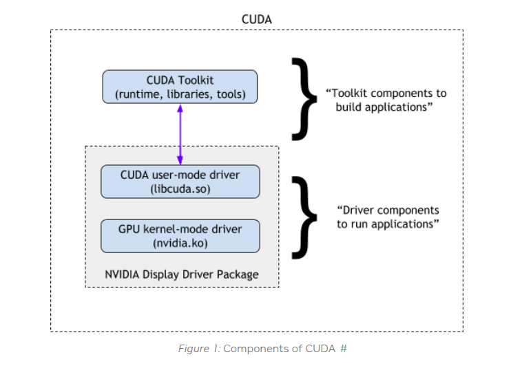
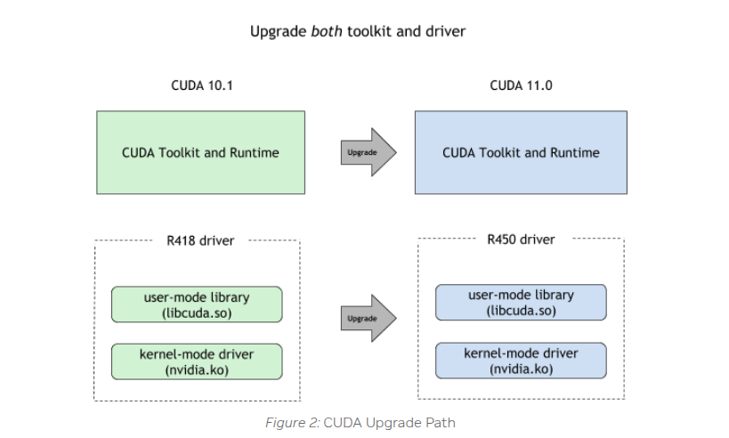

# CUDA Driver and Runtime Compatibility


## Hierarchical Architecture & Core Concepts




### 1. CUDA Runtime API Layer
#### Technical Positioning
1. **Functional Scope**: Provides high-level abstraction interfaces for developers, encapsulating core GPU operations (memory allocation, stream management, kernel launches, etc.)
2. **Version Binding**: Determined by the CUDA Toolkit version used during build (e.g., CUDA 12.0.1)

#### Version Detection Methods
```bash
# Python environment detection (recommended priority method)
pip list | grep cuda
conda list |grep cuda 
# Example output: cu121  # cu121 indicates CUDA 12.1 environment

# System-level runtime library detection
find / -name "libcudart*"
# cudart means cuda runtime
# Example output:
/usr/local/cuda-12.4/targets/x86_64-linux/lib/libcudart.so.12
/usr/local/cuda-12.4/targets/x86_64-linux/lib/libcudart.so.12.4.127
Indicates CUDA 12.4
```
if you find multi lib version, you should check your program which version used,like PATH, LD_LIBRARY_PATH or other program set
```bash
env |grep PATH
# Example output:
LIBRARY_PATH=/usr/local/cuda/lib64/stubs
LD_LIBRARY_PATH=/usr/local/nvidia/lib:/usr/local/nvidia/lib64
PATH=/go/bin:/usr/local/go/bin:/usr/local/nvidia/bin:/usr/local/cuda/bin:/usr/local/sbin:/usr/local/bin:/usr/sbin:/usr/bin:/sbin:/bin
#that means your cuda program used the first lib by lib path order
```

### 2. CUDA Driver API Layer
#### Technical Positioning
1. **Functional Scope**: Low-level interface directly interacting with GPU hardware, handling instruction translation and hardware resource scheduling
2. **Version Binding**: Determined by NVIDIA driver version, following SemVer specification

#### Version Detection Methods
```bash
nvidia-smi
# Example output:
+-----------------------------------------------------------------------------------------+
| NVIDIA-SMI 550.144.03             Driver Version: 550.144.03     CUDA Version: 12.4     |
|-----------------------------------------+------------------------+----------------------+
| GPU  Name                 Persistence-M | Bus-Id          Disp.A | Volatile Uncorr. ECC |
| Fan  Temp   Perf          Pwr:Usage/Cap |           Memory-Usage | GPU-Util  Compute M. |
|                                         |                        |               MIG M. |
|=========================================+========================+======================|
|   0  NVIDIA A30                     Off |   00000000:00:0B.0 Off |                    0 |
| N/A   31C    P0             28W /  165W |   10195MiB /  24576MiB |      0%      Default |
|                                         |                        |             Disabled |
+-----------------------------------------+------------------------+----------------------+
```


## Version Compatibility Matrix & Constraints

### Physical GPU Deployment - Core Compatibility Principles
First reference NVIDIA's official statement,the **base constraints** is
1. **Driver version must always be ≥ Runtime version**
2. NVIDIA officially guarantees **1 major version backward compatibility** (e.g., CUDA Driver 12.x supports Runtime 11.x)
3. Cross-two-major-version compatibility (e.g., Driver 12.x with Runtime 10.x) is neither officially supported nor recommended

when you deploy cuda program，please comply with the base constraints

#### Formal Rules
```diff
+ Mandatory: Driver version ≥ Runtime version
+ Recommended: Driver major version - Runtime major version ≤ 1
- Blocked: Driver version < Runtime version → May trigger CUDA_ERROR_UNKNOWN(999)
- Unstable: Driver major version - Runtime major version > 1 → Application may malfunction
```

### Virtualization Scenario Enhancements (HAMI/GPU-Manager)
When using Virtual GPU solutions like GPU-Manager or HAMI, **besides the base constraints up**, you must comply with the **additional constraints** apply:

#### Version Requirements
```text
1. Virtual GPU solutions baseline version ≥ Runtime version
2. Runtime major version = Driver major version = Baseline major version
```
**Special Note for GPU-Manager**:
We implemented partial cross-1-major-version compatibility (e.g., baseline 12.4 supporting vLLM 11.8). However, this requires per-application hook adjustments and must be analyzed case-by-case.


## Deployment Best Practices

### Recommended Strategy
• Adopt newer CUDA versions (e.g., CUDA 12.x) for both Driver and Runtime in new GPU cluster planning

### Alternative Solutions for Legacy Systems

#### 1. Physical GPU Scheduling or GPU-Manager Whole-Card Allocation
Whole-card scheduling provides native compatibility equivalent to physical GPU access
GPU-Manager can use whole card mode when you set tencent.com/vcuda-core to 100 multily positive integer,like 100,200,300
```yaml
resources:
  limits:
    tencent.com/vcuda-core: "100"

```

#### 2. Node Labeling Strategy
Label nodes based on supported Driver CUDA versions:
```yaml
node_labels:
  cuda-major-version: "12"
  cuda-minor-version: "4"
```
this means your node is cuda 12.4

Configure scheduling affinity in deployments:
you can set cuda-major-version and cuda-minor-version by your program cuda runtime need
```yaml
apiVersion: apps/v1
kind: Deployment
metadata:
  name: cuda-app
spec:
  template:
    spec:
      affinity:
        nodeAffinity:
          requiredDuringSchedulingIgnoredDuringExecution:
            nodeSelectorTerms:
            - matchExpressions:
              - key: cuda-major-version
                operator: In
                values: ["12"]
              - key: cuda-minor-version
                operator: Gt
                values: ["2"]
```

#### 3. Runtime Version Upgrade
Legacy CUDA Runtimes may have security vulnerabilities (CVEs) and lack support for new GPU features. Prioritize upgrades to CUDA 12.x.

nvidia recomend to upgrade both


## Troubleshooting Handbook

### Common Error Codes
| Error Code                   | Description                          | Recommended Action                  |
|------------------------------|--------------------------------------|--------------------------------------|
| CUDA_ERROR_INVALID_IMAGE     | Driver-Runtime incompatibility       | Align driver version with container CUDA version |
| CUDA_ERROR_ILLEGAL_ADDRESS   | Virtual memory violation (common in version mismatch) | Verify Runtime vs baseline constraints |
| CUDA_ERROR_UNSUPPORTED_PTX_VERSION | PTX instruction set mismatch | Recompile with explicit -arch=sm_xx |

---

