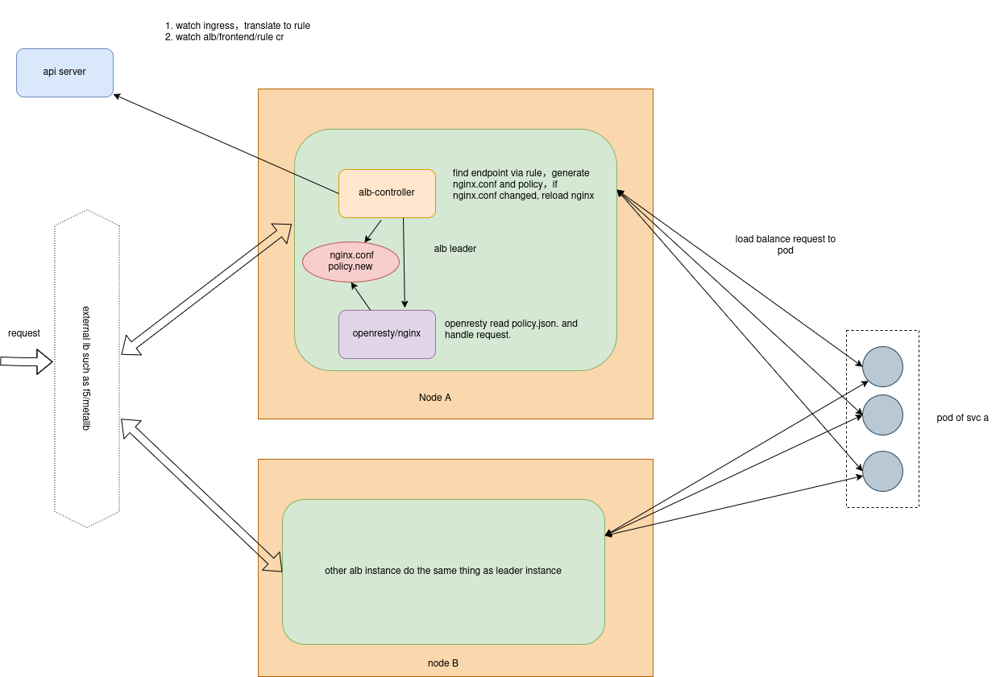

# Architecture
## alb operator
alb-operator controls the creation and update of all alb instances in a cluster.

## alb instance
a alb is composed of multiple pods of a deployment.

These pods elect a leader through lease. The leader is responsible for translating ingress resources into rule resources.

Each pod will get all the rules and handle requests independently, without dependencies on each other.

