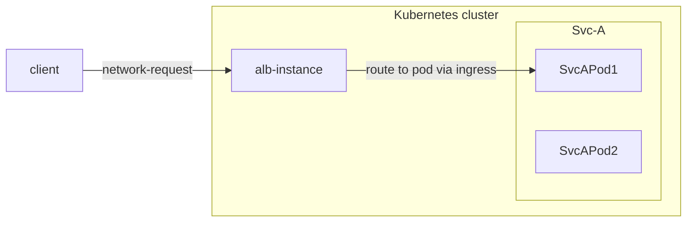

# relationship between alb,alb-instance,frontend/ft,rule,ingress,project
LoadBalancer is a key component in modern cloud-native architectures, serving as an intelligent traffic router and load balancer. 

To understand how ALB works in a Kubernetes cluster, we need to understand several core concepts and their relationships
- ALB itself
- frontend (ft)
- rules
- ingress resources
- projects

These components work together to enable flexible and powerful traffic management capabilities.

This article mainly introduces how these concepts work together and what roles they play in the request-calling chain. Detailed introductions for each concept will be covered in other articles.

in a request-calling chain.
1. client send a http/https/other protocol request, and finally the request will **arrive on a pod of alb**, and the pod(a alb-instance) will start to handle it.
2. the alb-instance find the rule from the ingress which it could match this request.
3. if needed, modify the request based on the rule.
4. find and select one pod ip from the services which the rule configured. and forward the request to the pod.

## ingress
ingress is a resource in kubernetes, used to describe what request should be send to which service.
## ingress controller
a program that understand ingress resource and will proxy resquest to service.
## alb
is a ingress controller.

in kubernetes cluster, we use `alb2` resource to operator a alb. you could use `kubectl get alb2 -A` to view all the alb in the cluster.

each alb has its own ingressclass, when you create an ingress, you can set it `.spec.ingressClassName` field to hint ingress controller.

alb are created by user manually.

## alb instance
alb also is a deployment aka bunch of pod running in the cluster. each pod is called as a alb instance.

each alb instance handle resquest independently, but share ft and rule and other config belongs to this alb.

alb-operator will create deployment for each alb according to the alb resource.

## alb-operator
alb-operator is a operator for alb. default deployed in the cluster.

## ft
ft is a resource defined by alb itself. it is used to represent the alb instance listening ports.

ft could be created by alb-leader or user manually.

ft created by alb-leader:
 1. if ingress has has certificate we will create ft 443 (https)
 2. if ingress has no certificate we will create ft 80 (http).

## rule
rule is a resource defined by alb itself. 
it take the same role as the ingress, but it is more specific.
a rule is uniquely associated with a ft.

rule could be created by alb-leader or user manually.

## alb leader
in  multiple alb-instance, it will elect one as leader.
the leader is responsible for
1. translating the ingress into rules.
    we will create rule for each path in the ingress.
2. create ft need by ingress.
    for example, if ingress has has certificate we will create ft 443 (https), if ingress has no certificate we will create ft 80 (http).

## project
project is a concept in alauda acp, from the perspective of alb, it is a set of ns.

you could configure one or more project in a alb. 
when alb leader translate the ingress into rules, it will ignore ingress in ns which not belongs to the project.

