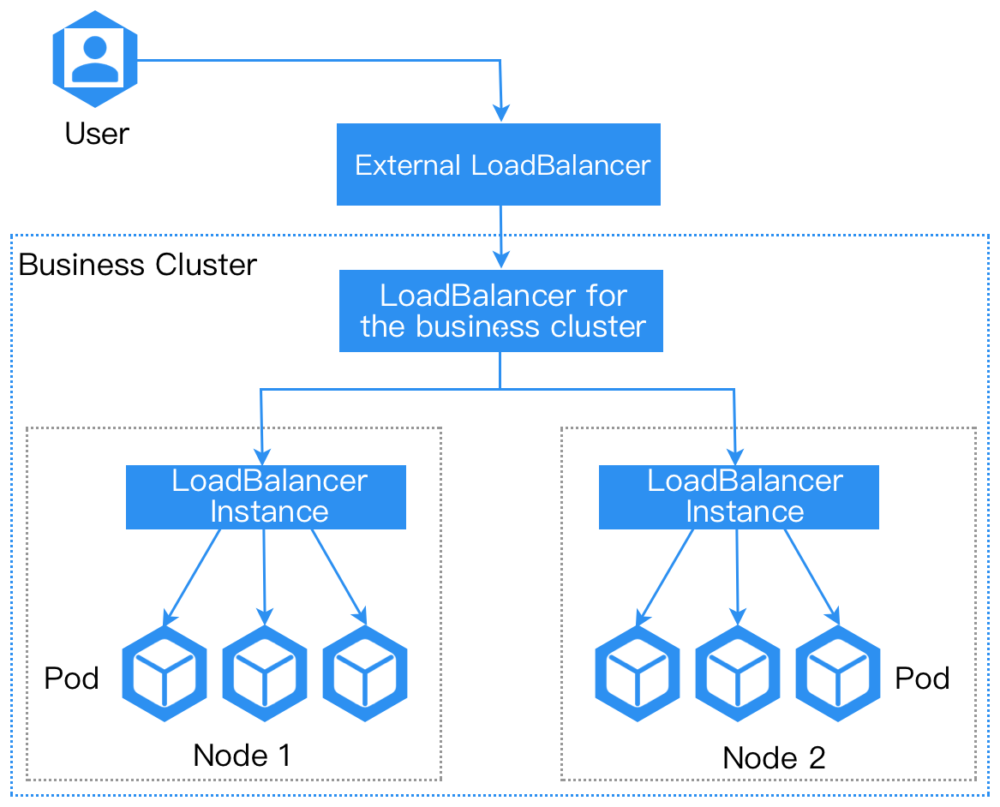

# network mode
a alb instance could be deployed in two modes: host network mode and container network mode.

## host network mode
directly use the node's network stack, sharing the IP address and port with the node. 

In this mode, the load balancer instance directly binds to the node's port, without port mapping or similar container network encapsulation conversion.

**Note**: To avoid port conflicts, only one alb instance is allowed to be deployed on a single node.

in hostnetwork mode alb instance will listen to all the nic of the node by default.

Advantages:
1. best network performance.
Disadvantages:
1. only one alb instance is allowed to be deployed on a single node.
2. port might be conflict with other process.

## container network mode

Unlike host network mode, container network mode deploys ALB using container networking.

Advantages:
1. supports deploying multiple alb instances on a single node.
2. alb provides integration with MetalLB, which can provide vip for alb.
3. port will not conflict with other process.

Disadvantages:
1. slightly lower performance.
2. must access alb through LoadBalancer service.
