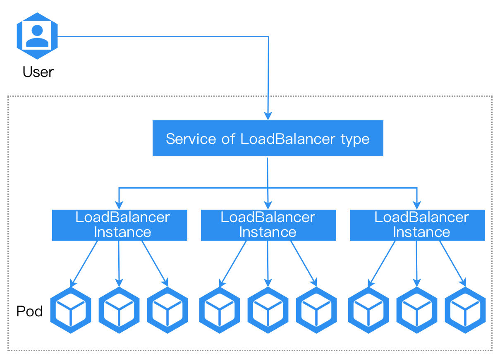

# In-Depth Understanding of Container Network Modes

Load balancers of container network types route traffic from outside the cluster to load balancer instances through internal routing of the LoadBalancer type, facilitating business communication. Compared to the host network mode, the performance of the container network mode is slightly inferior, but it supports the deployment of more load balancer instances on the nodes.

