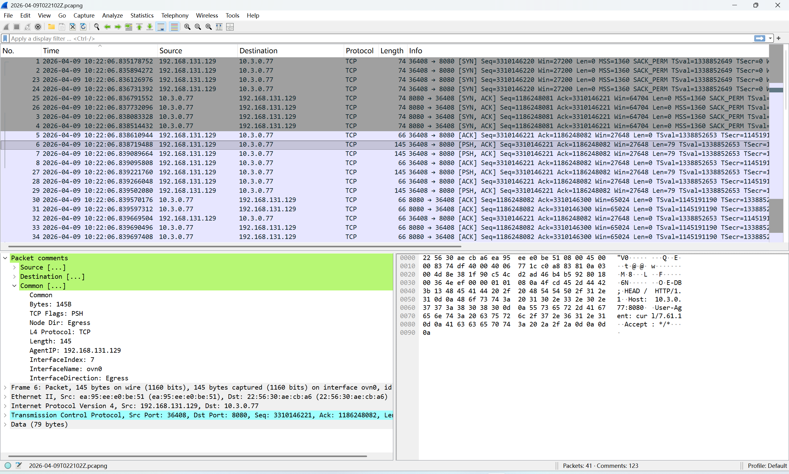
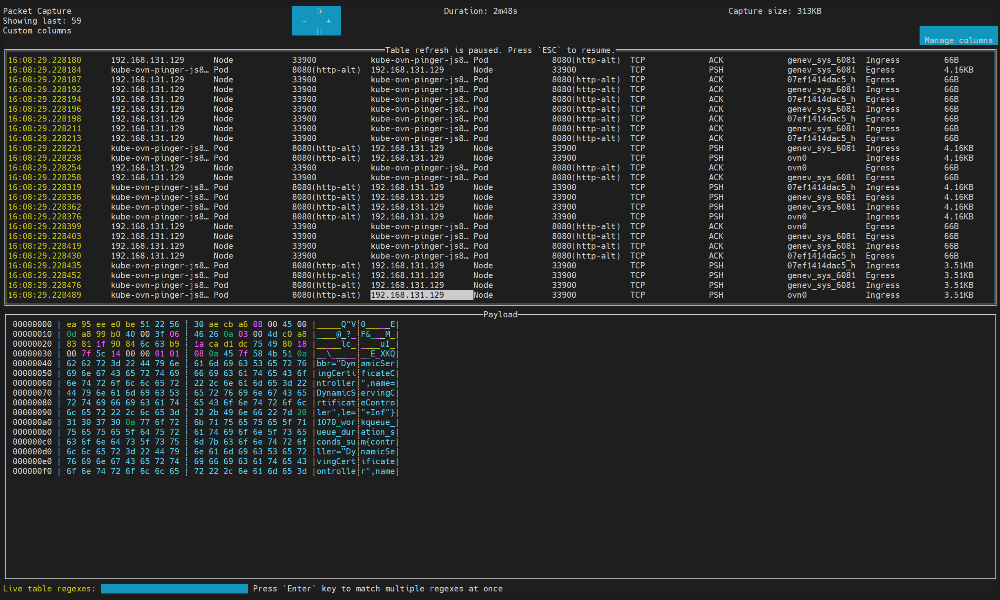
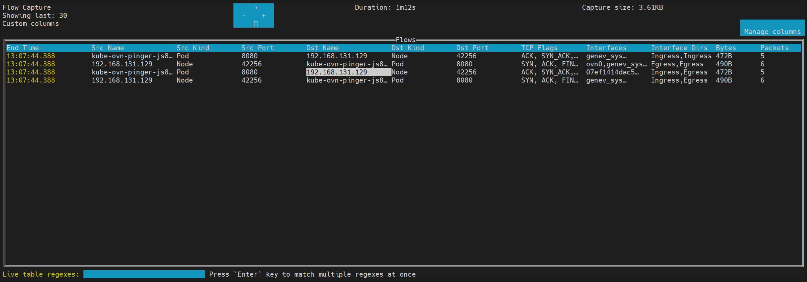

# Use the CLI

The CLI can run as a standalone tool or as a kubectl plugin.
You can copy it from the netobserv-controller-manager pod to your local machine.

Use the CLI for on-demand troubleshooting when you want to inspect packets or flows for a limited period.
It supports these two modes:

- TUI mode, which displays captured traffic in real time for interactive inspection
- Background mode, which starts a capture task and lets it continue until it reaches the configured stop condition or is stopped manually

Both modes support exporting capture results for offline analysis.

## Copy the CLI

Example:

```bash
# Replace value with the actual namespace where the NetObserv Operator is installed
NAMESPACE="netobserv-operator"
# Get name of the NetObserv Controller Manager pod
CONTROLLER_POD=$(kubectl get pods -n $NAMESPACE -l app=netobserv-operator -o jsonpath="{.items[0].metadata.name}")
# Copy the CLI from the controller manager pod to your local machine
kubectl cp $NAMESPACE/$CONTROLLER_POD:/kubectl-netobserv /usr/local/bin/kubectl-netobserv
# Make the CLI executable
chmod +x /usr/local/bin/kubectl-netobserv
# Verify that the CLI is working
kubectl netobserv help
```

## Install or Copy yq

The CLI requires __yq__ on your local machine to modify YAML files.
If yq is not installed locally, you can copy the binary from the netobserv-controller-manager pod.

```bash
# Copy yq from the controller manager pod to your local machine
kubectl cp $NAMESPACE/$CONTROLLER_POD:/yq /usr/local/bin/yq
# Make yq executable
chmod +x /usr/local/bin/yq
# Verify that yq is working
yq --version
```

:::note
The CLI uses some images packaged in the NetObserv Operator, but it does not require the NetObserv Operator to be installed to work.
After you prepare the CLI, you can uninstall the NetObserv Operator if you no longer need it. The CLI will continue to work.
:::

## View the Help Message

Before you start a capture task, review the available commands:

```bash
# Get help message for the CLI
kubectl netobserv help
# Get help message for packet capture command
kubectl netobserv packets help
# Get help message for flow capture command
kubectl netobserv flows help
```

## Capture Packets

Packet capture records raw packets that match the filters you specify.
Use packet capture when you need full packet details instead of summarized flow records.

:::note
If a packet length is greater than 256 bytes, the packet will be truncated in the capture results.
:::

The captured packets can be exported to a pcapng file for offline analysis with tools like Wireshark.

Example in Wireshark:



:::note
The captured packets are not sorted by timestamp in the pcapng file, so you may need to sort the packets by timestamp in Wireshark to analyze the packet flow.
:::

The packet comments include metadata such as node IP, interface name, and Kubernetes resource information.
Example packet comments:

```txt
Source
    Source
    Src IP: 192.168.131.129
    Src Node IP: 192.168.131.129
    Src Node Name: 192.168.131.129
    Src Name: 192.168.131.129
    Src Network Name: primary
    Src Owner: 192.168.131.129
    Src Owner Kind: Node
    Src Kind: Node
    Src MAC: ea:95:ee:e0:be:51
    Src Port: 36408
Destination
    Destination
    Dst IP: 10.3.0.77
    Dst Node IP: 192.168.128.117
    Dst Node Name: 192.168.128.117
    Dst Name: kube-ovn-pinger-js87q
    Dst Namespace: kube-system
    Dst Network Name: ovn-default
    Dst Owner: kube-ovn-pinger
    Dst Owner Kind: DaemonSet
    Dst Kind: Pod
    Dst MAC: 22:56:30:ae:cb:a6
    Dst Port: 8080(http-alt)
Common
    Common
    Bytes: 145B
    TCP Flags: PSH
    Node Dir: Egress
    L4 Protocol: TCP
    Length: 145
    AgentIP: 192.168.131.129
    InterfaceIndex: 7
    InterfaceName: ovn0
    InterfaceDirection: Egress
```

You can filter packets in Wireshark based on these comments.
Example filter by node IP and interface name:

```txt
frame.comment == "AgentIP: 192.168.131.129" && frame.comment == "InterfaceName: ovn0"
```

In Kube-OVN overlay networking, packets between pods on different nodes are encapsulated with Geneve or VxLAN.
The original packet is carried as the payload of the Geneve or VxLAN packet.
To capture encapsulated traffic, use `--enable_geneve` or `--enable_vxlan` when running the packet capture command.

Example command for capturing TCP packets on port 8080, including Geneve-encapsulated packets:

```bash
kubectl netobserv packets --enable_geneve --protocol=TCP --port=8080
```

### Run Packet Capture in TUI Mode

Example command for TUI mode:

```bash
kubectl netobserv packets --cidr=10.3.0.77/32 --peer_ip=192.168.131.129 --protocol=TCP --port=8080
```

This command captures packets that match the specified filters and displays them in TUI mode.

Example TUI interface:



Press _CTRL+C_ to exit TUI mode and stop the packet capture.
By default, the CLI will ask you whether to export the captured packets to a pcapng file after you exit TUI mode.
You can use the `--copy` flag to save the pcapng file automatically without confirmation.

### Run Packet Capture in Background Mode

Example command for background mode:

```bash
kubectl netobserv packets --background --cidr=10.3.0.77/32 --peer_ip=192.168.131.129 --protocol=TCP --port=8080
```

This command starts a packet capture task in the background that captures packets matching the specified filters.

To copy captured packets to a pcapng file in background mode, run:

```bash
kubectl netobserv copy
```

When the capture task is stopped or finished, you can use the `cleanup` command to remove the background capture task and free up resources.

```bash
kubectl netobserv cleanup
```

## Capture Flows

Flow capture records summarized network flow data instead of raw packets.
Use it when you want traffic metadata and flow statistics rather than full packet payloads.

The usage of flow capture is similar to packet capture, but the results are exported in JSON and SQLite format instead of pcapng.

Example command:

```bash
kubectl netobserv flows --cidr=10.3.0.77/32 --peer_ip=192.168.131.129 --protocol=TCP --port=8080
```

Example TUI interface:



Example exported flow record in formatted JSON:

```json
[
  {
    "AgentIP": "192.168.131.129",
    "Bytes": 611,
    "Dscp": 0,
    "DstAddr": "fd00::10:3:0:4e",
    "DstK8S_HostIP": "192.168.131.129",
    "DstK8S_HostName": "192.168.131.129",
    "DstK8S_Name": "kube-ovn-pinger-2w2qp",
    "DstK8S_Namespace": "kube-system",
    "DstK8S_NetworkName": "ovn-default",
    "DstK8S_OwnerName": "kube-ovn-pinger",
    "DstK8S_OwnerType": "DaemonSet",
    "DstK8S_Type": "Pod",
    "DstMac": "22:56:30:ae:cb:a6",
    "DstPort": 8080,
    "Etype": 34525,
    "Flags": 530,
    "FlowDirection": 2,
    "IfDirections": [
      1,
      1
    ],
    "Interfaces": [
      "ovn0",
      "211daf442f8b_h"
    ],
    "Packets": 6,
    "Proto": 6,
    "Sampling": 1,
    "SrcAddr": "2004::192:168:131:129",
    "SrcK8S_HostIP": "192.168.131.129",
    "SrcK8S_HostName": "192.168.131.129",
    "SrcK8S_Name": "kube-ovn-cni-zgjhs",
    "SrcK8S_Namespace": "kube-system",
    "SrcK8S_NetworkName": "primary",
    "SrcK8S_OwnerName": "kube-ovn-cni",
    "SrcK8S_OwnerType": "DaemonSet",
    "SrcK8S_Type": "Pod",
    "SrcMac": "ea:95:ee:e0:be:51",
    "SrcPort": 59848,
    "TimeFlowEndMs": 1775701945802,
    "TimeFlowStartMs": 1775701945799,
    "TimeReceived": 1775701946
  },
  {
    "AgentIP": "192.168.131.129",
    "Bytes": 509,
    "Dscp": 0,
    "DstAddr": "2004::192:168:131:129",
    "DstK8S_HostIP": "192.168.131.129",
    "DstK8S_HostName": "192.168.131.129",
    "DstK8S_Name": "kube-ovn-cni-zgjhs",
    "DstK8S_Namespace": "kube-system",
    "DstK8S_NetworkName": "primary",
    "DstK8S_OwnerName": "kube-ovn-cni",
    "DstK8S_OwnerType": "DaemonSet",
    "DstK8S_Type": "Pod",
    "DstMac": "76:34:72:f2:a9:03",
    "DstPort": 59848,
    "Etype": 34525,
    "Flags": 784,
    "FlowDirection": 2,
    "IfDirections": [
      0,
      0
    ],
    "Interfaces": [
      "211daf442f8b_h",
      "ovn0"
    ],
    "Packets": 4,
    "Proto": 6,
    "Sampling": 1,
    "SrcAddr": "fd00::10:3:0:4e",
    "SrcK8S_HostIP": "192.168.131.129",
    "SrcK8S_HostName": "192.168.131.129",
    "SrcK8S_Name": "kube-ovn-pinger-2w2qp",
    "SrcK8S_Namespace": "kube-system",
    "SrcK8S_NetworkName": "ovn-default",
    "SrcK8S_OwnerName": "kube-ovn-pinger",
    "SrcK8S_OwnerType": "DaemonSet",
    "SrcK8S_Type": "Pod",
    "SrcMac": "f2:81:a1:19:44:7a",
    "SrcPort": 8080,
    "TimeFlowEndMs": 1775701945802,
    "TimeFlowStartMs": 1775701945800,
    "TimeReceived": 1775701946
  }
]
```

Example exported flow records in SQLite:

```shell
$ sqlite3 2026-04-09T022936Z.db \
  "SELECT SrcAddr, SrcPort, DstAddr, DstPort, Proto, Packets, Bytes FROM flow;"
╭───────────────────────┬─────────┬───────────────────────┬─────────┬───────┬─────────┬───────╮
│        SrcAddr        │ SrcPort │        DstAddr        │ DstPort │ Proto │ Packets │ Bytes │
╞═══════════════════════╪═════════╪═══════════════════════╪═════════╪═══════╪═════════╪═══════╡
│ 2004::192:168:131:129 │   59848 │ fd00::10:3:0:4e       │    8080 │     6 │       6 │   611 │
│ fd00::10:3:0:4e       │    8080 │ 2004::192:168:131:129 │   59848 │     6 │       4 │   509 │
╰───────────────────────┴─────────┴───────────────────────┴─────────┴───────┴─────────┴───────╯
```

## Additional Resources

- [eBPF - Introduction, Tutorials & Community Resources](https://ebpf.io/)