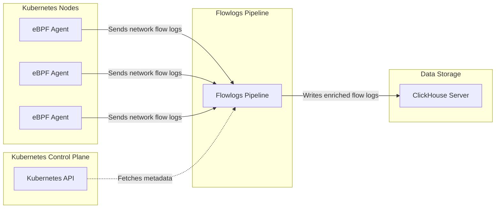
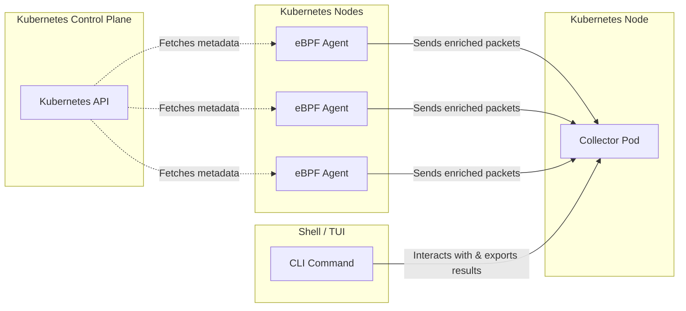

# Overview

## About Network Observability

In <Term name="company"/> Container Platform, network observability is provided by __NetObserv__.
NetObserv uses eBPF to capture network data and help you inspect traffic behavior, identify performance issues, and troubleshoot connectivity problems.

Use Network Observability when you need to:

- Monitor network traffic continuously across the cluster
- Debug network issues with detailed packet or flow data
- Investigate connectivity or latency issues between workloads
- Capture packets or flows for offline analysis

NetObserv includes these main components:

- An eBPF agent that runs on cluster nodes and captures packets or flow data
- A flow logs pipeline that enriches and exports flow logs
- A CLI that supports on-demand packet capture and flow capture

You can use NetObserv in either of these ways:

- Deploy the operator to collect and store cluster-wide flow logs continuously
- Use the CLI to capture packets or flows for troubleshooting and export the results for offline analysis

Choose the operator-based deployment if you need continuous, cluster-wide visibility.
Choose the CLI if you need short-term troubleshooting without changing the long-running collection setup.

## Recommended Workflow

For most deployments, follow this order:

1. Review [Prerequisites](./prerequisites.mdx) and verify kernel requirements.
2. Download and upload the NetObserv Operator package.
3. Prepare a ClickHouse backend.
4. Install the NetObserv Operator.
5. Create the ClickHouse authentication secret.
6. Create the FlowCollector instance.
7. Use the [CLI](./cli-usage.mdx) when you need packet or flow capture for troubleshooting.

## Operator Deployment Architecture

When deployed with the NetObserv Operator, the eBPF agents run as DaemonSets on Kubernetes nodes to collect network flow logs.
The flow logs pipeline runs as a Deployment, enriches the collected data with Kubernetes metadata, and exports it to ClickHouse for storage and analysis.

The following diagram shows the high-level architecture of NetObserv deployed with the NetObserv Operator:

## CLI Architecture

The CLI is a shell script that can run as a standalone tool or as a kubectl plugin.
It can capture packets or flows and export the results to files for further analysis.

The following diagram shows the high-level architecture of the NetObserv CLI:

