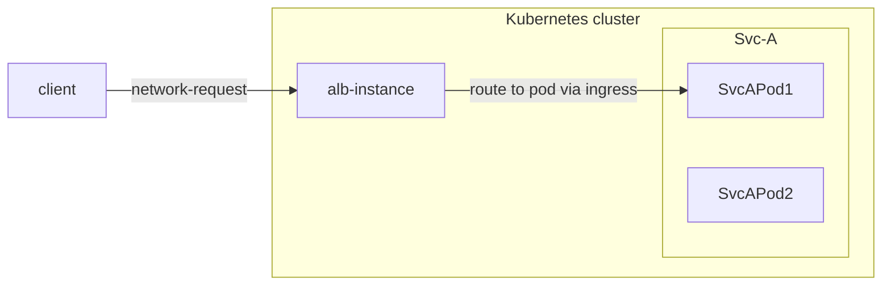

# Understanding ALB

:::warning
ALB has been deprecated. Please use the [ingress-nginx-operator](../ingress_nginx_operator.mdx) or [envoy-gateway](../envoy_gateway_operator.mdx) instead.
:::

ALB (Another Load Balancer) is a Kubernetes Gateway powered by OpenResty with years of production experience from Alauda.

## Core components


- **ALB Operator**: An operator that manages the lifecycle of ALB instances. It watches ALB CRs and creates/updates instances for different tenants.
- **ALB Instance**: An ALB instance includes OpenResty acting as the data plane and a Go controller as the control plane. The Go controller monitors various CRs (Ingress, Gateway, Rule, etc.) and converts them into ALB-specific DSL rules. OpenResty then uses these DSL rules to match and process incoming requests.

## Quick Start

### Deploy the ALB Operator

1. Create a cluster.
2. ```shell
    helm repo add alb https://alauda.github.io/alb/;helm repo update;helm search repo|grep alb
   ```
3. ```shell
    helm install alb-operator alb/alauda-alb2
   ```

### Deploy an ALB Instance

```yaml
cat <<EOF | kubectl apply -f -
apiVersion: crd.alauda.io/v2beta1
kind: ALB2
metadata:
    name: alb-demo
    namespace: kube-system
spec:
    address: "172.20.0.5"  # the ip address of node where alb been deployed
    type: "nginx"
    config:
        networkMode: host
        loadbalancerName: alb-demo
        projects:
        - ALL_ALL
        replicas: 1
EOF
```

### Run a demo application

```yaml
cat <<EOF | kubectl apply -f -
apiVersion: apps/v1
kind: Deployment
metadata:
  name: hello-world
  labels:
    k8s-app: hello-world
spec:
  replicas: 1
  selector:
    matchLabels:
      k8s-app: hello-world
  template:
    metadata:
      labels:
        k8s-app: hello-world
    spec:
      terminationGracePeriodSeconds: 60
      containers:
      - name: hello-world
        image: docker.io/crccheck/hello-world:latest
        imagePullPolicy: IfNotPresent
---
apiVersion: v1
kind: Service
metadata:
  name: hello-world
  labels:
    k8s-app: hello-world
spec:
  ports:
  - name: http
    port: 80
    targetPort: 8000
  selector:
    k8s-app: hello-world
---
apiVersion: networking.k8s.io/v1
kind: Ingress
metadata:
  name: hello-world
spec:
  rules:
  - http:
      paths:
      - path: /
        pathType: Prefix
        backend:
          service:
            name: hello-world
            port:
              number: 80
EOF
```

Now you can access the app via `curl http://${ip}`

## Relationship between ALB, ALB Instance, Frontend/FT, Rule, Ingress, and Project

LoadBalancer is a key component in modern cloud-native architectures, serving as an intelligent traffic router and load balancer.

To understand how ALB works in a Kubernetes cluster, we need to understand several core concepts and their relationships:

- ALB itself
- Frontend (FT)
- Rules
- Ingress resources
- Projects

These components work together to enable flexible and powerful traffic management capabilities.

The following explains how these concepts work together in the request path. Detailed introductions for each concept are covered in separate articles.



In a request-calling chain:

1. A client sends an HTTP/HTTPS/other protocol request, and finally the request will **arrive on a pod of ALB**, and the pod (an ALB instance) will start to handle this request.
2. This ALB instance finds a rule which could match this request.
3. If needed, modify/redirect/rewrite the request based on the rule.
4. Find and select one pod IP from the services which the rule configured. And forward the request to the pod.

### Ingress

Ingress is a resource in Kubernetes, used to describe what request should be sent to which service.

### Ingress Controller

A program that understands Ingress resource and will proxy request to service.

### ALB

ALB is an Ingress controller.

In Kubernetes cluster, we use the `alb2` resource to operate an ALB. You could use `kubectl get alb2 -A` to view all the ALBs in the cluster.

ALBs are created by users manually. Each ALB has its own IngressClass. When you create an Ingress, you can use `.spec.ingressClassName` field to indicate which Ingress controller should handle this Ingress.

### ALB Instance

ALB also is a Deployment (bunch of pods) running in the cluster. Each pod is called an ALB instance.

Each ALB instance handles requests independently, but all instances share Frontend (FT), Rule, and other configurations belonging to the same ALB.

### ALB-Operator

ALB-Operator, a default component deployed in the cluster, is an operator for ALB. It will create/update/delete Deployment and other related resources for each ALB according to the ALB resource.

### Frontend (abbreviation: FT)

FT is a resource defined by ALB itself. It is used to represent the ALB instance listening ports.

FT could be created by ALB-Leader or user manually.

Cases of FT created by ALB-Leader:

1.  If Ingress has certificate, we will create FT 443 (HTTPS).
2.  If Ingress has no certificate, we will create FT 80 (HTTP).

### RULE

RULE is a resource defined by ALB itself.
It takes the same role as the Ingress, but it is more specific.
A RULE is uniquely associated with a FT.

RULE could be created by ALB-Leader or user manually.

Cases of RULE created by ALB-Leader:

1. Sync Ingress to RULE.

## ALB Leader

In multiple ALB instances, one will be elected as leader.
The leader is responsible for:

1. Translating the Ingress into Rules.
   We will create Rule for each path in the Ingress.
2. Creating FT needed by Ingress.
   For example, if Ingress has certificate we will create FT 443 (HTTPS), if Ingress has no certificate we will create FT 80 (HTTP).

### Project

From the perspective of ALB, Project is a set of namespaces.

You could configure one or more Projects in an ALB.
When ALB Leader translates the Ingress into Rules, it will ignore Ingress in namespaces which do not belong to the Project.

## Additional resources:

- [Configure a Load Balancer](./configure_alb.html)
