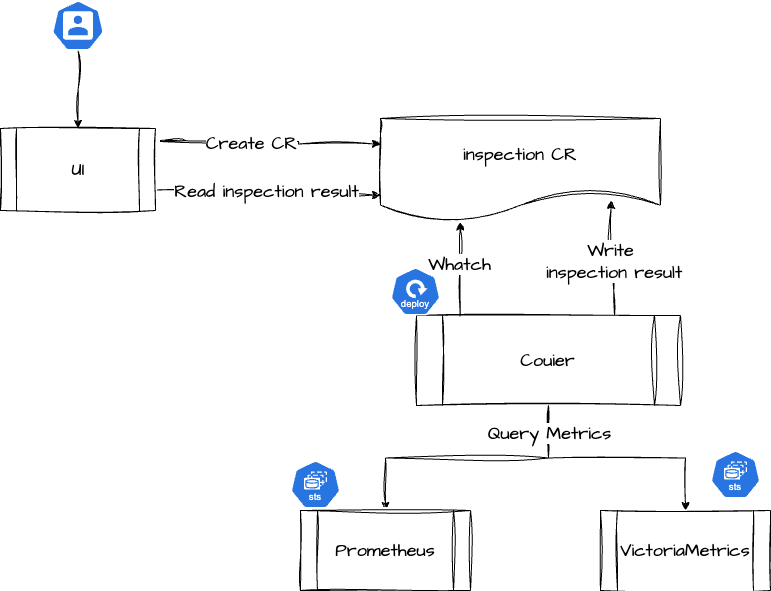

# Architecture

## Inspection

The inspection module is jointly provided by the platform component Courier and the monitoring component, involving the following business processes:

- Create inspection task: The platform submits an inspection-type CR to the Global cluster.
- Execute inspection task: The Courier component monitors the generation of inspection-type CRs and queries the monitoring components of each cluster for various metric data related to the inspection.
- Write inspection results: After the Courier component completes the evaluation of each inspection item, it will write the inspection results back into the corresponding inspection CR.
- View inspection results: Users can check the status and results of inspection tasks through the platform, where data will be obtained from the corresponding inspection CR.

## Component Health Status

Component health status is jointly provided by the platform component Courier and the monitoring component, involving the following business processes:

- Predefined component monitoring list: The platform has predefined two types of CRDs in the Global cluster to define the list of components to be monitored and the monitoring methods:
  - ModuleHealth: Defines the components that need to be monitored and the monitoring methods.
  - ModuleHealthRecord: Defines the monitoring results of the corresponding components in each cluster.
- Regularly monitor component status: Courier will watch ModuleHealth, check the specified functions, and then write the inspection results to the CR resources of ModuleHealth and ModuleHealthRecord.
- Component status determination: Courier will request data from Kubernetes and the monitoring components to determine the actual status of the components and any existing issues.
  - Kubernetes: Checks whether the component is deployed and whether the number of component replicas is normal.
  - Prometheus / VictoriaMetrics: Based on the metrics provided by each component, queries and determines whether the component can provide services normally.
- View component health status: Users can check the health status of each component through the platform, where data will be obtained from the corresponding CR resources of ModuleHealth and ModuleHealthRecord.
