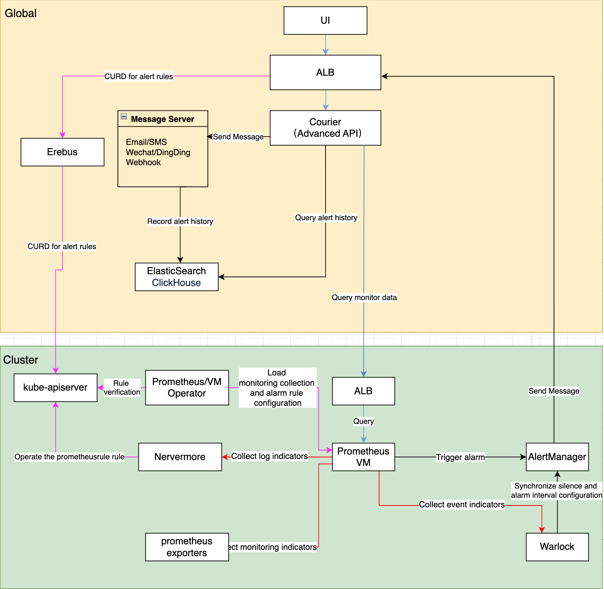

# Monitoring Module Architecture



## Overall Architecture Explanation

The monitoring system consists of the following core functional modules:

1. Monitoring System
   - Data Collection and Storage: Collecting and persisting monitoring metrics from multiple sources
   - Data Query and Visualization: Providing flexible query and visualization capabilities for monitoring data
2. Alerting System
   - Alert Rule Management: Configuring and managing alert policies
   - Alert Triggering and Notification: Evaluating alert rules and dispatching notifications
   - Real-time Alert Status: Providing a real-time view of the current alert status of the system
3. Notification System
   - Notification Configuration: Managing notification templates, contact groups, and policies
   - Notification Server: Managing the configuration of various notification channels

## Monitoring System

### Data Collection and Storage

1. Prometheus/VictoriaMetrics Operator Responsibilities:
   - Load and validate monitoring collection configurations
   - Load and validate alert rule configurations
   - Synchronize configurations to Prometheus/VictoriaMetrics instances
2. Sources of Monitoring Data:
   - Nevermore: Generates log-related metrics
   - Warlock: Generates event-related metrics
   - Prometheus/VictoriaMetrics: Discovers and collects various exporters' metrics via ServiceMonitor

### Data Query and Visualization

1. Monitoring Data Query Process:
   - The browser initiates a query request (Path: `/platform/monitoring.alauda.io/v1beta1`)
   - ALB forwards the request to the Courier component
   - Courier API processes the query:
     - Built-in Metrics: Obtains PromQL through the indicators interface and queries
     - Custom Metrics: Directly forwards PromQL to the monitoring component
   - The monitoring dashboard retrieves data and displays it

2. Monitoring Dashboard Management Process:
   - Users access the `global` cluster ALB (Path: `/kubernetes/cluster_name/apis/ait.alauda.io/v1alpha2/MonitorDashboard`)
   - ALB forwards the request to the Erebus component
   - Erebus routes the request to the target monitoring cluster
   - The Warlock component is responsible for:
     - Validating the legality of the monitoring dashboard configuration
     - Managing the MonitorDashboard CR resource

3. Perses Dashboard Query Process:
   - Users open **Operations Center** > **Monitor** > **Dashboards (Perses)** in the console.
   - The console sends dashboard requests to the Perses server deployed in the `global` cluster by **Alauda Container Platform Dashboard for Perses**.
   - The Perses server uses the fixed `acp-observe` data source to query metrics through `observe-api`.
   - `observe-api`, deployed by **Alauda Container Platform Dashboard Essentials** in the `global` cluster, checks the user's cluster, namespace, and project permissions before forwarding queries to the platform metric storage. The selected workload cluster is the metric query target, but it does not run a local Perses server or `observe-api`.
   - The platform metric storage, such as VictoriaMetrics or Prometheus, returns query results to the dashboard.

     ```text
     User -> Console Perses dashboard -> Perses server -> observe-api
          -> Platform metric storage -> Dashboard
     ```

   Perses dashboards introduce `observe-api`, Perses server, and perses-operator into the query and rendering path. Perses server and `observe-api` run only in the `global` cluster. Workload clusters install the Perses operator as needed to provide PersesDashboard CRDs and store their own dashboard resources. The existing MonitorDashboard capability remains available and continues to use the existing MonitorDashboard management path.

## Alerting System

### Alert Rule Management

The alert rule configuration process:

1. Users access the `global` cluster ALB (Path: `/kubernetes/cluster_name/apis/monitoring.coreos.com/v1/prometheusrules`)
2. The request passes through ALB -> Erebus -> target cluster kube-apiserver
3. Responsibilities of each component:
   - Prometheus/VictoriaMetrics Operator:
     - Validating the legality of alert rules
     - Managing PrometheusRule CR
   - Nevermore: Listening for and processing log alert metrics
   - Warlock: Listening for and processing event alert metrics

### Alert Processing Workflow

1. Alert Evaluation:
   - PrometheusRule/VMRule defines alert rules
   - Prometheus/VictoriaMetrics evaluates rules periodically
2. Alert Notification:
   - Alerts are sent to Alertmanager once triggered
   - Alertmanager -> ALB -> Courier API
   - Courier API is responsible for dispatching notifications
3. Alert Storage:
   - Alert history is stored in ElasticSearch/ClickHouse

### Real-time Alert Status

1. Status Collection:
   - The `global` cluster Courier generates metrics:
     - cpaas_active_alerts: Current active alerts
     - cpaas_active_silences: Current silence configurations
   - Global Prometheus collects every 15 seconds
2. Status Display:
   - The front-end queries and displays real-time status via Courier API

## Notification System

### Notification Configuration Management

The management process for notification templates, notification contact groups, and notification policies is as follows:

1. Users access the standard API of the `global` cluster via a browser
   - Access path: `/apis/ait.alauda.io/v1beta1/namespaces/cpaas-system`
2. Managing related resources:
   - Notification Template: apiVersion: "ait.alauda.io/v1beta1", kind: "NotificationTemplate"
   - Notification Contact Group: apiVersion: "ait.alauda.io/v1beta1", kind: "NotificationGroup"
   - Notification Policy: apiVersion: "ait.alauda.io/v1beta1", kind: "Notification"
3. Courier is responsible for:
   - Validating the legality of notification templates
   - Validating the legality of notification contact groups
   - Validating the legality of notification policies

### Notification Server Management

1. Users access the `global` cluster's ALB via a browser
   - Access path: `/kubernetes/global/api/v1/namespaces/cpaas-system/secrets`
2. Managing and submitting notification server configurations
   - Resource name: platform-email-server
3. Courier is responsible for:
   - Validating the legality of the notification server configuration
