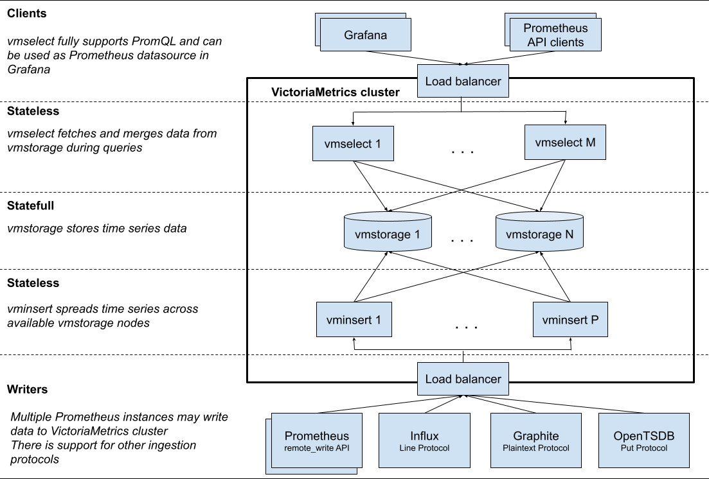

# Monitoring Component Selection Guide

When installing cluster monitoring, the platform provides two monitoring components for you to choose from: VictoriaMetrics and Prometheus. This article will detail the characteristics and applicable scenarios of these two components, helping you make the most suitable choice.

## Important Notes

- Only one of VictoriaMetrics or Prometheus can be selected when installing cluster monitoring components.
- Starting from version 3.18, VictoriaMetrics has been upgraded to Beta status, which meets production environment usage conditions.
- VictoriaMetrics is suitable for scenarios with high availability requirements and multi-cluster monitoring.
- Prometheus is suitable for single-cluster monitoring scenarios, especially for smaller scales.

## Component List

### Prometheus Related Components

| Component Name          | Function Description                          |
| ----------------------- | --------------------------------------------- |
| Prometheus Server       | Core server responsible for collecting, storing, and querying monitoring data |
| Exporters               | Monitoring data collection components that expose monitoring metrics via HTTP interfaces |
| AlertManager            | Alert management center, handling alert rules and notifications              |
| PushGateway             | Supports push mode for monitoring data, used for data transfer in special network environments |

### VictoriaMetrics Related Components

| Component Name          | Function Description                      |
| ----------------------- | ----------------------------------------- |
| VMStorage               | Monitoring data storage engine            |
| VMInsert                | Data writing component responsible for data distribution and storage |
| VMSelect                | Query service component providing data querying capabilities |
| VMAlert                 | Alert rule evaluation and handling component |
| VMAgent                 | Monitoring metric collection component     |

## Architecture Comparison

### Prometheus Architecture

Prometheus is a mature open-source monitoring system and is the second graduated project of CNCF after Kubernetes. It has the following characteristics:

- Powerful data collection capabilities.
- Flexible query language PromQL.
- A comprehensive ecosystem.
- Supports cluster monitoring at a thousand-node scale.

### VictoriaMetrics Architecture

VictoriaMetrics is a next-generation high-performance time series database and monitoring solution with the following advantages:

- Higher data compression ratio.
- Lower resource consumption.
- Native support for cluster high availability.
- Simpler operation and maintenance management.

## Feature Comparison

| Feature               | Prometheus | VictoriaMetrics | Description                                 |
| --------------------- | ---------- | ---------------- | ------------------------------------------- |
| High Availability Installation | ❌          | ✅               | VictoriaMetrics supports true cluster high availability with better data consistency |
| Single Node Installation | ✅          | ✅               | Both support single-node installation mode                      |
| Long-term Data Storage  | Requires remote storage | Natively supported | VictoriaMetrics is more suitable for long-term data storage |
| Resource Efficiency     | Higher      | Better           | VictoriaMetrics has better resource utilization               |
| Community Support       | Very mature | Rapidly developing | Prometheus has a larger community ecosystem                  |

## Installation Scheme Suggestions

### Monitoring Installation Architecture Overview

The above diagram shows the installation architecture and data flow of the monitoring components supported by the platform. The platform provides the following two installation methods for selection:

**Note**: When replacing monitoring components, please ensure that existing components are completely uninstalled, and monitoring data does not support cross-component migration.

#### Prometheus Installation Method

This method corresponds to the architecture of **cluster4** in the above diagram:

- Uses Prometheus components to collect and process monitoring data.
- Queries and displays data through the monitoring panel.
- Suitable for single-cluster scenarios.

#### VictoriaMetrics Installation Method

VictoriaMetrics supports the following two installation modes:

1. **Single Cluster Installation Mode**
   - Corresponds to the architecture of **cluster2** in the above diagram.
   - All VictoriaMetrics components are installed in the same cluster.
   - Uses VMAgent to collect data and write to VictoriaMetrics.
   - VMAlert is responsible for alert rule evaluation.
   - Queries and displays data through the monitoring panel.
   **Tip**: It is recommended to use this mode when data scale is below 1 million per second.

2. **Multi-Cluster Installation Mode**
   - Corresponds to the architecture of **cluster1/cluster2/cluster3** in the above diagram.
   - Installs VMAgent in the workload cluster as a data collection agent.
   - VMAgent writes data into VictoriaMetrics in the central monitoring cluster.
   - Supports unified monitoring management across multiple clusters.
   **Tip**: Ensure that VictoriaMetrics services are installed in the monitoring cluster before installing VMAgent.

### Selection Recommendations

#### Scenarios Suitable for Using VictoriaMetrics

- **High Performance and Scalability Needs**: Suitable for monitoring scenarios that handle high-throughput data and long-term storage.
- **Cost-Effectiveness Considerations**: Need to optimize storage and computing resource costs.
- **High Availability Requirements**: Requires high availability assurance for monitoring components.
- **Multi-Cluster Management**: Requires unified management of monitoring data across multiple clusters.

#### Scenarios Suitable for Using Prometheus

- **Single Cluster with Small Scale**: Monitoring scale is small, with no high availability requirements.
- **Existing Prometheus Users**: Already have a complete Prometheus monitoring system.
- **Simple Stability Requirements**: Pursuing a simple and reliable monitoring solution.
- **Deep Ecosystem Integration**: Closely integrated with the Prometheus ecosystem, with high migration costs.
