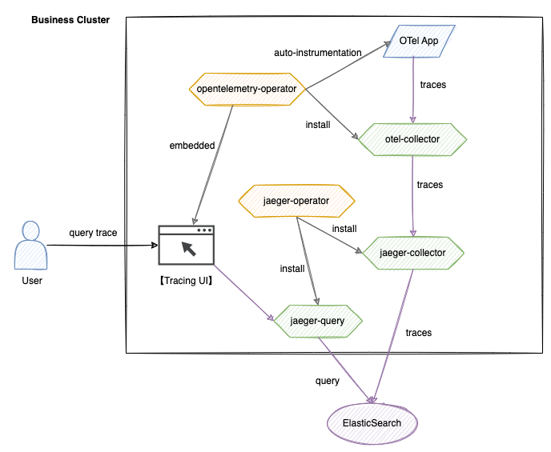

# Architecture

This architecture is built on the OpenTelemetry and Jaeger technology stack, achieving the full lifecycle management of distributed call chains. The system comprises five core modules: data collection, transmission, storage, querying, and visualization.

## Core Components

1. **OpenTelemetry System**
   - **opentelemetry-operator**\
     A cluster-level Operator responsible for deploying and managing the otel-collector component, providing OTel automatic injection capability.
   - **otel-collector**\
     Receives tracing data from applications, filters and batches it, and then forwards it to the jaeger-collector.
   - **Call Chain UI**\
     A self-developed visualization interface that integrates with the jaeger-query API, supporting multi-dimensional query conditions.

2. **Jaeger System**
   - **jaeger-operator**\
     Deploys and manages the jaeger-collector and jaeger-query components.
   - **jaeger-collector**\
     Receives call chain data forwarded and processed by the otel-collector, performs format conversion, and writes it to Elasticsearch.
   - **jaeger-query**\
     Provides a call chain query API, supporting multi-condition retrieval including TraceID and labels.

3. **Storage Layer**
   - **Elasticsearch**\
     A distributed storage engine that supports efficient writing and retrieval of massive Span data.

## Data Flow

- **Writing Process**\
  `Application -> otel-collector -> jaeger-collector -> Elasticsearch`

  The application generates Span data via SDK or automatic injection, which is standardized by the otel-collector and subsequently persisted to Elasticsearch by the jaeger-collector.

- **Query Process**\
  `User -> Call Chain UI -> jaeger-query -> Elasticsearch`

  The user submits query conditions through the UI, and jaeger-query retrieves data from Elasticsearch; the UI visualizes the results based on the return data.
