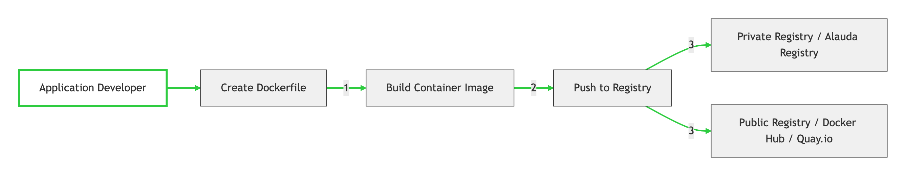

# Understanding Alauda Container Platform development

To fully leverage the capability of containers when developing and running enterprise-quality applications, ensure your environment is supported by tools that allow containers to be: 

- Created as discrete microservices that can be connected to other containerized, and non-containerized, services. For example, you might want to join your application with a database or attach a monitoring application to it. 
- Resilient, so if a server crashes or needs to go down for maintenance or to be decommissioned, containers can start on another machine. 
- Automated to pick up code changes automatically and then start and deploy new versions of themselves. 
- Scaled up, or replicated, to have more instances serving clients as demand increases and then spun down to fewer instances as demand declines. 
- Run in different ways, depending on the type of application. For example, one application might run once a month to produce a report and then exit. Another application might need to run constantly and be highly available to clients. 
- Managed so you can watch the state of your application and react when something goes wrong. 

Containers’ widespread acceptance, and the resulting requirements for tools and methods to make them enterprise-ready, resulted in many options for them. 

The rest of this section explains options for assets you can create when you build and deploy containerized Kubernetes applications in Alauda Container Platform. It also describes which approaches you might use for different kinds of applications and development requirements. 

## About developing containerized applications

You can approach application development with containers in many ways, and different approaches might be more appropriate for different situations. To illustrate some of this variety, the series of approaches that is presented starts with developing a single container and ultimately deploys that container as a mission-critical application for a large enterprise. These approaches show different tools, formats, and methods that you can employ with containerized application development. This topic describes: 

- Building a simple container and storing it in a registry 
- Creating a Kubernetes manifest and saving it to a Git repository 
- Making an Operator to share your application with others 

## Building a simple container

You have an idea for an application and you want to containerize it. 

First you require a tool for building a container, like buildah or docker, and a file that describes what goes in your container, which is typically a [Dockerfile](https://docs.docker.com/reference/dockerfile/).

Next, you require a location to push the resulting container image so you can pull it to run anywhere you want it to run. This location is a container registry. 

Some examples of each of these components are installed by default on most Linux operating systems, except for the Dockerfile, which you provide yourself. 

The following diagram displays the process of building and pushing an image: 

The process of creating a containerized application requires the following steps: 
- Install container engine tools: provides tools for building container images and managing containers, such as those found in `docker` or `containerd` ecosystems. 
- Create a Dockerfile to combine base image and software: Information about building your container goes into a file that is named `Dockerfile`. In that file, you identify the base image you build from, the software packages you install, and the software you copy into the container. You also identify parameter values like network ports that you expose outside the container and volumes that you mount inside the container. Put your `Dockerfile` and the software you want to containerize in a directory on your operating system.
- Run docker build: Run the `docker build` command to pull your chosen base image to the local system and create a container image that is stored locally.
- Tag and push to a registry: Add a tag to your new container image that identifies the location of the registry in which you want to store and share your container. Then push that image to the registry by running the `docker push` command. 
- Pull and run the image: From any system that has a container client tool, such as docker, run a command that identifies your new image. For example, run the `docker run <image_name>` command. Here `<image_name>` is the name of your new container image, which resembles myrepo/myapp:latest. The registry might require credentials to push and pull images. 

## Registry options

Container registries are where you store container images so you can share them with others and make them available to the platform where they ultimately run. You can select large, public container registries that offer free accounts or a premium version that offer more storage and special features. You can also install your own registry that can be exclusive to your organization or selectively shared with others. 

If you want your own, private container registry, Alauda Container Platform itself includes a private container registry that is installed with Alauda Container Platform and runs on its cluster.

All of the registries mentioned here can require credentials to download images from those registries. Some of those credentials are presented on a cluster-wide basis from Alauda Container Platform, while other credentials can be assigned to individuals. 

## Creating a Kubernetes manifest for Alauda Container Platform

While the container image is the basic building block for a containerized application, more information is required to manage and deploy that application in a Kubernetes environment such as Alauda Container Platform. The typical next steps after you create an image are to: 
- Understand the different resources you work with in Kubernetes manifests
- Make some decisions about what kind of an application you are running
- Gather supporting components
- Create a manifest and store that manifest in a Git repository so you can store it in a source versioning system, audit it, track it, promote and deploy it to the next environment, roll it back to earlier versions, if necessary, and share it with others

### About Kubernetes pods and services

While the container image is the basic unit with docker, the basic units that Kubernetes works with are called [pods](https://kubernetes.io/docs/concepts/workloads/pods/). Pods represent the next step in building out an application. A pod can contain one or more than one container. The key is that the pod is the single unit that you deploy, scale, and manage. 

Scalability and namespaces are probably the main items to consider when determining what goes in a pod. For ease of deployment, you might want to deploy a container in a pod and include its own logging and monitoring container in the pod. Later, when you run the pod and need to scale up an additional instance, those other containers are scaled up with it. For namespaces, containers in a pod share the same network interfaces, shared storage volumes, and resource limitations, such as memory and CPU, which makes it easier to manage the contents of the pod as a single unit. Containers in a pod can also communicate with each other by using standard inter-process communications, such as System V semaphores or POSIX shared memory.

While individual pods represent a scalable unit in Kubernetes, a [service](https://kubernetes.io/docs/concepts/services-networking/service/) provides a means of grouping together a set of pods to create a complete, stable application that can complete tasks such as load balancing. A service is also more permanent than a pod because the service remains available from the same IP address until you delete it. When the service is in use, it is requested by name and the Alauda Container Platform cluster resolves that name into the IP addresses and ports where you can reach the pods that compose the service. 

By their nature, containerized applications are separated from the operating systems where they run and, by extension, their users. Part of your Kubernetes manifest describes how to expose the application to internal and external networks by defining [network policies](https://kubernetes.io/docs/concepts/services-networking/network-policies/) that allow fine-grained control over communication with your containerized applications. To connect incoming requests for HTTP, HTTPS, and other services from outside your cluster to services inside your cluster, you can use an [Ingress](https://kubernetes.io/docs/concepts/services-networking/ingress/) resource. 

If your container requires on-disk storage instead of database storage, which might be provided through a service, you can add [volumes](https://kubernetes.io/docs/concepts/storage/volumes/) to your manifests to make that storage available to your pods. You can configure the manifests to create persistent volumes (PVs) or dynamically create volumes that are added to your `Pod` definitions.

After you define a group of pods that compose your application, you can define those pods in [Deployment](https://kubernetes.io/docs/concepts/workloads/controllers/deployment/) objects.

### Application types

Next, consider how your application type influences how to run it. 

Kubernetes defines different types of workloads that are appropriate for different kinds of applications. To determine the appropriate workload for your application, consider if the application is: 

- Meant to run to completion and be done. An example is an application that starts up to produce a report and exits when the report is complete. The application might not run again then for a month. Suitable Alauda Container Platform objects for these types of applications include [Job](https://kubernetes.io/docs/concepts/workloads/controllers/job/) and [CronJob](https://kubernetes.io/docs/concepts/workloads/controllers/cron-jobs/) objects. 
- Expected to run continuously. For long-running applications, you can write a deployment. 
- Required to be highly available. If your application requires high availability, then you want to size your deployment to have more than one instance. A Deployment object can incorporate a [replicaset](https://kubernetes.io/docs/concepts/workloads/controllers/replicaset/) for that type of application. With replica sets, pods run across multiple nodes to make sure the application is always available, even if a worker goes down. 
- Need to run on every node. Some types of Kubernetes applications are intended to run in the cluster itself on every master or worker node. DNS and monitoring applications are examples of applications that need to run continuously on every node. You can run this type of application as a [daemonset](https://kubernetes.io/docs/concepts/workloads/controllers/daemonset/). You can also run a daemon set on a subset of nodes, based on node labels.
- Have identity or numbering requirements. An application might have identity requirements or numbering requirements. For example, you might be required to run exactly three instances of the application and to name the instances 0, 1, and 2. A [statefulset](https://kubernetes.io/docs/concepts/workloads/controllers/statefulset/) is suitable for this application. Stateful sets are most useful for applications that require independent storage, such as databases and zookeeper clusters. 
- Require life-cycle management. When you want to hand off your application so that others can use it, consider creating an Operator. Operators let you build in intelligence, so it can handle things like backups and upgrades automatically. Coupled with the [Operator Lifecycle Manager (OLM)](https://github.com/operator-framework/operator-lifecycle-manager), cluster managers can expose Operators to selected namespaces so that users in the cluster can run them.  

### Available supporting components

The application you write might need supporting components, like a database or a logging component. To fulfill that need, you might be able to obtain the required component from the following Catalogs that are available in the Alauda Container Platform web console:
- **​​OperatorHub**​​, which is available in each Alauda Container Platform cluster. The OperatorHub makes Operators available from Alauda, certified Alauda partners, and community members to the cluster operator. The cluster operator can make those Operators available in all or selected namespaces in the cluster, so developers can launch them and configure them with their applications.
- **​​Helm charts​​**, which provide a powerful and flexible way to define, install, and manage Kubernetes applications. Helm charts package pre-configured Kubernetes resources into a single, versioned unit. They support templating and parameterization, allowing you to easily customize deployments for different environments or requirements. Helm excels at managing the lifecycle of complex applications and their dependencies.

You can configure the supporting Operators and Helm charts to the specific needs of your development team and then make them available in the namespaces in which your developers work. Many people publish Helm charts to shared repositories accessible cluster-wide, enabling consistent deployment across namespaces.

### Applying the manifest

Kubernetes manifests let you create a more complete picture of the components that make up your Kubernetes applications. You write these manifests as YAML files and deploy them by applying them to the cluster, for example, by running the `kubectl apply` command. 

### Next steps

At this point, consider ways to automate your container development process. Ideally, you have some sort of CI pipeline that builds the images and pushes them to a registry. In particular, a GitOps pipeline integrates your container development with the Git repositories that you use to store the software that is required to build your applications. 

The workflow to this point might look like: 
- Day 1: You write some YAML. You then run the `kubectl apply` command to apply that YAML to the cluster and test that it works. 
- Day 2: You put your YAML container configuration file into your own Git repository. From there, people who want to install that app, or help you improve it, can pull down the YAML and apply it to their cluster to run the app. 
- Day 3: Consider writing an Operator for your application. 

## Develop for Operators

Packaging and deploying your application as an Operator might be preferred if you make your application available for others to run. As noted earlier, Operators add a lifecycle component to your application that acknowledges that the job of running an application is not complete as soon as it is installed. 

When you create an application as an Operator, you can build in your own knowledge of how to run and maintain the application. You can build in features for upgrading the application, backing it up, scaling it, or keeping track of its state. If you configure the application correctly, maintenance tasks, like updating the Operator, can happen automatically and invisibly to the Operator’s users. 

An example of a useful Operator is one that is set up to automatically back up data at particular times. Having an Operator manage an application’s backup at set times can save a system administrator from remembering to do it. 

Any application maintenance that has traditionally been completed manually, like backing up data or rotating certificates, can be completed automatically with an Operator. 
